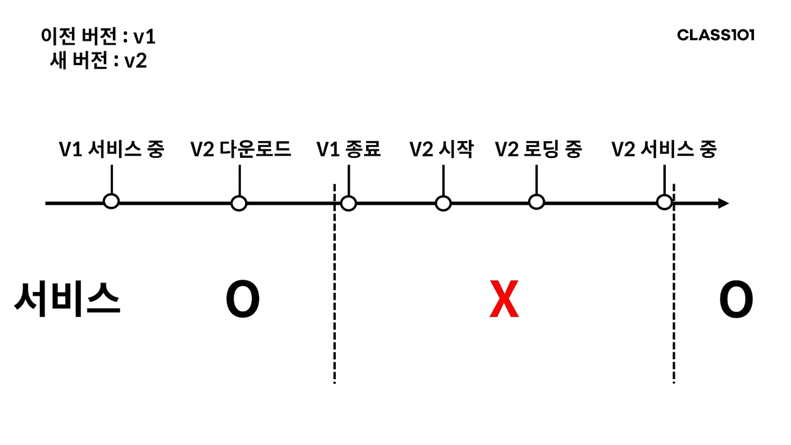

# 무중단 배포를 위한 환경 이해하기

- 무중단 배포
    - 배포를 중단 없이 하는 것
- 배포
    - 새로 만든 코드를 패키징 해 서버에서 새로운 버전의 애플리케이션을 실행하는 것
- 우리가 이전까지 한 건 중단 배포다.
    - 애플리케이션을 띄우는 몇 초의 시간동안 애플리케이션은 요청을 받을 수 없다.
    - 배포하려고 애플리케이션을 내릴 때도 마찬가지다.

- 이전 버전과 새 버전은 같은 포트를 사용한다.
    - 한 서버에서 서로 다른 애플리케이션이 하나의 포트를 동시에 사용할 수 없다.
        - 물론 포트를 다르게 주면 이전 버전을 종료하지 않고도 새 버전을 실행할 수 있다.
    - 따라서 새 버전을 배포하려면 이전 버전을 종료시켜야 한다.
- 이전 버전을 종료한 뒤 새 버전을 실행하고, 로딩하고, 요청 받을 준비가 될 때까지 서비스가 중단된다.
- 이렇게 중단되는 시간을 downtime이라고 한다.

## 해결책

- 애플리케이션 서버를 두 개로 늘린다먄?
    - 사용자는 두 서버의 IP를 모두 알아야 한다.
    - 게다가 어떤 게 배포 중인 서번지 알 방법도 없다.
- 서버와 사용자 사이에 중계해줄 존재가 있으면 된다.

### 리버스 프록시

- 프록시
    - 대리자
    - 클라이언트를 숨겨주는 역할을 한다.
    - 서버는 클라이언트가 누군지 확인할 수 없다.
- 리버스 프록시
    - 서버를 숨긴다.
    - 클라이언트는 서버를 모른 채 서버를 대리하는 리버스 프록시만 알게 된다.

[리버스 프록시](https://www.lesstif.com/system-admin/forward-proxy-reverse-proxy-21430345.html)

### 로드 밸런싱

- 부하 분산
- 요청을 여러 개의 서버로 전달한다.

중간에 대리자가 생기니 로드 밸런싱도 할 수 있게 된다.

[로드 밸런서](https://d2.naver.com/helloworld/284659)

### 롤링

- 하나씩 배포하는 방법

[배포 전략의 종류](https://reference-m1.tistory.com/211)

### nginx

- 리버스 프록시와 로드 밸런싱으로 많이 사용하는 웹 서버
- 한 서버를 중단 시키면 nginx는 다른 정상적인 서버로 다시 요청한다.
    - 이런 방식으로 하나씩 롤링으로 배포할 수 있다.

## 막대한 트래픽

- nginx가 대용량의 트래픽을 무조건 해결해주는 건 아니다.
- 아무리 스케일 아웃으로 애플리케이션 서버의 수가 많아져도 결국 트래픽은 nginx 서버를 거쳐간다.
- nginx 서버에서 처리할 수 있는 용량은 한계가 있다.

이 문제는 세 가지 방법으로 해결할 수 있다.

- nginx가 실행되는 서버를 스케일 업 한다.
    - 성능을 높이니 당연히 좋아진다.
- 네트워크 장치로 로드 밸런싱 한다.
    - nginx 같은 소프트웨어 대신 하드웨어 적으로 로드 밸런싱 하는 것이다.
    - 대표적으로 L4 스위치나 L7 스위치를 사용할 수 있다.
- DNS를 리다이렉션 한다.
    - 도메인을 입력하면 DNS 서버로 가서 해당 도메인에 매칭되는 IP를 가져온다.
    - 로드 밸런서를 여러 개 두고, 하나의 도메인에 각 로드 밸런서로 분산되도록 IP를 여러 개 가지게 한다.
    - 그럼 각 로드 밸런서가 받아야 할 트래픽은 줄어든다.

[L4 로드 밸런서 vs L7 로드 밸런서](https://velog.io/@makeitcloud/%EB%9E%80-L4-load-balancer-vs-L7-load-balancer-%EB%9E%80)

## 롤링 배포 실패

- 배포 실패 원인은 진행 과정에서 알기 어려울 때도 많다.
- 새로 배포된 서버를 이전으로 롤백 시키고 원인을 찾아야 한다.
- 대부분 새 코드에 문제가 있어 실패한다.

### 성공 여부 체크

따라서 배포 성공 여부를 체크할 수 있는 시스템이 필요하다. 

- 배포 스크립트에 포함
- 새로 배포된 서비스에 특정 API를 요청해 올바른 응답이 오는지 확인하는 제 3의 서비스

### 수동 롤백 vs 자동 롤백

- 무조건 자동으로 해야한다는 법칙은 없다.
- 일단 수동으로 하고 배포가 잦다면 자동으로 하면 좋을 것 같다.