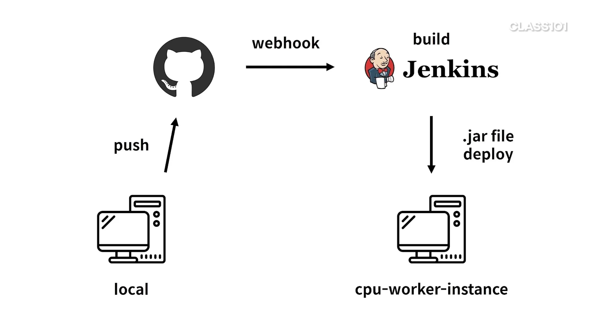
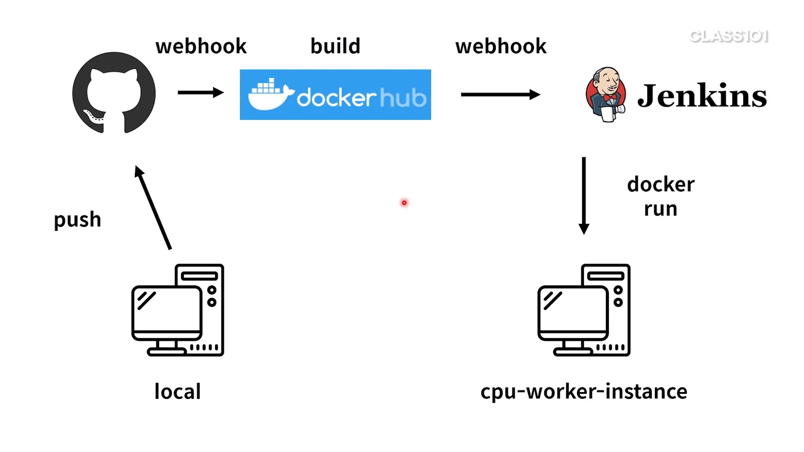

# GitHub Webhook과 jenkins로 배포 자동화

- 레포에 push가 발생하면 jenkins가 자동으로 코드를 빌드하도록 만든다.

## jenkins

```shell
./mvnw clean package
```

- 레포 주소와 연결하고 build 스크립트를 추가한다.

```shell
+ ./mvnw clean package
/tmp/jenkins4402402538478088396.sh: line 2: ./mvnw: Permission denied
```

- 빌드하면 권한 문제로 실패가 뜬다.
- 애플리케이션을 맥에서 생성했기 때문에 리눅스에서는 파일 실행 권한이 없다.

```shell
chmod 544 ./mvnw
./mvnw clean package
```

- 권한을 추가하는 명령을 추가한다.

### jar 실행 설정

```text
[INFO] Building jar: /var/lib/jenkins/workspace/cpu-worker-instance deploy/target/cpu-0.0.1-SNAPSHOT.jar
...
SSH: EXEC: STDOUT/STDERR from command [nohup docker run -p 8080:80 {username}/spring-boot-cpu-bound > nohup.out 2>&1 &] ...
```

- 이번 예제는 도커 대신 jar 파일로 실행하는 것이 목표다.
- 인스턴스 3개에 모두 아래의 설정 값을 넣는다.
    - 빌드 후 조치 - Transfers - Source files
        - `target/cpu-0.0.1-SNAPSHOT.jar`
    - Remove prefix
        - `target`
    - Exec command
        - `sudo java -jar /cpu-0.0.1-SNAPSHOT.jar`

### java 설치

```text
SSH: EXEC: STDOUT/STDERR from command [sudo java -jar /cpu-0.0.1-SNAPSHOT.jar] ...
SSH: EXEC: connected
sudo: java: command not found
```

- 각 인스턴스에 도커는 설치했어도 java는 따로 설치하지 않아 에러가 발생한다.

```shell
sudo yum install -y java
```

- 각 인스턴스에 SSH 접속한 뒤 java를 설치한다.
- -y 옵션
    - 중간에 yes를 누르지 않아도 설치된다.

### 로그 이슈 해결

```shell
nohup sudo java -jar /cpu-0.0.1-SNAPSHOT.jar > nohup.out 2>&1 &
```

- 로딩 중인 로그 때문에 젠킨스가 배포가 끝나지 않았다고 인식하는 문제를 저번과 동일하게 해결한다.

```shell
SSH: Disconnecting configuration [worker-instance-1] ...
SSH: Transferred 1 file(s)
SSH: Connecting from host [jenkins-instance--1]
SSH: Connecting with configuration [cpu-worker-instance-2] ...
SSH: EXEC: completed after 201 ms
SSH: Disconnecting configuration [cpu-worker-instance-2] ...
SSH: Transferred 1 file(s)
SSH: Connecting from host [jenkins-instance--1]
SSH: Connecting with configuration [cpu-worker-instance-3] ...
SSH: EXEC: completed after 201 ms
SSH: Disconnecting configuration [cpu-worker-instance-3] ...
SSH: Transferred 1 file(s)
Finished: SUCCESS
```

- 배포에 성공한다.

## 프로세스 종료

- 도커와 nginx는 8080 포트로 연결했는데 애플리케이션은 80 포트를 사용한다.
- 애플리케이션을 8080 포트로 변경해보자.
- 우선 인스턴스 1, 2, 3의 애플리케이션을 종료한다.

```shell
ps -aux | grep java
```

- 프로세스를 찾는다.

```shell
sudo kill -9 {process id}
```

- 프로세스를 종료한다.

## GitHub Webhook 추가


- 젠킨스와 연결한다.

### 포트 변경

```properties
server.port=8080
```

- 포트를 80에서 8080으로 변경한 뒤 push 한다.
- 그럼 젠킨스에 자동으로 빌드가 추가된다.

## 프로세스 종료 스크립트 추가

- 배포를 시도해도 기존 프로세스를 종료하지 않으면 포트가 이미 사용중이라고 하온다.

```shell
# lsof는 centOS에서 기본으로 제공하지 않아 설치가 필요하다.
sudo yum install -y lsof
# 특정 프로세스를 사용하고 있는지 확인한다.
lsof
```

```shell
sudo kill -15 $(sudo lsof -t -i:8080)
```

- 8080 포트를 죽이는 명령어를 젠킨스 exec command에 추가한다.

## 무중단 배포

- 모든 인스턴스가 동시에 배포되기 때문에 다운 타임이 발생해 서비스에 요청을 넣어도 실패하게 된다.
- 여기서는 젠킨스 exec command에 단순히 sleep으로 30초 딜레이를 주도록 만든다.
    - 실제 서비스라면 이런 방식은 절대 충분하지 않다.

## 정리



1. 로컬에서 코드 push
2. github의 webhook으로 jenkins에 요청
3. jenkins가 애플리케이션을 빌드 후 jar 파일 배포

### 도커를 사용하게 된다면?



1. 로컬에서 코드 push
2. github의 webhook 실행
3. docker hub에서 애플리케이션 빌드
4. jenkins가 docker 실행

도커 허브에서 소스 코드 이미지를 빌드하고 웹훅을 지원해주는 것까지 지원하는 것이 차이점이다.