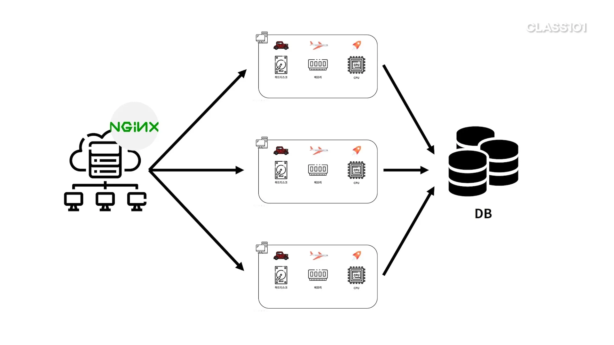

# I/O bound 애플리케이션도 서버를 늘리면 성능을 올릴 수 있을까

## 하드디스크를 많이 사용하는 I/O bound 애플리케이션

- 파일 I/O라면 서버를 늘려서 성능을 향상시키는 게 가능할 수 있다.
- DB I/O라면 서버를 늘려도 결국 DB의 성능에 의존적이므로 성능 향상이 되지 않는다.
    - DB 병목 현상
    - 그럼 DB도 나눠서 로드밸런싱을 하면 되지 않나?
        - 각 데이터가 실시간으로 정확하다고, 정합성이 맞다고 할 수 없다.

## 예제

- 글 작성
- 글 목록
- 글 번호로 조회
- 글 내용으로 검색

사용자가 새로고침을 할 때마다 계속 조회해야 한다. DB에 변경사항이 없어도!