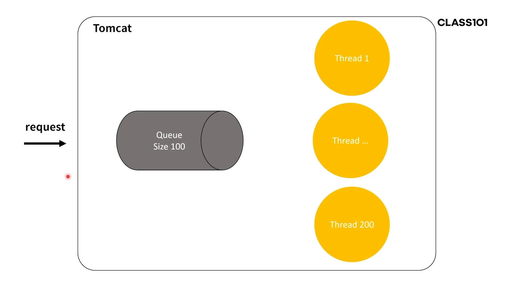
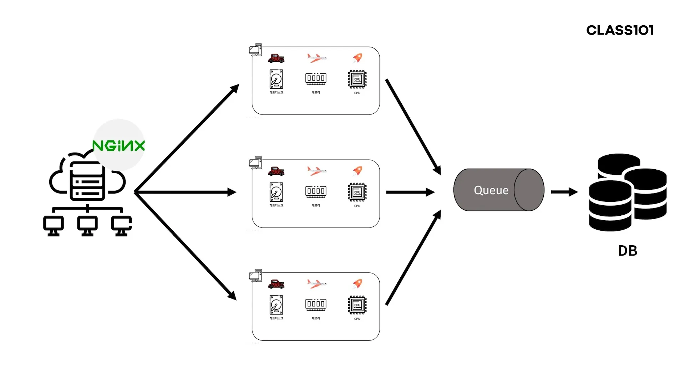
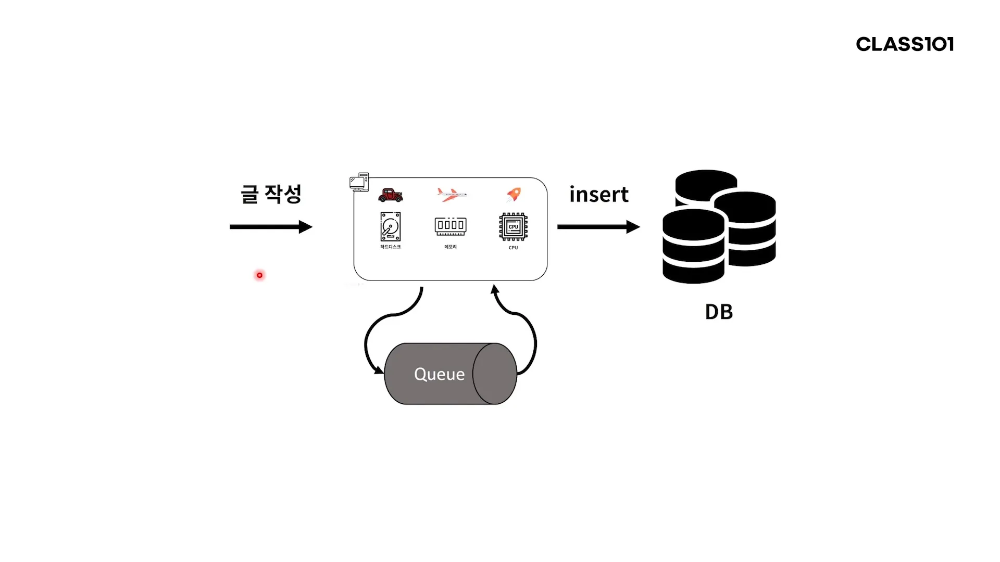
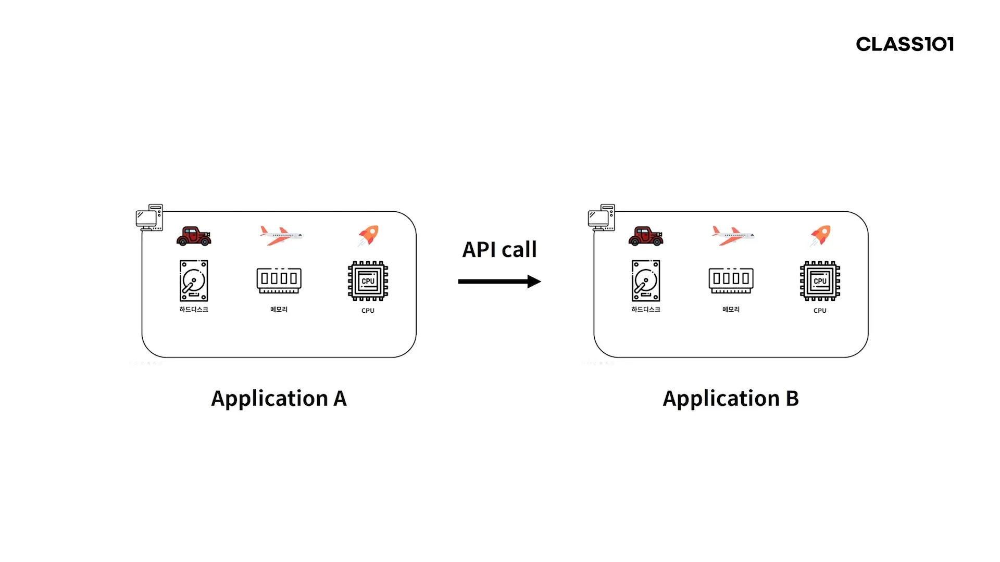

# 서버가 죽는 이유와 Message Queue를 도입하여 얻을 수 있는 장점

## 서버가 죽는다?

- 일부 요청이 실패한다.
    - 대부분 여기에 해당한다.
- 모든 요청이 실패한다.
    - 네트워크 장애나 서버 자체의 장애
    - 그냥 기다리거나 서버를 재시작 해야할 수 있다.

## 서버가 죽는 이유

죽는 이유를 이해하려면 톰캣을 이해해야 한다.

- 사용자의 요청이 큐에 들어간다.
    - 먼저 들어온 요청이 먼저 처리되는 구조
- 놀고 있는(idle) 쓰레드가 있다면, 그 스레드가 큐에 들어온 요청을 가져가 처리한다.
- 톰캣 기본 설정은 큐 사이즈 100, 쓰레드 사이즈 200이다.
    - 스레드가 처리하는 양보다 들어오는 요청이 많다면?
    - 즉, 모든 스레드가 사용중이면 새로운 요청은 큐에서 대기한다.
- 큐가 채워지고도 계속 요청이 들어오면 해당 요청부터는 버려진다.
    - 큐에 들어가 있는 것도 30초(기본 설정값)가 넘으면 타임아웃 처리 된다.

### 큐, 스레드, 타임아웃을 늘린다면?

- 큐, 스레드, 타임아웃을 늘린다고 해결되는 건 아니다.
    - 일시적으로 사용자가 요청 실패 경험하는 시간을 늦출 수는 있다.
    - 하지만 타임아웃이 발생하면 큐에 쌓여있던 요청들은 결국 다 실패한다.
- 타임아웃을 늘리면?
    - 진작 실패되었어야 할 요청들이 큐에 계속 쌓인다.
- 스레드의 수를 늘리면?
    - 스레드는 CPU를 공유하며 작업하기 때문에 한 스레드가 작업하면 자기 차례를 기다려야 한다.
        - DB 역시 마찬가지
    - 이렇게 되면 다량의 요청이 들어올 경우 점점 느려진다.
    - 일부 요청은 큐에 쌓이다가, 어떤 요청은 타임아웃으로 실패하게 된다.
- 실제 처리 속도를 늘리지 않는 이상 결국 큐가 쌓이기 때문에 한계가 있다.

## 메시지 큐를 사용하는 구조로 변경

- DB에 넣기 전 요청을 모두 메시지 큐에 넣었다가 처리한다.
- 앞쪽에서 Nginx에게 요청을 전달 받을 때는 여전히 톰캣 큐를 사용하고 있다.

## 메시지 큐와 애플리케이션의 관계

1. 글 작성 요청이 들어오면 컨트롤러에서 바로 메시지 큐에 넣는다.
2. 해당 스레드는 다음 요청을 받을 준비가 된다.
3. I/O bound 애플리케이션의 다른 부분에서는 메시지 큐에 있는 글 작성 요청을 뽑아 DB에 넣는다.

- 예제에서는 publish와 consume이 같은 애플리케이션에서 수행되지만 대부분 나뉘어있다.
- 이렇게 하면 consume 하는 쪽 애플리케이션은 수시로 배포, 중단되어도 문제가 줄어든다.

## 톰캣 큐와 메시지 큐의 차이

- 톰캣
    - 메모리에 저장된 데이터
    - 애플리케이션 강제 종료 시 모두 날아간다.
    - 즉, 무언가에 저장했다가 사용하는데에 특화되어 있지 않다.
- 메시지 큐
    - 디스크에 저장하는 등 여러 옵션을 줄 수 있다.

## 메시지 큐의 특징

### 비동기성

- 요청이 몰릴 때도 저장해놨다가 처리할 수 있다.
- DB 속도와 무관하게 메시지를 누락없이 저장했다가 처리할 수 있게 된다.
    - insert 하는 시간보다 메시지 큐에 메시지를 넣는 시간이 훨씬 짧다.

### 애플리케이션간 의존성 제거

- A에서 B로 API를 통해 데이터를 전달하면 A는 B에 의존성이 생긴다.
    - B가 배포를 하거나 죽으면 A에서 보낸 요청은 유실된다.
- 중간에 API call 대신 메시지 큐를 넣으면 유실되지 않는다.
    - A는 메시지 큐에 데이터를 넣고 B는 그 데이터를 가져간다.
    - B가 죽어도 메시지는 큐에 남아있다.
    - B가 정상적으로 돌아오면 큐에서 다시 가져간다.

### 이중화

- 여러 개의 큐를 묶고 큐 사이에 데이터를 지속적으로 동기화한다.
    - 큐도 결국 애플리케이션이기 때문에 죽을 수도 있다.
    - 여러 개를 두면 한쪽 큐에 장애가 발생해도 전체 큐 서비스에는 영향이 없도록 할 수 있다.

### 신뢰성

- 큐에서 메시지를 꺼내 로직을 실행했을 때 예외가 발생하면 그 메시지를 다시 큐에 넣을 수 있다.
    - 실패한 메시지는 큐로 Ack 하지 않기 때문에 그 메시지에서 빠져나가지 않는다.
- 그렇다고 메시지가 절대 유실되지 않는다는 것은 아니다.
    - 유실되면 안되는 메시지는 꼭 로깅을 철저히 하여 복구할 수 있게 해야 한다.

### 확장성

- 하나의 큐에 여러 개의 애플케이션이 동시에 메시지를 넣거나 뺄 수 있다.
- 애플레케이션을 스케일 아웃 해도 메시지 큐는 하나만 존재해도 된다.