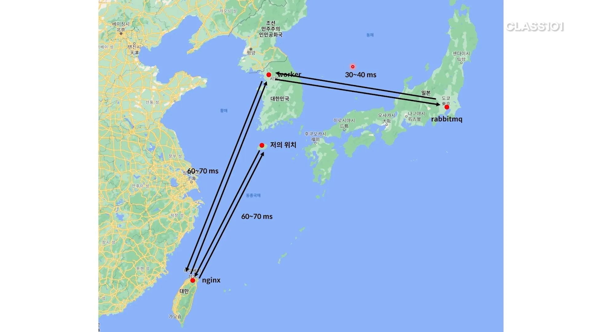
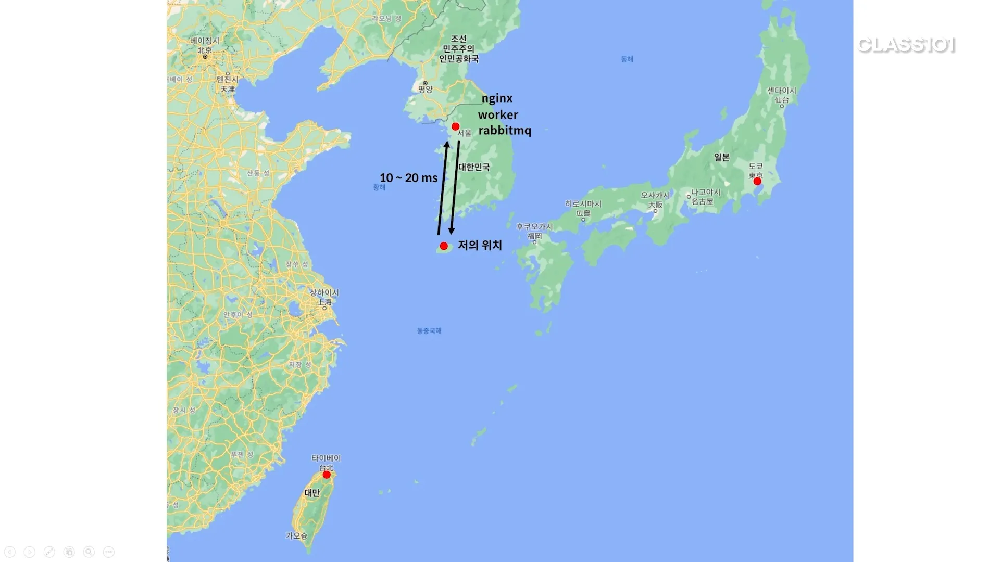

# 스트레스 테스트

## 글 작성 요청은 실패하지 않을까?

RabbitMQ로 바꿔도 여전히 글쓰기 요청이 모두 성공하지 않았다. 왜일까?

- 각 인스턴스에 ping을 날려 확인해본다.
- 한국에서 대만
    - 60~70ms
- 한국에서 일본
    - 30~40ms
- 같은 리전에 있는 인스턴스
    - 1ms

### 인스턴스 간 latency가 무슨 영향이 있는가?

- latency로 요청이 오래 걸리면 스레드와 큐 사이즈가 빠르게 고갈된다.
- 그래서 가능하면 빨리 요청을 처리할 수 있어야 한다.

- 따라서 Nginx 인스턴스를 서울에 만들어 준다.
    - Nginx 인스턴스에 RabbitMQ도 함께 올린다.
    - 모든 인스턴스가 서울 리전에 있게 되므로 latency가 낮아진다.
- 워커를 하나 줄였는데 성능이 안좋아지진 않을까?
    - 기존 시스템의 병목 컴퓨팅 파워가 아니라 네트워크 지연이 문제였다.
    - 따라서 워커가 하나 줄어도 괜찮다.

### 트러블 슈팅

- latency를 줄였지만 해결되지 않았다?
    - 톰캣에 직접 요청하는 건 잘되네. Nginx를 끼면 안되는구나.
    - Nginx 에러 로그 확인 후 구글링대로 nofile limit을 변경한다.

### 그럼 Nginx로 해결한거니 메시지 큐는 의미없는 거 아닌가?

- Nginx 설정을 바꿔서 해결하긴 했지만 RabbitMQ로 얻은 이점이 크다.
    - 실제였다면 produce하는 애플리케이션과 consume 하는 애플리케이션이 서로 다르다.
    - 따라서 consume 하는 애플리케이션이 무중단으로 배포하기가 쉬워진다.