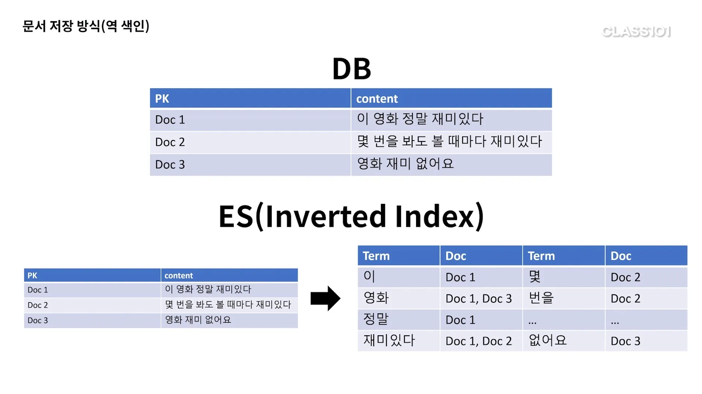

# 검색과 분석을 위한 저장소 ElasticSearch

## 문서 저장 방식

- DB
    - 직관적으로 문서가 순서대로 위치한다.
    - 특정 단어를 찾으려면 모든 문서를 확인해야 한다.
- ES
    - 단어 단위로 잘라서 해당 단어가 어디 위치하는지 기록한다.
    - Inverted Index, 역색인이라고 한다.

### 형태소 분석

- `재미있다`를 보면 `재미`는 검색이 안되고 `재미있다`만 검색될 것이다.
- 이 둘을 같은 단어로 기록하려면 형태소 분석이 필요하다.
- 영어는 자동 지원을 해주시만 한글은 `노리`라는 플러그인을 사용한다.

### 샤드

- 문서 100개를 한 공간에 저장하는 대신 여러 곳에 쪼개서 저장한다.
- 이 각각의 샤드가 다른 머신(노드)로 올라간다.
- 노드의 리소스도 따로 사용하므로 성능상 이점이 있다.

### 레플리카

- 특정 노드에 문제가 있어 내려가면 해당 노드의 데이터를 다른 곳에 저장한다.
- 복사본이 계속 남아있기 때문에 장애가 발생해도 서비스가 가능하다.
- 동일 레플리카는 동일 노드에 저장되지 않는다.
    - 복제하는 의미가 사라지기 때문이다.

## ES는 DB의 상위 호환인가?

둘은 데이터를 저장한다는 공통점이 있지만 목적과 방식이 다르다.

- ES는 실시간 처리가 불가하다.
    - insert한 뒤 조회하기까지 딜레이가 필연적으로 발생한다.
- 트랜잭션과 롤백을 제공하지 않는다.
    - 트랜잭션은 비용이 제법 큰 작업이다.
    - ES는 DB와 다르게 여러 노드에 분산해서 데이터를 저장하므로 지원하지 않는다.
    - 만약 비즈니스 로직에서 트랜잭션에 많이 의존하고 있다면 ES 도입이 어려울 수 있다.
- 문서를 업데이트 할 수 없다.
    - 데이터를 삭제했다가 다시 만드는 동작을 한다.
    - 데이터 업데이트가 자주 일어나면 클러스터에 영향을 줄 수 있다.