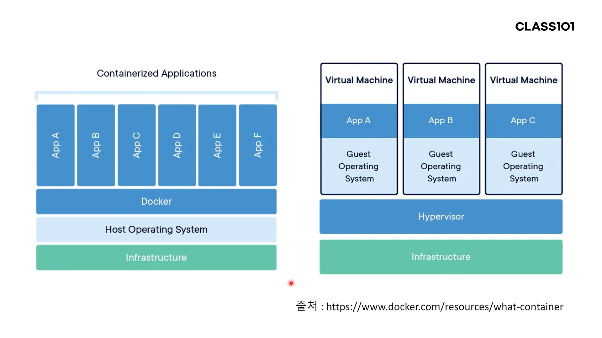
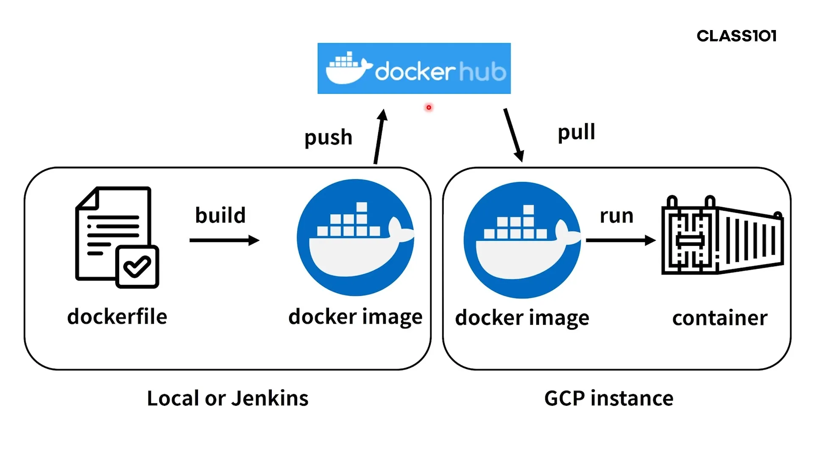
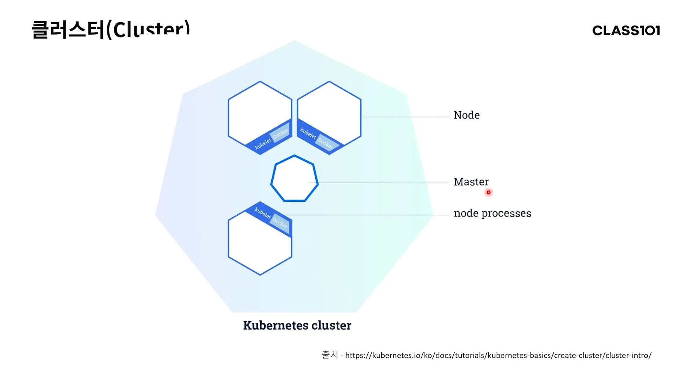
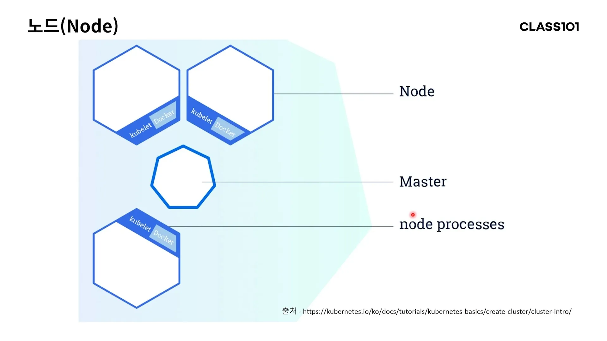
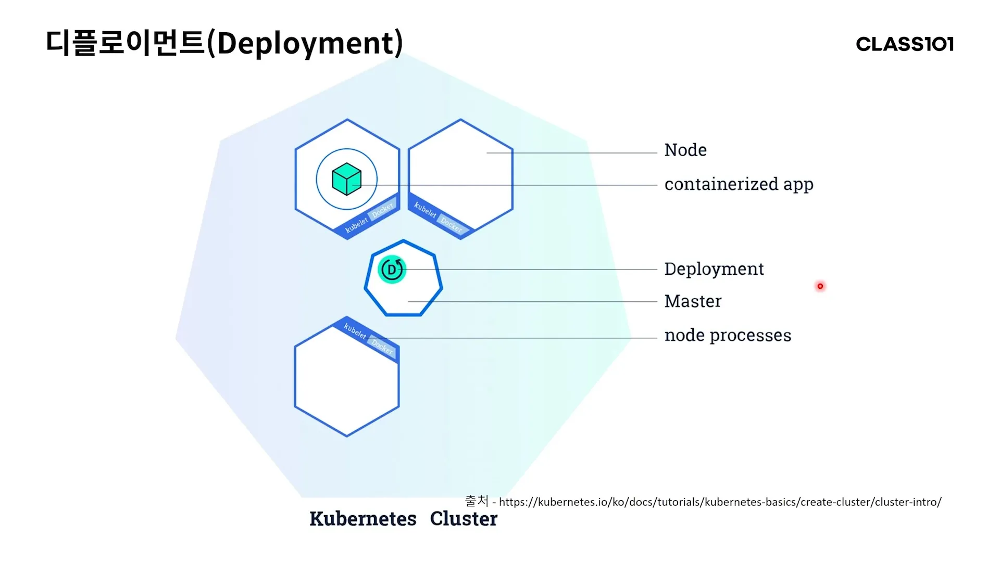
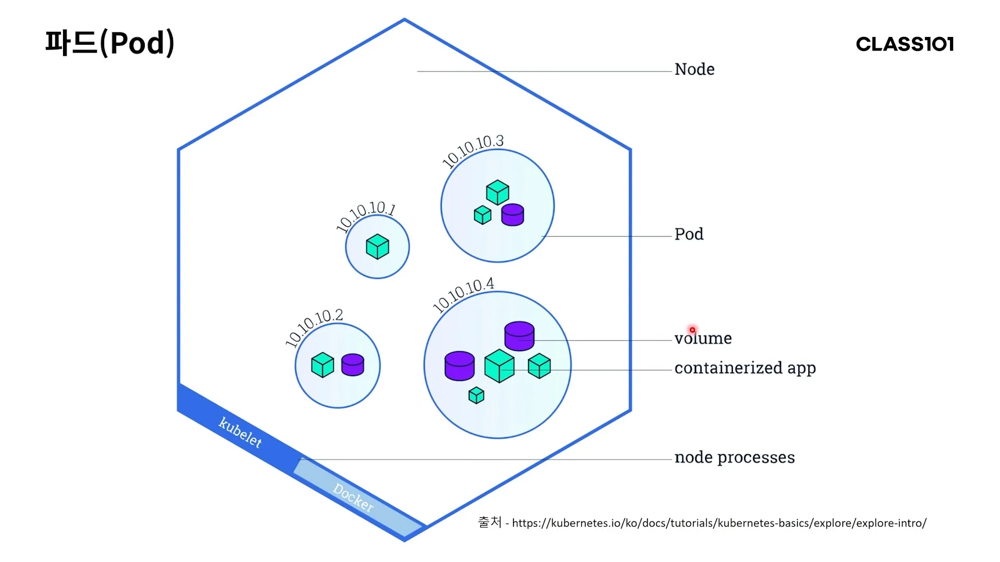
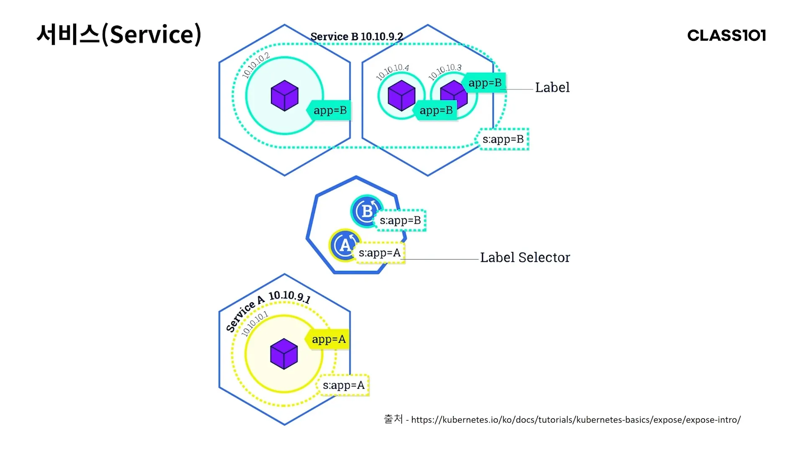
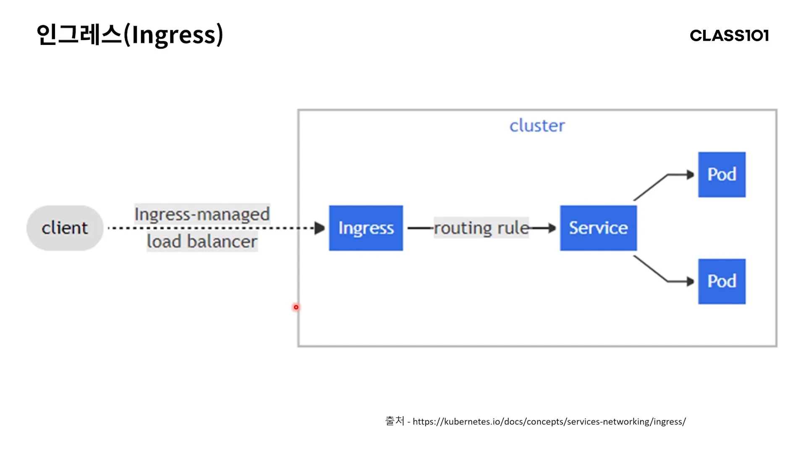
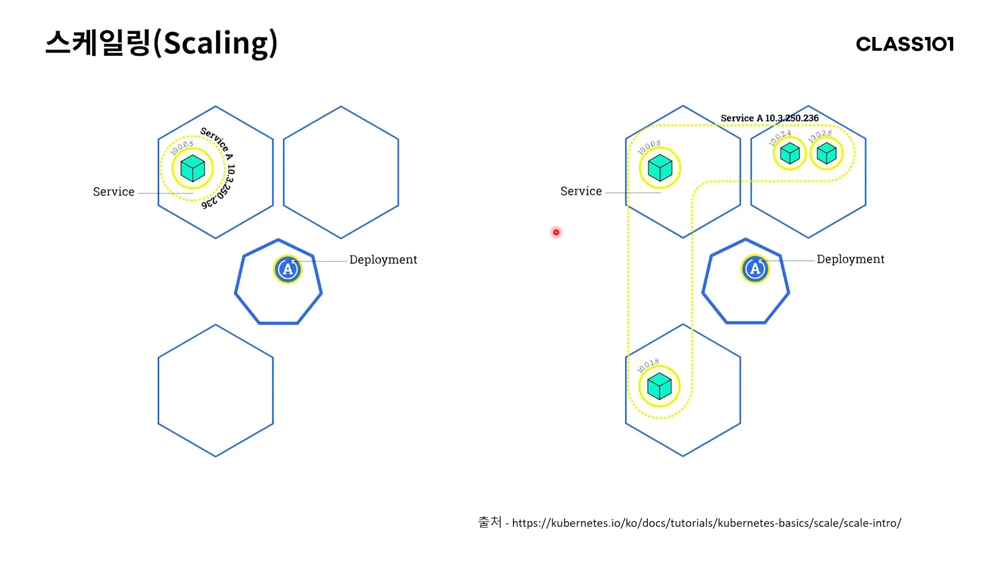

# Kubernetes

## Docker

- 도커
    - 하나의 애플리케이션처럼 동작한다.
- 가상 머신
    - 내부에 독자적인 게스트 운영체제가 있다.
    - 도커에 비해 성능을 발휘하기 어렵다.

- 도커 컨테이너를 띄우려면 이미지가 필요하다.
    - 도커 파일을 빌드하면 도커 이미지가 만들어진다.
- 이미지를 도커 허브에 업로드한 뒤 실행할 컨테이너에서 다운받는다.

예제에서는 젠킨스로 스크립트를 하나하나 넣으면서 컨트롤 했다. 하지만 도커 컨테이너가 많아지면 관리가 어려워진다.

## 오케스트레이션 툴

- 가상 머신 인스턴스를 생성, 제거 하는 등 내부적으로 처리해주는 툴
    - ex. GCP는 내부적으로 오케스트레이션 툴로 처리한다.

## 컨테이너 오케스트레이션 툴

- 도커 컨테이너를 관리해주는 툴
- 쿠버네티스가 대표적이다.

## 쿠버네티스

### 클러스터

- 워커 노드와 마스터 노드로 이루어진다.
- 각 노드는 물리적 서버일 수도 있고 가상의 서버일 수도 있다.
    - 어쨌든 네트워크로 구분되는 하나하나의 서버를 의미한다.

### 마스터 노드

- 마스터 노드는 클러스터 전체를 관리한다.
    - 마스터 노드가 직접 애플리케이션을 실행하지는 않는다.
- 마스터 노드의 수는 워커 노드의 수에 따라 3개에서 7개까지 나올 수 있다.
    - 정말 테스트용인 경우는 1개여도 무관하다.
    - 이 때 개수는 반드시 홀수여야 한다.
    - 홀수가 되어야 클러스터 상태를 관리할 때 **컨센서스**를 이룰 수 있다.

#### 컨센서스

- 합의를 뜻한다.
- 마스트 노드끼리 투표를 하는데 짝수면 동점이 될 수 있으므로 홀수를 유지한다.

### 워커 노드

- 직접 애플리케이션을 실행하는 노드
- 마스터 노드의 관리를 받는다.
- 워커 노드의 개수는 몇 개가 되어도 무관하다.
    - 쿠버네티스에서 제공하는 네트워크 플러그인에 따라 수 백에서 수 천개까지 제한이 있다.

### 디플로이먼트

- 마스터 노드에 생성된다.
- 워커 노드에 컨테이너화 된 애플리케이션이 떠있는지 확인한다.
    - 노드가 다운되거나 삭제되어 동작하지 않는다면 다른 노드에 애플리케이션을 생성한다.
- yaml 파일에 선언하는 것만으로도 간단하게 생성할 수 있다.

### 파드

- 그림에서 실제 애플리케이션 컨테이너는 `containerized app`이다.
- 하나의 파드에는 여러 애플리케이션이 뜰 수 있다.
    - 하나의 파드 = 하나의 애플리케이션 (X)
- 파드부터는 클러스터 내부 IP를 갖게 된다.
- 하지만 이 상태로는 실행중인 애플리케이션을 클러스터 외부로 서비스할 수 없다.

### 서비스

- 클러스터 외부로 서비스 하려면 서비스가 필요하다.
- 파드를 묶어 외부에 노출시킨다.
    - `Label`처럼 이름도 붙일 수 있다.
- 서비스만으로는 간단한 라우팅만 할 수 있다.
    - 로드 밸런싱이나 https 같은 추가적인 처리는 인그레스가 필요하다.

### 인그레스

- 클러스터 외부에서 트래픽을 받아 라우팅 룰에 따라 서비스로 라우팅 한다.
- 마치 nginx가 해주는 역할과 거의 동일한 존재라고 생각하면 된다.

### 스케일링

- 스케일링 되는 기준
    - 파드
    - 이 파드는 서비스로 묶여있다.
- 쿠버네티스에서 기본적으로 제공하는 오토 스케일링을 사용할 수 있다.
    - CPU와 메모리 사용량을 기준으로 정한다.
    - 그 외의 기준으로 하고 싶다면 쿠베네티스 API를 사용해야 한다.