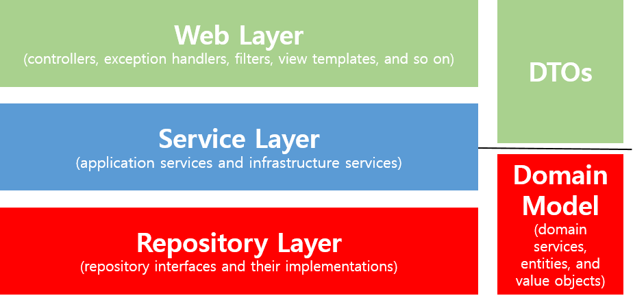

# 등록/수정/조회 API 만들기

API를 구현하려면 총 3개의 클래스가 필요하다.

- Request 데이터를 받을 DTO
- API 요청을 받을 Controller
- 트랜잭션, 도메인 기능 간의 순서를 보장하는 Service

보통 Service는 비즈니스 로직을 처리한다고 오해하는데, 사실 트랜잭션, 도메인 간의 순서를 보장하는 역할만 한다.



### Web(Controller) Layer

- `@Controller`와 JSP 등의 뷰 템플릿 영역이다.
- `@Filter`, `@ControllerAdvice`, interceptor 등 외부 요청과 응답에 대한 전반적인 영역을 말한다.

### Service Layer

- `@Service`에 사용되는 서비스 영역이다.
- 일반적으로 Controller와 DAO 중간 영역에서 사용된다.
- `@Transactional`이 사용되는 영역이다.

### Repository Layer

- Database처럼 데이터 저장소에 접근하는 영역이다.
- DAO(Data Access Object) 영역으로 생각하면 된다.

### DTO

- DTO(Data Transfer Object)는 계층 간에 데이터 교환을 위한 객체를 말한다.
- 뷰 템플릿 엔진에서 사용될 객체나 Repository Layer에서 결과로 넘겨준 객체 등이 해당한다.

### Domain Model

- 도메인이라는 개발 대상을 모든 사람이 동일한 관점에서 이해하고 공유하도록 단순화 시킨 것이다.
- 택시 앱을 예로 들면 배차, 탑승, 요금 등이 도메인이 된다.
- `@Entity`가 사용된 영역 역시 도메인 모델에 해당한다.
- 무조건 데이터베이스의 테이블과 연관있어야 하는 것은 아니다.
    - VO처럼 값 객체들도 이 영역에 해당한다.

이 중에서 비즈니스 처리를 담아하는 곳은 `Domain`이다.



```java
public class Example {
    @Transactional
    public Order cancelOrder(int orderId) {
        // 1. 데이터베이스로부터 Orders, Billing, Delivery 조회
        OrdersDto order= ordersDao.selectOrders(orderId);
        BillingDto billing = billingDao.selectBilling(orderId);
        DeliveryDto delivery = deliveryDao.selectDelivery(orderId);
    
        // 2. 배송 취소를 해야하는지 확인
        String deliveryStatus = delivery.getStatus();
    
        // 3. if(배송 중이라면) 배송 취소로 변경
        if("IN_PROGRESS".equals(deliveryStatus)) {
            delivery.setStatus("CANCEL");
            deliveryDao.update(delivery);
        }
    
        // 4. 각 테이블에 취소 상태 update
        order.setStatus("CANCEL");
        ordersDao.update(order);
        biling.setStatus("CANCEL");
        deliveryDao.update(biling);
    
        return order;
    }
}
```


```java
public class Example {
    @Transactional
    public Order cancelOrder(int orderId) {
        // 1. 데이터베이스로부터 Orders, Billing, Delivery 조회
        Orders order = ordersRepository.findById(orderId);
        Billing billing = billingRepository.findByOrderId(orderId);
        Delivery delivery = deliveryRepository.findByOrderId(orderId);
    
        // 2. 배송 취소를 해야하는지 확인
        // 3. if(배송 중이라면) 배송 취소로 변경
        delivery.cancel();
    
        // 4. 각 테이블에 취소 상태 update
        order.cancel();
        billing.cancel();
    }
}
```



첫번째 탭처럼 서비스에서 처리하는 방식을 트랜잭션 스크립트라고 한다. 모든 로직이 서비스 클래스 내부에서 처리되다보니 서비스 계층이 무의미하고, 객체가 단순히 데이터 덩어리 역할만 하게 된다.

하지만 두번째의 경우, order, billing, delivery가 각자 본인의 취소 이벤트를 처리한다. 서비스 메서드는 트랜잭션과 도메인 간의 순서만 보장한다. 이 프로젝트에서는 도메인 모델을 다룰 것이다.

## 등록 기능 구현



```java
@RequiredArgsConstructor
@RestController
public class PostsApiController {

    private final PostsService postsService;

    @PostMapping("/api/v1/posts")
    public Long save(@RequestBody PostsSaveRequestDto requestDto) {
        return postsService.save(requestDto);
    }
}
```


```java
@RequiredArgsConstructor
@Service
public class PostsService {

    private final PostsRepository postsRepository;

    @Transactional
    public Long save(PostsSaveRequestDto requestDto) {
        return postsRepository.save(requestDto.toEntity()).getId();
    }
}
```



빈을 주입할 때는 `@Autowired`, `setter`, `생성자` 세 가지 방식이 있다. 이 중 제일 권장하는 방식은 생성자로 주입받는 것이다. 생성자로 Bean 객체를 받으면 `@Autowired`와 동일한 효과를 보는 것이다.

이때 생성자는 `@RequiredArgsConstructor`가 해결해준다. final인 모든 필드를 인자로 하는 생성자를 대신 생성해준다.




```java
@Getter
@NoArgsConstructor
public class PostsSaveRequestDto {
    private String title;
    private String content;
    private String author;

    @Builder
    public PostsSaveRequestDto(String title, String content, String author) {
        this.title = title;
        this.content = content;
        this.author = author;
    }

    public Posts toEntity() {
        return Posts.builder()
                .title(title)
                .content(content)
                .author(author)
                .build();
    }
}
```


```java
@Getter
@NoArgsConstructor
@Entity 
public class Posts {

    @Id
    @GeneratedValue(strategy = GenerationType.IDENTITY)
    private Long id;

    @Column(length = 500, nullable = false)
    private String title;

    @Column(columnDefinition = "TEXT", nullable = false)
    private String content;

    private String author;

    @Builder
    public Posts(String title, String content, String author) {
        this.title = title;
        this.content = content;
        this.author = author;
    }
}
```



`PostsSaveRequestDto`는 `Posts` Entity와 거의 유사하지만 따로 생성했다. Entity 클래스는 데이터베이스와 맞닿아 있는 핵심 클래스다. Entity 클래스를 기준으로 테이블이 생성되고 스키마가 변경된다.

Entity 클래스가 변경되면 여러 클래스에 영향을 미친다. 그런데 Request와 Response용 DTO는 View를 위한 클래스라 많은 변경이 필요하다. 사소한 수정 사항 때문에 테이블과 연결된 Entity 클래스까지 고치는 것은 위험 부담이 크다.

그러므로 View Layer와 DB Layer의 역할을 철저하게 분리하는 것이 좋다. 실제로도 Controller에서 결과값을 보낼 때 여러 테이블을 조인해서 줘야할 경우가 자주 있다. 따라서 Entity 클래스와 Controller에 쓸 DTO는 반드시 분리해 사용하자.




```java
@RunWith(SpringRunner.class)
@SpringBootTest(webEnvironment = SpringBootTest.WebEnvironment.RANDOM_PORT)
public class PostsApiControllerTest {

    @LocalServerPort
    private int port;

    @Autowired
    private TestRestTemplate restTemplate;

    @Autowired
    private PostsRepository postsRepository;

    @After
    public void tearDown() throws Exception {
        postsRepository.deleteAll();
    }

    @Test
    public void Posts_등록된다() throws Exception {
        // given
        String title = "title";
        String content = "content";
        PostsSaveRequestDto requestDto = PostsSaveRequestDto.builder()
                .title(title)
                .content(content)
                .author("author")
                .build();

        String url = "http://localhost:" + port + "/api/v1/posts";

        // when
        ResponseEntity<Long> responseEntity = restTemplate.postForEntity(url, requestDto, Long.class);

        // then
        assertThat(responseEntity.getStatusCode()).isEqualTo(HttpStatus.OK);
        assertThat(responseEntity.getBody()).isGreaterThan(0L);

        List<Posts> all = postsRepository.findAll();
        assertThat(all.get(0).getTitle()).isEqualTo(title);
        assertThat(all.get(0).getContent()).isEqualTo(content);
    }
}
```



`@WebMvcTest`는 JPA가 작동하지 않아 Controller와 ControllerAdvice 등 외부 연동과 관련된 부분만 활성화된다. 따라서 지금처럼 JPA 기능까지 한번에 테스트 하려면 `@SpringBootTest`와 `TestRestTemplate`을 사용한다.

## 수정, 조회 기능 구현 



```java
@RequiredArgsConstructor
@RestController
public class PostsApiController {

    private final PostsService postsService;

    @PostMapping("/api/v1/posts")
    public Long save(@RequestBody PostsSaveRequestDto requestDto) {
        return postsService.save(requestDto);
    }

    @PutMapping("/api/v1/posts/{id}")
    public Long update(@PathVariable Long id, @RequestBody PostsUpdateRequestDto requestDto) {
        return postsService.update(id, requestDto);
    }

    @GetMapping("/api/v1/posts/{id}")
    public PostsResponseDto findById(@PathVariable Long id) {
        return postsService.findById(id);
    }
}
```


```java
@Getter
public class PostsResponseDto {

    private Long id;
    private String title;
    private String content;
    private String author;

    public PostsResponseDto(Posts entity) {
        this.id = entity.getId();
        this.title = entity.getTitle();
        this.content = entity.getContent();
        this.author = entity.getAuthor();
    }
}
```



`PostsResponseDto`는 Entity의 필드 중 일부만 사용하므로 생성자로 Entity를 받아 필드에 넣는다.



```java
@Getter
@NoArgsConstructor
public class PostsUpdateRequestDto {
    private String title;
    private String content;

    @Builder
    public PostsUpdateRequestDto(String title, String content) {
        this.title = title;
        this.content = content;
    }
}
```


```java
@RequiredArgsConstructor
@Service
public class PostsService {

    private final PostsRepository postsRepository;

    @Transactional
    public Long save(PostsSaveRequestDto requestDto) {
        return postsRepository.save(requestDto.toEntity()).getId();
    }

    @Transactional
    public Long update(Long id, PostsUpdateRequestDto requestDto) {
        Posts posts = postsRepository.findById(id).orElseThrow(() -> new IllegalArgumentException("해당 게시글이 없습니다. id = " + id));

        posts.update(requestDto.getTitle(), requestDto.getContent());

        return id;
    }

    public PostsResponseDto findById(Long id) {
        Posts entity = postsRepository.findById(id).orElseThrow(() -> new IllegalArgumentException("해당 게시글이 없습니다. id= " + id));

        return new PostsResponseDto(entity);
    }
}
```



update 코드를 보면 데이터베이스에 쿼리를 날리는 부분이 없다. JPA의 영속성 컨텍스트 덕분이다.

### 영속성 컨텍스트와 더티 체킹

Entity를 영구히 저장하는 환경으로, 일종의 논리적인 개념이다. JPA의 핵심은 Entity가 영속성 컨텍스트에 포함되는지 아닌지로 갈린다.

JPA의 `EntityManager`가 활성화된 상태로 트랜잭션 안에서 DB 데이터를 가져온다면 영속성 컨텍스트가 유지된 상태라고 볼 수 있다.  Spring Data Jpa를 쓴다면 기본값으로 `EntityManager`가 활성화 된다.

이 상태에서 해당 데이터의 값을 변경하면 트랜잭션이 끝나는 시점에 해당 테이블의 변경 사항을 반영한다. 즉, Entity 객체의 값만 변경하면 별도로 Update 쿼리를 날릴 필요가 없는 것이다. 이 개념을 `더티 체킹`이라고 한다. 

**Reference**

[더티 체킹이란?](https://jojoldu.tistory.com/415)

이제 정상적으로 update를 하는지 테스트 코드를 구현해보자.



```java
@RunWith(SpringRunner.class)
@SpringBootTest(webEnvironment = SpringBootTest.WebEnvironment.RANDOM_PORT)
public class PostsApiControllerTest {

    ...

    @Test
    public void Posts_수정된다() throws Exception {
        // given
        Posts savedPosts = postsRepository.save(Posts.builder()
                .title("title")
                .content("content")
                .author("author")
                .build());

        Long updatedId = savedPosts.getId();
        String expectedTitle = "title2";
        String expectedContent = "content2";

        PostsUpdateRequestDto requestDto = PostsUpdateRequestDto.builder()
                .title(expectedTitle)
                .content(expectedContent)
                .build();

        String url = "http://localhost:" + port + "/api/v1/posts/" + updatedId;

        HttpEntity<PostsUpdateRequestDto> requestEntity = new HttpEntity<>(requestDto);
        
        // when
        ResponseEntity<Long> responseEntity = restTemplate.exchange(url, HttpMethod.PUT, requestEntity, Long.class);
        
        // then
        assertThat(responseEntity.getStatusCode()).isEqualTo(HttpStatus.OK);
        assertThat(responseEntity.getBody()).isGreaterThan(0L);
        
        List<Posts> all = postsRepository.findAll();
        assertThat(all.get(0).getTitle()).isEqualTo(expectedTitle);
        assertThat(all.get(0).getContent()).isEqualTo(expectedContent);
    }
}
```



## H2 데이터베이스 접근하기

`http://localhost:8080/h2-console`로 접속하면 다음과 같은 화면이 나온다.


`JDBC URL`에 `jdbc:h2:mem:testdb`를 입력하고 Connect 한다.


접속하면 `POSTS` 테이블이 보인다.

```sql
insert into posts (author, content, title) values ('author', 'content', 'title');
```

데이터를 insert 한 뒤 API로 조회해보자. 브라우저에 `http://localhost:8080/api/v1/posts/1`를 입력하면

```json
{
    "id": 1,
    "title": "title",
    "content": "content",
    "author": "author"
}
```

입력한 데이터와 같은 내용을 출력한다.