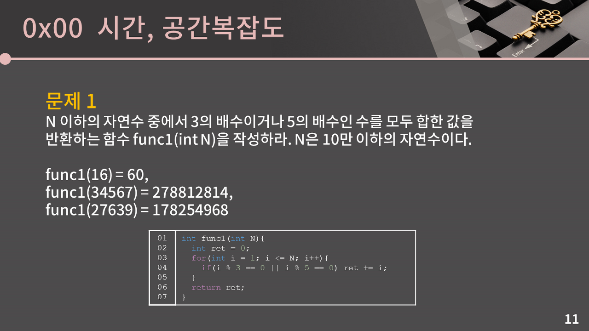
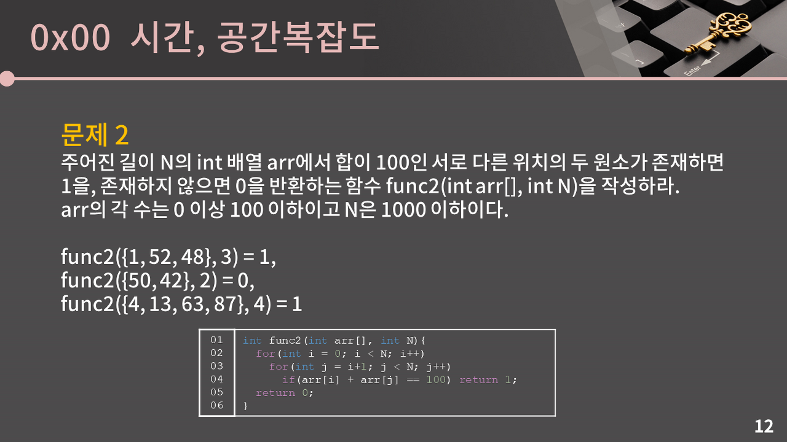

# 시간/공간 복잡도

아래의 함수가 몇 번의 연산을 수행하는지 확인해보자.

```cpp
int func1(int arr[], int n) {
    // 1번: cnt 변수를 선언하고 0을 넣는다.
    int cnt = 0;

    // 2번: i의 초기값을 0으로 대입한다
    for(int i=0; i<n; i++) {
        ////// 아래의 연산은 n번 수행되므로 n * (2 + 2 + 1) //////
        // 2번: i가 n보다 작은지 확인 + 그럴 경우 i에 +1 하는 연산 
        // 2번: arr[i]를 5로 나누고 + 0과 일치하는지 확인하는 연산
        // 1번: 5의 배수일 때 cnt를 +1 하는 연산
        if(arr[i] % 5 == 0) cnt++;
    }
    // 1번: cnt 값 반환
    return cnt;
}
```

최종적으로 1 + 1 + n * (2 + 2 + 1) + 1 = `5n + 3` 이라는 결과가 나온다. n이 100만이라면 대충 500만 번의 연산을 하게 된다.

빅오 표기법은 실제 알고리즘의 러닝 타임을 재기 위한 것이 아니라, 장기적으로 데이터가 증가함에 따라 처리 시간의 증가율을 예측하기 위한 것이다. 따라서 상수는 제외해서 `n에 비례한다`고 표현한다.

앞처럼 하나하나 계산하지 않고 빠르게 캐치할 수 있다. 결국 이 코드는 n개의 수를 훑어보면서 5로 나눈 나머지를 계산하는 코드다. 

for문에서 n번에 걸쳐 5로 나눈 나머지를 확인하고 0과 일치하면 cnt를 증가시킨다. 따라서 n에 비례하겠거니 하고 충분히 생각할 수 있다.

> 대회장에 N명의 사람들이 일렬로 서있다. 거기서 당신 이름이 '가나다'인 사람을 찾기 위해 사람들에게 이름을 물어볼 것이다.
> 이름을 물어보고 대답을 듣는데까지 1초가 걸린다면 얼마만큼의 시간이 필요할까?

앞에서부터 차례대로 물어보면 최악의 경우 n명이므로 n초가 걸린다. 최선의 경우라면 1초가 걸린다. 평균으로 따지면 중간까지 찾는거니까 n/2초가 필요하다. 결국 걸리는 시간은 n에 비례한다.

> 만약 사람들이 이름 순으로 서있다면 얼마의 시간이 필요할까?

술자리 업다운 게임을 하듯이 중간 사람에게 계속 물어보면 된다. 1과 50 사이에서 처음에 25를 불러서 범위를 줄이는 것과 같은 것이다.

최선의 경우는 맨 처음 사람이 가나다인 경우이니 1초가 된다. 최악의 경우엔 한 명이 남을 때까지 절반으로 계속 쪼개야 한다. 100명 -> 50명 -> 25명 -> 12명 -> 6명 -> 3명 -> 1명까지 도달하면 찾을 수 있는 것이다.

사람이 16명이면 16 -> 8 -> 4 -> 2 -> 1로 총 4번, 32명이면 5번, 64명이면 6번...이렇게 걸리니 결국 log N에 비례한다.

log는 밑이 2인 로그만 나오기 때문에 해당 수가 2의 몇 거듭 제곱인지를 의미한다. log 2 = 1, log 4 = 2, log 8 = 3 이정도만 이해해도 충분하다.

평균적으로는 log N초가 걸린다. 엄밀하게는 수학적으로 기댓값을 계산하면 (1-1/N)log N인데 1/N은 N이 커질 수록 사실상 0에 가까워서 log N으로 표현한다.

## 시간복잡도의 정의

입력의 크기와 문제를 해결하는데 걸리는 시간의 상관 관계. 첫 번째 문제에서 사람이 N명일 때 최악의 경우 N초가 걸렸고, 두 번째 문제에서는 log N초가 걸렸다. 이 시간이 각 문제의 시간복잡도다.

## 빅오 표기법

주어진 식을 값이 가장 큰 대표향만 남겨서 나타내는 방법

### O(n)

5N + 3, 2N + 10logN, 10N

### O(n^2)

N^2 + 2N + 4, 6N^2 + 20N + 10logN

### O(NlogN)

NlogN + 30N + 10, 5NlogN + 6

### O(1)
 
5, 16, 36


그래프를 보면 N이 점점 커질 수록 시간 복잡도의 차이가 크게 벌어진다.

O(log N)은 `로그 시간`, O(N)은 `선형 시간`, O(log N)부터 O(N^2)까지처럼 거듭제곱으로 나타내는 것을 `다항 시간`이라고 한다.


위는 N의 크기에 따른 허용 시간 복잡도다. 해당 시간 내에 풀지 못하면 그 풀이는 잘못된 것이다.

## 시간 복잡도 파악하기



```cpp
int func1(int n)
{
    int result = 0;
    for (int i = 1; i <= n; i++)
    {
        if ((i % 3 == 0 || i % 5 == 0))
        {
            result += i;
        }
    }
    return result;
}
```

N이 1부터 n까지 돌아가면서 확인하므로 O(N)의 시간 복잡도를 가진다.



```cpp
int func2(int arr[], int N)
{
    for (int i = 0; i < N; i++)
    {
        for (int j = i+1; j < N; j++)
        {
            if (arr[i] + arr[j] == 100)
            {
                return 1;
            }
        }
    }
}
```

가장 간단한 방법은 이중 for문이다. 

i가 0일 때 N-1개의 수에 대해 합을 비교하고, i가 1일 때 N-2개의 수에 대해 합을 비교하고...이렇게 반복하면 (N-1) + (N-2) + ... + 3 + 2 + 1 = (N^2-N)/2가 되며, 빅오 표기법으로 나타내기 위해 상수와 더 낮은 항을 없애 O(N^2)이 된다.

이 문제는 O(N)이 걸리는 풀이도 존재하지만 다음 강의에 설명하겠다.