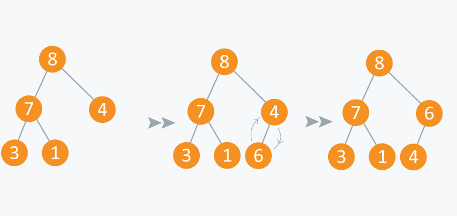
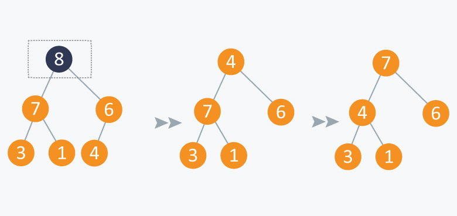

# 우선순위 큐

일반적인 큐는 먼저 들어간 순서대로 데이터가 나온다. 하지만 우선순위 큐는 들어간 순서는 상관 없이 우선순위가 높은 데이터가 먼저 나온다. 응급실에서 응급 환자를 먼저 보는 것과 마찬가지다.

우선순위는 프로그래머가 판단해서 결정해야 하며 우선순위가 같은 데이터가 존재할 수도 있다.

## 구현 방법

- 배열을 기반으로 구현
- 연결 리스트를 기반으로 구현
- 힙을 이용하는 방법

### 배열
#### 장점

- 상대적으로 간단하게 구현 가능함

#### 단점

- 데이터를 삽입하고 삭제하는 과정에서 한 칸씩 당기거나 미는 연산을 계속 해야함
- 삽입할 위치를 찾기 위해 배열에 저장된 모든 데이터와 우선 순위를 비교해야 함

### 연결 리스트
#### 장점

- 상대적으로 간단하게 구현 가능함

#### 단점

- 삽입할 위치를 찾기 위해 첫번째 노드부터 시작해 마지막 노드에 저장된 데이터까지 우선순위를 비교하며 진행함
    - 데이터가 많을 경우 성능 저하가 커짐
    
### 힙

위의 이유로 일반적으로 우선순위 큐는 최대 힙을 이용해 구현한다.

#### 최대 힙


부모 노드가 자식 노드보다 값이 큰 완전 이진 트리

- 모든 부모 노드가 자식보다 값이 큼
- 최대 힙의 root node는 항상 최대값을 가짐
- 전체 트리가 최대 힙 구조를 유지하도록 해야 함

## 최대 힙을 이용한 우선순위 큐


우선순위 큐는 일반적인 선형의 큐와는 다르게 트리 구조로 본다.

### 데이터 삽입



우측 하단에 6을 삽입했다. 삽입 이후에는 루트 노드까지 거슬러 올라가면서 최대 힙을 구성한다. 즉, 부모 노드와 비교해서 자신이 더 크면 교체한다.

### 데이터 삭제



루트 노드인 9를 삭제한 후 가장 마지막 원소를 루트 노드 위치로 옮긴다. 그리고 교체된 루트 노드부터 하향식으로 내려가면서 최대 힙을 구성한다.

```java
public class Main {
    public static int n = 100;

    public static int[] input = {9, 8, 1, 2, 5, 4, 7, 6, 3};

    public static void main(String[] args){
          Heap heap = new Heap();


    }
}
```

## 활용 사례

- 운영체제의 작업 스케줄링
- 정렬
- 네트워크 관리

이외에도 다양한 분야에서 사용한다.

## 시간 복잡도

배열이나 리스트를 사용하면 insert 하는 데에 O(N), 정렬하는 데에 O(NlogN)이 걸린다.

하지만 힙을 사용하면 insert하고 지우는 데에 O(logN)이 걸린다.


[Heaps and Priority Queues](https://www.hackerearth.com/practice/notes/heaps-and-priority-queues/)