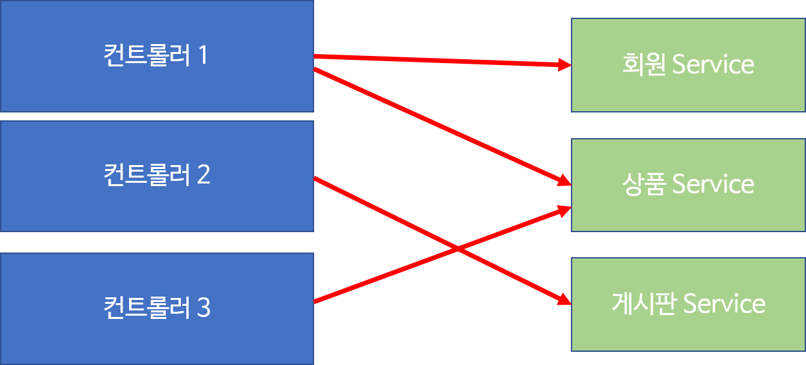

# Layered Architecture

상품 목록 보기에서도 메인 화면에서도 회원 정보를 보여줘야 한다면 회원 정보와 관련한 기능만 별도의 객체로 만들어 이용해야 중복을 줄일 수 있다. 

회원 정보 기능을 별도의 객체인 `서비스`로 구현하는데, 이때 사용하는 메서드를 `비즈니스 메서드`라고 한다. 

즉, `서비스` 객체란 비즈니스 로직을 수행하는 메서드를 가진 객체이며 하나의 비즈니스 로직은 하나의 트랜잭션으로 동작한다.

한 트랜잭션은 여러 개의 DB 작업이 수행될 수도 있다. 이때 비즈니스 메서드마다 중복되는 기능을 호출하는 경우도 생긴다.

서비스 객체에서도 이런 중복되는 부분은 별도로 분리해야 한다.

지금까지 내용을 그림으로 정리하면 위와 같다.

### Presentation Layer

컨트롤러 객체가 동작하는 부분

### Service Layer

비즈니스 메서드를 갖고 있는 서비스 객체가 동작하는 부분

- 실제 DB에 접근해서 데이터를 가져오는 등의 업무를 수행한다.
- Repository Layer에 있는 DAO 객체를 사용한다.

### Repository Layer

DAO 객체를 제공하는 부분

---

이렇게 레이어를 나누면 어느 한 레이어를 바꿔 끼어도 정상적으로 동작하므로 재사용이나 유지 보수 측면에서 매우 유리하다. 개발하면서 이 로직을 어느 레이어에 두는게 맞을지 고민하며 구현해야 한다.