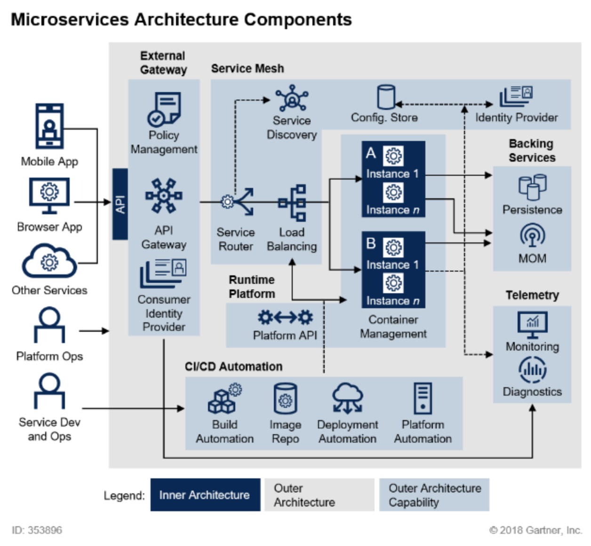
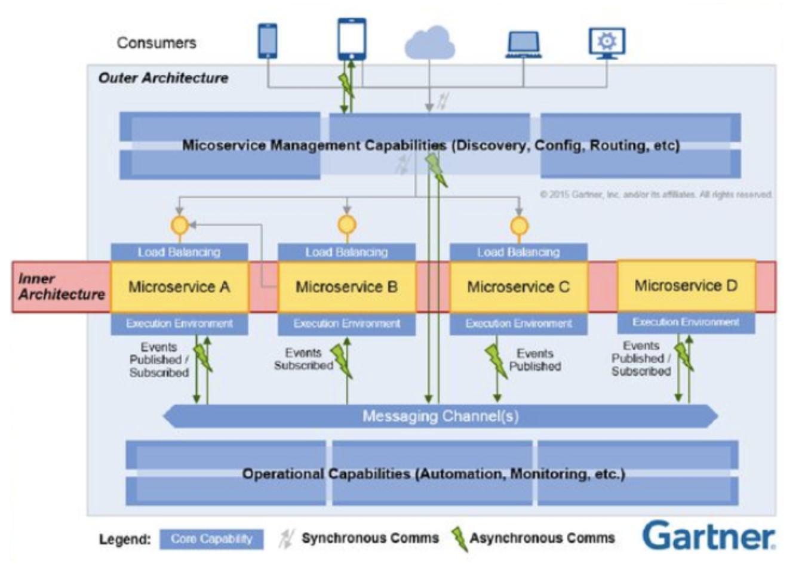
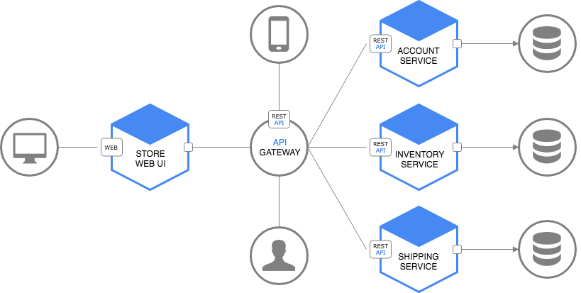
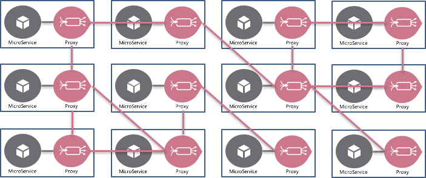
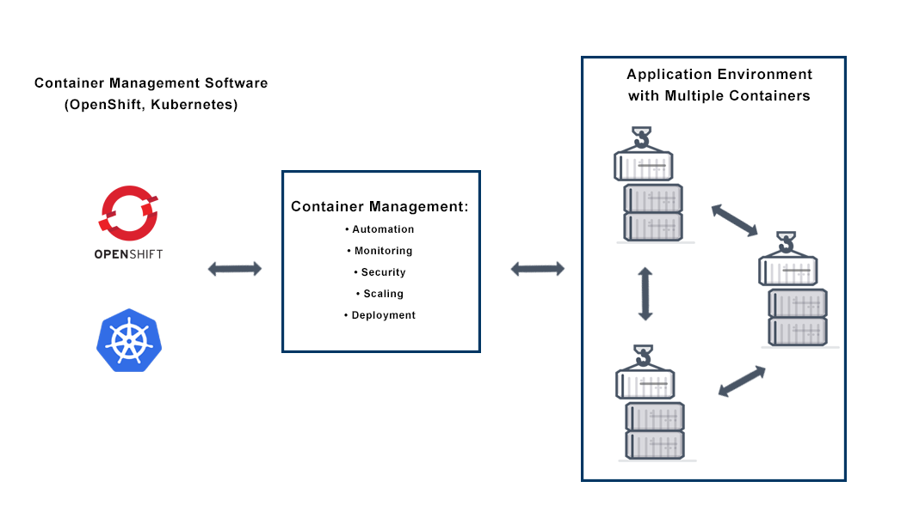
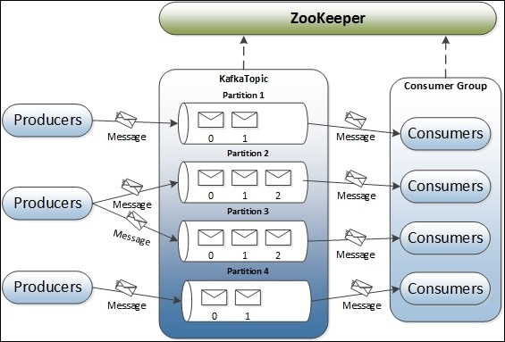

# MSA의 아키텍처 구성

MSA는 크게 Inner와 Outer로 나뉜다.

## Inner Architecture

내부 서비스를 어떻게 쪼갤지에 대한 아키텍처다.

### 마이크로 서비스를 어떻게 정의할까?

쇼핑몰을 만든다고 치자. 주문하기와 카트에 넣기를 같은 서비스로 넣을지, 분리할지 결정해야 한다.

비즈니스, 시스템 특성, 배포 용이성, 장애 대응, 운영 율성 등 많은 부분을 고려해야 한다.

### DB Access 구조를 어떻게 설계할까?

마이크로 서비스는 보통 일관된 API로 데이터에 접근한다. 각 서비스는 자체적으로 DB를 가질 수 있는데, 어떤 트랜잭션은 여러 개의 마이크로 서비스에 걸쳐 있어서 정합성을 어떻게 보장할지 생각해야 한다.

### API를 어떻게 설계할까?

### 논리적인 컴포넌트들을 어떤 layer로 설계할까?

Inner Architecture는 비즈니스, 서비스, 시스템마다 특성이 달라서 표준이 없다. 그래서 설계하는 데에 어려움이 따른다.

## Outer Architecture

다시 이 그림을 살펴보면 Outer Architecture는 총 6개로 분류된다.

### External Gateway

외부에서 들어오는 요청을 내부 구조를 드러내지 않고 처리하기 위한 요소다.

- 사용자 인증(Consumer Identity Provider)
- 권한 정책 관리(Policy Management)

#### API Gateway

서버 맨 앞에서 모든 API 호출을 받고 적절한 서비스에 다시 전달(routing)하는 핵심 역할을 맡는다.

### Service Mesh

마이크로 서비스 간의 네트워크를 제어한다.

- Service Discovery
- Service Routing
- 트래픽 관리
- 보안

### Container Management

컨테이너로 애플리케이션을 운영하면 유연한 설계가 가능하고 자율성을 가진다. 개발자가 쉽게 접근하고 운영할 수 있어 MSA에 적합하다.

컨테이너 관리를 도와주는 툴은 Kubernetes가 대표적이다. AWS의 EKS, Google의 Cloud Platform은 Kubernetes를 지원한다.

- 자동화
- 모니터링
- 보안
- 스케일링
- 배포

### Backing Service

애플리케이션이 실행될 때 네트워크로 사용할 수 있는 모든 서비스를 의미한다. 데이터베이스, 캐시 시스템, SMTP 등 애플리케이션과통신하는 리소스를 지칭하는 포괄적인 개념이다.

#### Message Queue

MSA는 송신자와 수신자가 직접 통신하지 않고 Message Queue를 이용해 비동기적으로 메시지를 주고 받는다.

장애가 발생하면 MSA는 새로운 마이크로 서비스를 신규 생성하거나 재생성하게 된다. 이때 Message Queue를 사용하지 않아 결합이 강한 구조라면, 여러 서비스에 걸쳐있는 트랜잭션을 처리할 때 한 서비스가 죽으면 그 트랜잭션이 끊어진다. 이렇게 되면 그 요청을 보존할 수가 없어 큰 에러가 발생한다. 게다가 REST 통신은 트랜잭션 실패를 처리하는 방법이 굉장히 복잡하다.

따라서 MSA에서 데이터를 변경하거나 보상 트랜잭션과 관련된 처리는 Message Queue를 활용해 비동기적으로 처리해야 한다.

### Telemetry

실시간으로 원격 측정을 할 수 있는 기능이다. MSA는 분산 환경에서 대부분 운영되므로 각 서비스들을 하나하나 모니터링 하고 이슈에 대응하기가 힘들다.

Telemetry는 서비스를 모니터링 하고 각 서비스에서 발생하는 이슈에 대응할 수 있는 환경을 구성해준다.

### CI/CD Automation

CI/CD는 애플리케이션 개발 단계를 자동화해서 좀 더 짧은 주기로 고객에게 제공할 수 있는 방법이다. 이렇게 자주 배포를 하러면 자동화는 필수적이다.