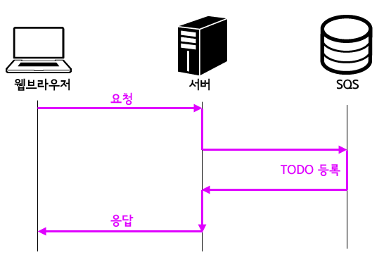

# SQS(Simple Queue Service)

- 해야할 일을 나중에 처리하거나 다른 시스템이 처리할 수 있도록 하는 비동기 메시징 서비스

SQS는 처리해야할 업무에 대한 TODO 리스트 같은 것이다. 시스템에서는 이런 것을 `메시지`라고 부른다. SQS는 이 메시지의 저장소다.

AWS에서 제공하는 것이므로 처리할 수 있는 메시지 양을 신경쓰지 않아도 되며 가격도 매우 저렴하다. 중복적으로 처리하는 것을 막아주는 역할도 한다.

## 사용 사례
### Youtube

Youtube를 AWS에서 구축한다고 해보자. 대규모의 사용자가 전송하는 대용량의 데이터를 처리해야 한다. 이런 서비스는 독립적인 시스템을 여러 개 쪼개서 구축하고 각 시스템이 서로 협력하는 방식으로 구현해야 효율적이다.

예를 들어, 사용자가 업로드한 영상을 수신하는 `수신자`, 업로드 된 영향을 전달 받아 인코딩 하는 `인코더`, 인코딩이 끝났음을 업로더에게 알리는 `메일러`로 시스템을 나눴다고 생각해보자.

서로 협력하기 위해서는 각자의 진행 상황을 공유하며 다음과 같이 데이터를 처리한다.

1. `수신자`가 SQS에 업로드 된 동영상을 추가한다.
2. `인코더`가 정기적으로 SQS를 확인한다.
3. SQS에 영상이 추가되면 인코딩을 시작한다.
4. 인코딩이 끝나면 SQS에 해당 영상을 추가한다.
5. `메일러`는 SQS에 인코딩이 끝난 영상이 존재하는지 확인한다.
6. 동영상이 발견되면 업로더에게 이메일을 발송한다.

### 새 글 작성 알림

새 글을 쓰면 구독자에게 이메일로 알리는 시스템이 있다고 해보자. 그런데 구독자가 많은 블로그는 매우 오랜 시간 사용자를 대기하게 만들 것이다.

1. 새 글이 작성되면 작성되었다는 사실을 SQS에 알린다.
2. 백그라운드에서 SQS를 처리한다.

이렇게 하면 대기 시간을 줄일 수 있다.