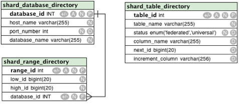
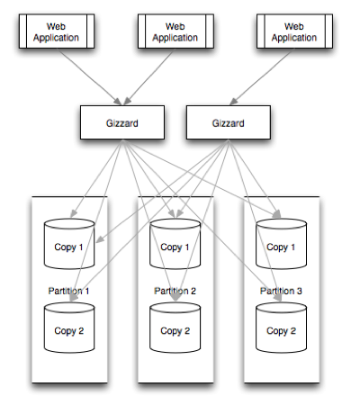

# 샤딩

데이터가 많아져 하나의 DB로 감당이 힘들게 되면 여러 DB를 이용해야 한다. Cassandra나 Dynamo처럼 분산 환경을 고려해 만들어진 DB도 있지만 범위 검색에 취약하거나 JOIN 연산이 불가한 것 등등 기능에 제약이 많다.

상대적으로 풍부한 기능으로 데이터를 확장하려면 RDMBS를 샤딩하는 것이 좋다. 최근에는 직접 샤딩을 구현하지 않고 샤딩 플랫폼을 도입한다. 샤딩 플랫폼은 증가하는 데이터를 장애 없이 효과적으로 대응하고 서비스마다 각기 다른 데이터 특성과 모델에 대처해준다.

샤딩 플랫폼의 예시로는 [Spock Proxy](http://spockproxy.sourceforge.net/), [Gizzard](https://github.com/twitter-archive/gizzard), [CUBRID SHARD](https://www.cubrid.org/manual/ko/9.3.0/shard.html) 등이 있다.

## 수평 분할

* 스키마가 같은 데이터를 두 개 이상의 테이블에 나누어 저장하는 것
  * 예\) `User Table`을 동일 스키마의 13세 미만의 유저를 저장하는 `User Table #0`과 13세 이상의 유저를 저장하는 `User Table #1`로 분할하여 사용
  * 예\) 주민 데이터를 처리하기 위해 같은 스키마 안에서 `서현동 주민 테이블`과 `정자동 주민 테이블`을 나눠 사용
* [인덱스](https://itholic.github.io/database-index/)의 크기를 줄이고 작업 [동시성](https://seamless.tistory.com/42)을 늘릴 수 있다.
* 보통 하나의 DB 안에서 이루어진다.

## 샤딩

* 물리적으로 아예 다른 DB에 데이터를 분산 저장하고 조회하는 방법
  * 예\) `User Table`이 여러 데이터베이스에 있을 때 13세 미만의 유저를 0번 데이터베이스에, 13세 이상의 유저를 1번 데이터베이스에 저장
  * 예\) `주민` 테이블이 여러 DB에 있을 때 `서현동 주민`은 A DB에, `정자동 주민`은 B DB에 저장
* 수평 분할 방식을 사용한다.
* 하나의 데이터 베이스 인스턴스에 넣을 수 없는 큰 데이터를 분산 처리하기 위해 사용한다.
* 여러 DB를 다루기 때문에 JOIN 연산, 일관성, 복제 등에 불리하다.
* 예전에는 애플리케이션 서버 레벨에서 구현했으나 최근에는 플랫폼 레벨에서 제공한다.
---
* 서버에서 동작하는 형태
  * Hibernate Shards
* 미들티어로 동작하는 형태
  * CUBRID SHARD
  * Spock Proxy
  * Gizzard
* 데이터베이스 자체에서 제공하는 형태
  * nStore
  * MongoDB

## 샤딩 플랫폼

샤딩 플랫폼은 사용자가 설정한 기준에 따라 다양한 DB 중 한 곳을 선택해 CRUD 연산을 수행해야 하며 다음의 항목을 고려해야 한다.

* 데이터베이스 위치 추상화
  * 애플리케이션 서버에서 어떤 데이터\(ROW\)가 어떤 DB에 들어가있는지 알 필요가 없도록 하는 것
  * 애플리케이션은 단지 샤딩 플랫폼과 연결만 되어있을 뿐, DB에 연결하는 건 샤딩 플랫폼의 역할이다.
* 확장성
  * 따라서 DB를 [마이그레이션](https://www.popit.kr/나만-모르고-있던-flyway-db-마이그레이션-tool/)하고 교체하기 위해 샤드\(분할된 DB 중 하나\)에 복제 저장소를 추가할 때, 애플리케이션 서버의 재시작이나 변경이 필요없다.
  * 샤딩 플랫폼이 중단되면 애플리케이션 서버는 DB에 접근할 수 없으므로 샤딩 플랫폼의 이중화를 고려해야 한다.
* 모니터링과 운영에 용이함
  * Shard key별로 요청 개수와 에러 정보를 보여줄 수 있어야 한다.

### Shard key

* 어떤 데이터베이스에 데이터가 저장되어 있는지 판단하는 기준
* 샤딩의 기준이 되는 키가 명확하면 나눠서 저장하기가 쉽다.
  * 예\) 개인화 서비스의 경우 사용자의 ID 별로 샤드 키를 잡는다.
* 샤드 키를 무엇으로 잡아야 할지 명확하지 않은 경우 조심해야 한다. 
  * 중간에 샤드키를 바꾸는 비용은 굉장히 크기 때문이다. 
  * RDB는 사용량이 늘어났을 때 분산하는 비용이 비싸므로 성장할 서비스라면 RDB 자원을 아껴 쓸 필요가 있다.

## Spock Proxy

[MySQL Proxy](http://www.hanbit.co.kr/channel/category/category_view.html?cms_code=CMS8168518374)를 바탕으로 제작한 샤딩 플랫폼이다. MySQL Proxy는 SQL을 분석하고 변경하는 데에 목적이 있으며, SQL 수행 전/후에 Lua 스크립트를 실행해 쿼리나 ResultSet에 대한 설정을 할 수 있다.

사용하기 위해서는 MySQL DB를 하나 생성한 다음, 위의 그림에 있는 테이블에 row를 추가해야 한다. 이 row는 샤딩을 위해 정한 규칙이다.

* Sharding rule 저장
  * MySQL DB의 테이블에 샤딩 규칙을 저장한다.
* Shard key 생성 방법
  * Modulo
* Shard key 찾는 법
  1. 애플리케이션 서버로부터 전달받은 SQL을 파싱한다.
  2. 해당 SQL에 shard key가 있는지 파악한다.
  3. shard key가 있다면 DB에 기록된 기준에 따라 MySQL의 인스턴스를 찾아 SQL을 전달한다.

### 장점

* shard key에 대한 정보를 따로 기술할 필요가 없다.
* 따라서 샤딩을 쓰지 않다가 적용해야 할 경우 SQL을 변경하지 않고도 진행할 수 있다. \(단, 스키마 변경이 없거나 기존 SQL 변경 없이 샤딩을 적용할 수 있는 상태일 경우\)

### 단점

* SQL을 파싱한 후 샤드를 찾는 방식은 Spock Proxy와 MySQL 둘 다 SQL을 파싱하는 불필요한 작업을 하기 때문에 성능 이슈가 있다.

## Gizzard

Twitter에서 공개한 샤딩 플랫폼이다. Spock Proxy와는 용도와 아키텍쳐가 다르다.

위 그림은 두 대의 Gizzard가 여러 개의 DB로 샤딩된 데이터를 처리하는 모습이다.

* 미들티어 차원에서 데이터베이스 마이그레이션을 할 수 있다.
  * 예\) Gizzard에서 직접 DB를 복제할 수 있다.
  * MySQL, Oracle에는 복제 기능이 이미 있으므로 Spock Proxy등의 미들티어에서 제공할 필요는 없다.
  * Gizzard의 복제 기능은 단순한 방식이라 한계가 있지만, 복제 기능이 없는 DB를 사용할 때 유용하다.
* 애플리케이션 서버는 JDBC가 아니라 [Thrift](https://ko.wikipedia.org/wiki/아파치_스리프트)라는 RPC 프로토콜을 사용한다.
  * 스키마가 달라지면 Gizzard도 수정해야 한다. 
  * RDBMS 외의 여러 데이터베이스를 연결할 수 있는 장점이 있다.

## 샤딩의 한계

* 두 개 이상의 샤드에 대해 JOIN을 할 수 없다.
* auto increment는 샤드마다 달라질 수 있다.
* 가장 최근에 추가한 auto increment 값을 리턴하는 last\_insert\_id\(\) 값이 유효하지 않다.
* shard key의 column 값은 update 할 수 없다. delete와 insert를 사용한다.
* 하나의 트랜잭션에서 두 개 이상의 샤드에 접근할 수 없다.

이러한 제약 사항이 문제가 되지 않도록 데이터 모델링 하는 것이 중요하다.

[NHN의 안과 밖: Sharding Platform](https://d2.naver.com/helloworld/14822)

[ADT 활용 예제1: MySQL Shard 데이터 재분배](https://tech.kakao.com/2016/07/01/adt-mysql-shard-rebalancing/)

