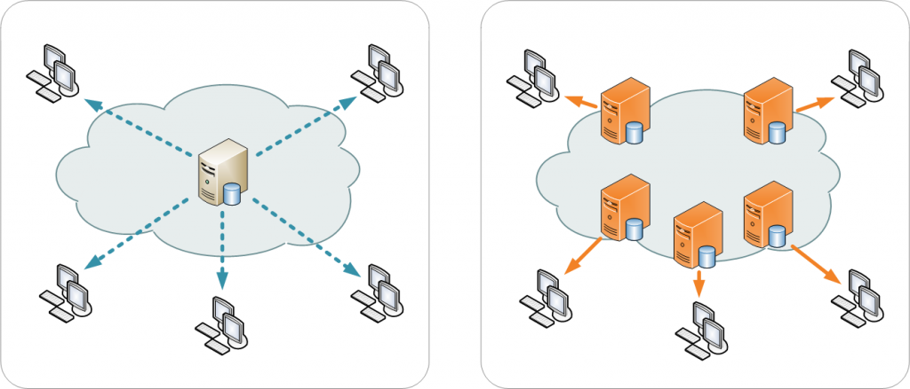

# CDN(Contents Delivery Network)

지리적, 물리적으로 떨어져있는 사용자에게 컨텐츠를 더 빠르게 제공하기 위한 기술이다. 즉, Origin과 End User(Client) 사이에 컨텐츠를 전달하는 역할을 의미한다.

사용자와 Origin Server가 멀리 떨어져 있으면 컨텐츠를 받을 때 시간이 오래 걸린다. 따라서 사용자와 가까운 곳에 Cache Server를 설치하고 컨텐츠를 저장(캐싱)하면 요청 시에 Cache Server가 응답을 보내게 한다.

CDN은 웹, 애플리케이션, 스트리밍 미디어 등 다양한 콘텐츠를 전송하도록 전 세계에 촘촘히 분산되어 있다.

## 장점

CDN을 사용하지 않으면 오리진 서버는 모든 엔드 유저의 요청에 일일이 응답해야 한다. 이는 오리진에 막대한 트래픽을 유발해 장애가 발생할 확률을 높인다. 

CDN이 오리진을 대신해 엔드 유저와 가까운 물리적 위치/네트워크에서 요청에 응답하면 서버의 트래픽 부하를 줄이고 엔드 유저의 경험을 개선할 수 있다.