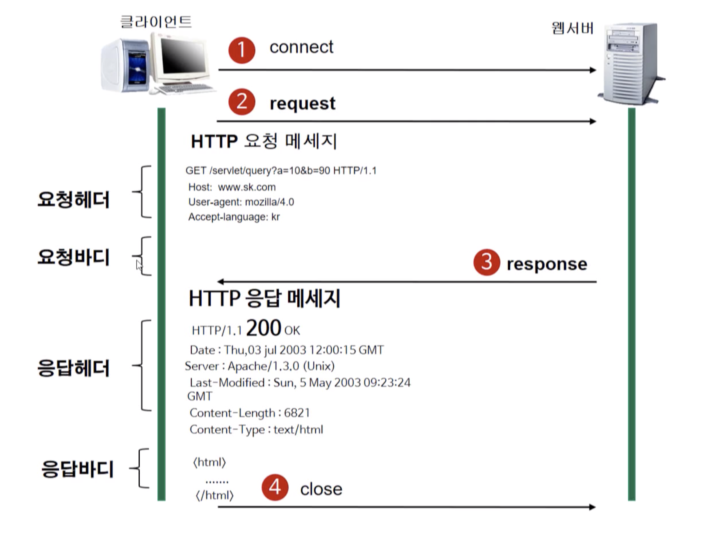
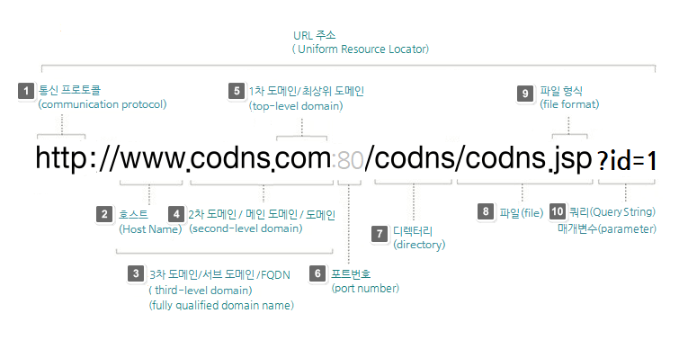

# HTTP 프로토콜

사람들끼리 통화를 하러면 서로 알아들을 수 있는 언어를 사용하고, 한쪽이 말할 때 다른 쪽은 들어야 하며, 연결이 끊어지면 대화를 계속할 수 없는 등 몇 가지 규약이 있다.

웹 브라우저와 웹 서버 간에도 통신을 하려면 규약이 필요하다. 이때 필요한 것이 HTTP 프로토콜이다.

## HTTP(Hypertext Transfer Protocol)

서버와 클라이언트가 인터넷 상에서 데이터를 주고받기 위한 프로토콜이다. 제일 많이 사용되는 것은 HTTP 1.1이며, HTTP 2.0까지 등장했다.

- 이미지, 동영상, 오디오, 텍스트 문서 등 종류에 상관없이 전송할 수 있다.
- 클라이언트가 요청을 서버에 보내면 서버가 클라이언트에게 응답을 보낸다.
- 클라이언트와 서버가 요청과 응답을 마치고 나면 바로 연결을 끊는다.
    - 클라이언트가 다음 내용을 요청해도 서버는 이 클라이언트가 아까랑 같은지 알 수 없다.

## 작동 방식

HTTP는 서버-클라이언트 모델을 따른다.

웹이 동작하려면 반드시 클라이언트가 원하는 서버에 접속을 해야 한다. 원하는 것을 서버에 요청하면 서버는 클라이언트가 접속해서 요청한 사항에 대해서만 응답 결과를 돌려준다. 응답이 끝나면 연결은 끊기는 무상태성을 가진다.

이렇게 주고 받는 데이터는 정해진 규칙이 있는데 이것을 `요청 데이터 포맷`이라고 한다.

### 요청 헤더

> GET /servlet/query?a=10&b=90 HTTP/1.1

GET이라는 `요청 메서드` + 자원의 위치를 명시하는 `URI` + `http 프로토콜 버전`으로 구성된다.

> Host: www.sk.com
> User-agent: mozilla/4.0
> Accept-language: kr

그 아래에는 여러 줄의 헤더 정보가 나온다. 각 줄의 헤더 명과 해더 값이 콜론으로 구분되어 있다.

### 요청 바디

요청 바디에는 아무 것도 쓰여있지 않다. GET 방식은 요청할 때 필요한 자원을 URI에 붙여서 가져가기 때문에 없는 것이다.

POST나 PUT일 경우는 바디에 내용이 들어온다.

### 응답 헤더

> HTTP/1.1 200 OK

응답 HTTP 프로토콜의 버전과 응답 코드, 응답 메시지가 들어간다.

그 아래 나머지 헤더 부부에는 날짜, 웹 서버 이름과 버전, 콘텐츠 타입, 캐시 제어 방식, 콘텐츠 길이 등의 값이 써있다.

### 응답 바디

헤더 아래의 빈 줄 다음으로 나오는 것이 실제 응답 리소스 데이터다.

### 장점

- Stateless(무상태성)이므로 불특정 다수를 대상으로 하는 서비스에 적합하다.
- 클라이언트와 서버가 계속 연결된 상태가 아니므로 정해진 최대 연결 수보다 더 많은 요청과 응답을 처리할 수 있다.
    - 10명만 들어올 수 있는 공유 폴더라도 10명 모두가 계속 연결을 유지하는 것이 아니므로 더 많은 사람을 수용할 수 있다.

### 단점

- Stateless(무상태성)라 연결을 끊어버리므로 클라이언트의 이전 상황을 알 수가 없다.
    - 결제를 하려고 들어갔는지 뭘 쇼핑했는지 알지 못할 수가 있다.
- 따라서 특정 정보를 유지하려면 cookie 등을 사용한다.

## URL(Uniform Resource Locator)

인터넷 상에서 자원이 위치하는 곳을 가리킨다. 특정 웹 서버에서 특정 파일에 접근하기 위한 경로나 주소다.

> 참고) IP는 집 주소고 Port는 집 안에 존재하는 방이라고 생각하면 된다. 하나의 방에 여러 서버가 존재할 수 없다.

## 요청 메서드

### GET

정보를 요청한다.(SELECT)

### POST

정보를 밀어넣는다.(INSERT)

### PUT

정보를 업데이트 한다.(UPDATE)

### DELETE

정보를 삭제한다.(DELETE)

### HEAD

HTTP 헤더 정보만 요청한다. 해당 자원이 존재하는지, 서버에 문제가 없는지 확인하기 위해 사용한다.

### OPTIONS

웹 서버가 지원하는 메서드의 종류를 요청한다.

### TRACE

클라이언트의 요청을 그대로 반환한다. echo로 서버 상태를 확인하기 위한 목적으로 사용한다.

## HTTPS(HyperText Transfer Protocol Secure)

기존 HTTP에 보안을 추가한 프로토콜이다.

### SSL

### TLS

