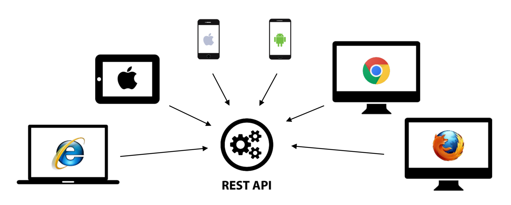

# REST API

REST API는 핵심 컨텐츠와 기능을 외부 사이트에서 활용할 수 있도록 돕는 인터페이스다. 예를 들어, 블로그에 글을 쓰고, 목록을 조회하고, 지도를 사용할 수 있도록 돕는 것이다.

웹 뿐만 아니라 앱 등 다양한 클라이언트가 등장하면서 이들에 대응하기 위해 널리 사용되기 시작했다. 

### Mashup

서비스 업체들이 제공하는 다양한 REST API를 조합해 애플리케이션을 만드는 것

> ex) 네이버 API, 공공 API 등

## REST API의 조건

아래의 조건을 지키지 않으면 진정한 REST API가 아니다.

### Client - Server

REST 서버는 API 제공, 클라이언트는 사용자 인증, 컨텍스트(세션, 로그인 정보) 등을 관리한다.

이렇게 서로 역할이 명확히 구분되기 때문에 서로 의존성이 줄어든다.

### Stateless

작업하기 위한 상태 정보를 따로 저장하고 관리하지 않는다. 즉 세션 정보나 쿠키를 따로 사용하지 않기 때문에 API 서버는 단순히 들어오는 요청만 처리하면 된다.

따라서 서비스 자유도가 높고 서버에서 불필요한 정보를 관리하지 않아도 되므로 구현이 단순해진다.

### Cachable

REST는 HTTP 기존 웹 표준을 그대로 사용하기 때문에 웹에서 사용하는 기존 인프라를 활용할 수 있다.

따라서 HTTP의 캐싱 기능을 적용할 수 있다. HTTP 프로토콜 표준에서 사용하는 Last-Modified 태그나 E-Tag를 이용하면 캐싱을 구현할 수 있다.

### Uniform Interface

URI로 지정한 리소스 조작법을 통일되고 한정적인 인터페이스로 수행하는 아키텍처 스타일이다.

HTTP 프로토콜을 사용한다면 다른 것들은 쉽게 구현 가능하지만 문제는 Uniform Interface다.

- 리소스가 URI로 식별되어야 한다.
- 리소스를 생성/수정/추가하려면 HTTP 메시지에 표현해서 전송해야 한다.
- 메시지는 스스로 설명할 수 있어야 한다.(Self-descriptive Message)
    - 보통 응답결과는 JSON 메시지로 보내는데, 이 메시지가 어디에 전달되고 어떤 의미를 표현해야 하는지 스스로 표현하기 쉽지 않다.
- 애플리케이션 상태는 Hyperlink로 전이되어야 한다.(HATEOAS)
    - HATEOAS를 API에서 제공하는 것이 쉽지 않다.

#### HATEOAS

리스트 보기에 상세보기나 글쓰기로 갈 수 있는 링크/상세보기에 글 수정이나 삭제로 갈 수 있는 링크 등 웹 페이지 자체에 관련 링크가 있는 것을 HATEOAS라고 한다.

### Layered System

REST 서버는 다중 계층으로 구성될 수 있다. 보안, 로드 밸런싱, 암호화 계층 등을 추가해서 구조를 유연하게 둘 수 있다.

Proxy, 게이트웨이와 같은 네트워크 기반의 중간 매체를 사용할 수도 있다.

### Code-on-Demand(Optional)

## REST API 디자인 가이드

1. URI는 정보의 자원을 표현해야 한다.
2. 자원에 대한 행위는 HTTP Method(GET, POST, PUT, DELETE)로 표현한다.

## Web API(HTTP API)

REST의 uniform interface를 지원하는 것이 쉽지 않기 때문에 많은 서비스가 모든 조건을 지키지 않은 채 API를 만들고 있다.

REST의 모든 것을 제공하지 않으면서 REST API라고 부르거나, WEb API/HTTP API로 부르는 두 경우가 있다.