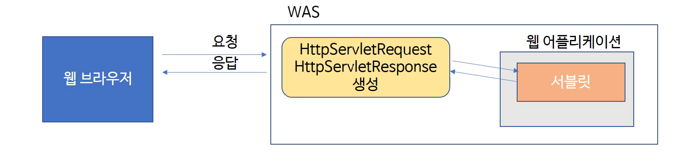

# Servlet

자바 웹 애플리케이션의 구성 요소 중 하나로, 동적인 처리를 담당한다. WAS에 동작하는 JAVA 클래스다. `HttpServlet` 클래스를 상속받아 사용한다.

웹 페이지를 구성하는 화면(HTML)은 JSP로 표현하고, 복잡한 프로그래밍은 서블릿으로 구현한다.

## 라이프 사이클

1. Initialization
    - 리소스를 불러온다.
2. Service
    - 요청을 받아 처리하고 응답을 보낸다.
    - GET일 경우는 doGet(request, response) 메소드를 호출한다.
    - POST일 경우는 doPost(request, response) 메소드를 호출한다.
3. Destruction
    - 리소스를 해제한다.
    
## 요청과 응답

WAS는 웹 브라우저로부터 서블릿 요청을 받으면 다음과 같이 처리한다.

1. `HttpServletRequest` 객체를 생성해 요청할 때 가지고 있던 정보를 저장한다.
2. 웹 브라우저에게 응답을 보낼 때 사용할 `HttpServletResponse` 객체를 생성한다.
3. 생성된 `HttpServletRequest`와 `HttpServletResponse` 객체를 서블릿에 전달한다.

### HttpServletRequest

http 프로토콜의 request 정보를 서블릿에 전달하기 위한 목적으로 사용한다.

- 헤더 정보, 파라미터, 쿠키, URI, URL 등의 정보를 읽는 메서드를 가지고 있다.
- 바디의 stream을 읽는 메서드를 가지고 있다.

### HttpServletResponse

- WAS는 어떤 클라이언트가 요청을 보냈는지 알고 있는 상태에서 응답을 보내기 위해 `HttpServletResponse` 객체를 생성해 서블릿에 전달한다.
- 서블릿은 `HttpServletResponse`를 가지고 content type, 응답 코드, 응답 메시지를 전송한다.
 