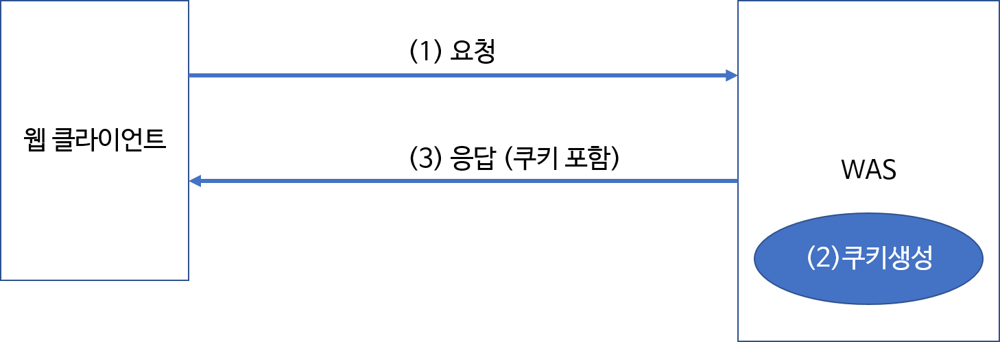
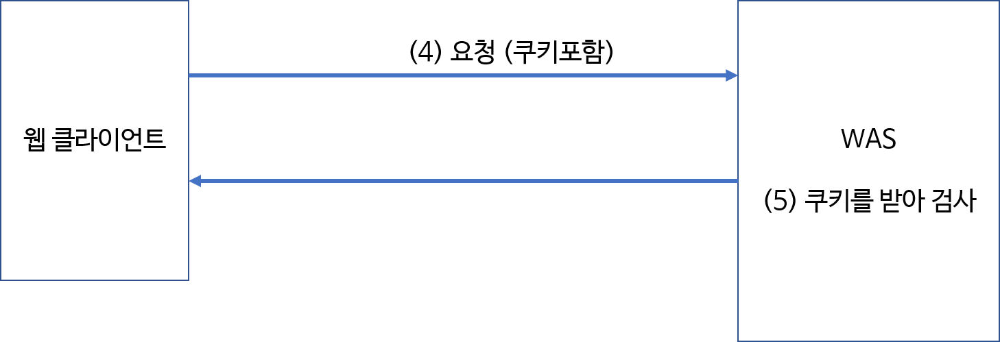
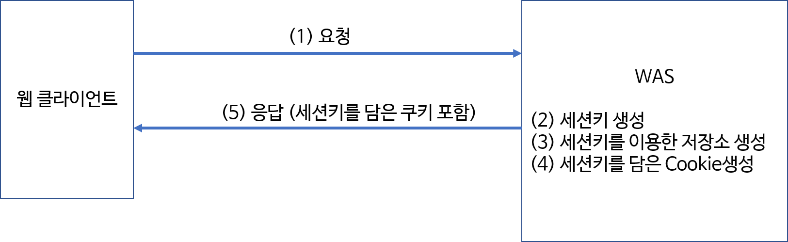
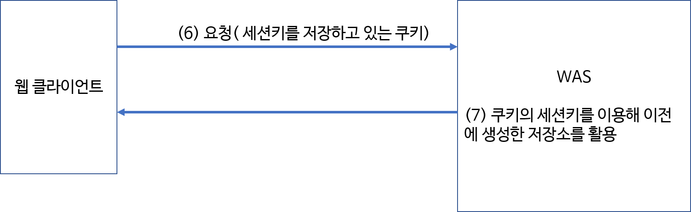

# 상태 정보

HTTP 프로토콜은 상태 유지가 되지 않는 프로토콜이다. 따라서 서버는 클라이언트가 이전에 무슨 일을 했고 뭘 할 것인지 알지 못한다. 요청에 대한 응답이 끝나면 연결도 끊기는 것이다.

하지만 로그인이나 쇼핑 기록 등 유지해야 하는 정보가 있다면 cookie와 session을 사용할 수 있다.

## 쿠키

유지해야 할 정보를 `사용자 컴퓨터`에 저장한다.

- 사용자 쪽에 저장되므로 보안 정보 유출의 위험이 있다.
- 유효 시간이 지나면 사라진다.

일단 클라이언트가 서버에 요청을 보낸다. 이때 유지할 정보가 있다면 서버는 그 정보로 쿠키를 생성한다.

## 세션

유지해야 할 정보를 `서버`에 저장한다.

- 서버가 종료되거나 유효 시간이 지나면 사라진다.

