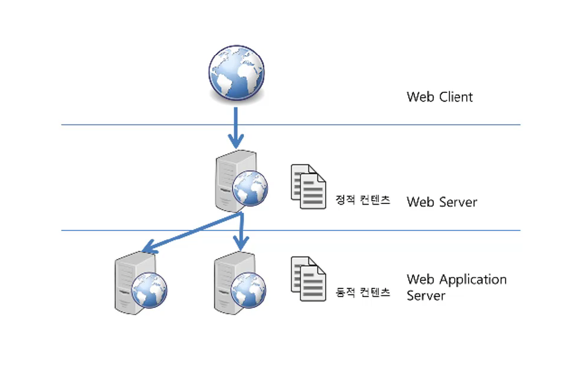

# WAS(Web Application Server)

## 배경

서버는 서비스를 제공하고 클라이언트는 그 결과를 보여준다. 웹 서버와 웹 브라우저가 대표적인 서버-클라이언트 관계다. 

DBMS가 등장하면서 클라이언트가 처리해야 할 것들이 많아지고 크기가 커지게 되었다. 프로그램 로직이 변경되면 클라이언트는 매번 새로를 배포해서 번거로웠고 대부분의 로직이 클라이언트에 포함되어 배포되므로 보안 문제도 있었다.

그래서 미들웨어가 등장했다. DBMS와 클라이언트를 직접 연결하지 않고 또 다른 서버를 두는 것이다.

클라이언트는 단순히 요청만 중앙에 있는 미들웨어에게 보내고 미들웨어가 대부분의 로직을 수행한다.

미들웨어는 데이터를 조작할 일이 있다면 DBMS에 부탁하고 결과를 클라이언트에게 전송하면 클라이언트가 화면에 보여주게 된다.

클라이언트는 복잡한 로직이 사라지고 화면에 결과만 보여주면 되므로 크기가 작아진다. 프로그램 로직이 변경되어도 모든 클라이언트를 배포할 필요 없이 중앙의 미들웨어만 변경하면 된다.

### WAS

최초에 웹이 등장했을 때 웹 브라우저는 단순히 정적인 데이터만 보여줬다. 하지만 웹이 보편화 되면서 데이터를 입력하고 조회하는 등 동적인 기능이 필요해졌다.

이런 동적인 기능은 프로그래밍을 통해야 가능했다. 이렇게 웹 서버에 프로그래밍 기능이 들어가는 것을 CGI라고 부른다.

CGI는 단순한 프로그래밍 정도는 사용할 때 별 문제가 없었다. 하지만 웹이 점점 복잡해지면서 더 고도화된 프로그래밍이 요구되었다. 특히 DBMS와 연관된 경우가 많았다.

따라서 클라이언트인 브라우저와 DBMS 사이에 동작하는 미들웨어가 필요하게 된 것이다. 이 미들웨어를 `WAS`라고 부른다.

## WAS의 주요 기능

- 프로그램 실행 환경과 DB 접속 기능을 제공한다.
- 여러 개의 트랜잭션을 관리한다.
- 업무를 처리하는 비즈니스 로직을 수행한다.
- 웹 서버의 기능도 기본적으로 제공한다.
    - 간단한 서비스는 톰캣 하나만 설치하면 Apache를 따로 설치하지 않아도 구동할 수 있다.

## 활용 사례

현업에서는 대부분 위의 형태로 구성한다. 웹 서버가 정적인 콘텐츠를 웹 브라우저에 전송하고 WAS는 동적인 결과를 웹 브라우저에 전송한다. 동적인 컨텐츠는 프로그램이 동작해서 얻은 결과를 말한다.

WAS의 웹 서버 성능이 웹 서버에 비해 떨어지는 것은 아니다. 과거에는 WAS의 웹 서버 기능이 떨어져 웹 서버와 같이 설치해야 했지만 지금은 많이 발전한 상태다.

그럼에도 불구하고 별도로 사용하는 이유는 웹 서버가 WAS보다 간단한 구조로 만들어져 있기 때문이다.

만약 사람이 많이 몰리면 WAS에 장애가 발생할 수 있다. 장애 때문에 재시작이 필요하면 웹 서버는 앞단에서 먼저 WAS를 사용하지 못하게 막아둔다. 그럼 사람들은 장애가 발생한지 모를 수 있다. 

이렇게 무중단으로 운영해서 장애를 극복하기 위해 보통 웹 서버가 WAS 앞단에 동작하도록 설정한다.

## 톰캣 버전 별 차이 점

자바, 서블릿, JSP, EL, 웹 소캣 등의 스펙이 다르다.