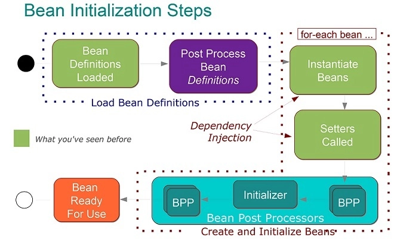

# 제어의 역전과 의존성 주입
## 제어의 역전

- 내가 사용할 의존성을 외부 즉, 프레임워크게 맡기는 것
- 스프링에서 IoC를 담당하는 컨테이너가 `빈 팩토리` 또는 `애플리케이션 컨텍스트`라고 불린다.

### BeanFactory

- 빈 인스턴스를 제공하고 관리하는 컨테이너의 인터페이스
- 스프링 IoC 컨테이너 최상위에 있음
- 빈 생성과 라이프사이클을 관리

### ApplicationContext

- 메타데이터, 빈 등 애플리케이션의 모든 정보를 가진 컨테이너
- BeanFactory 상속
- 애플리케이션이 시작할 때 빈을 초기화 함
- 리소스 로딩, 이벤트 발생, 다국어 등의 기능 추가

## 의존성 주입

- 사용할 객체를 직접 생성하지 않고 밖에서 주입 받는 것
- 의존하는 객체를 직접 생성하고 검색할 필요가 없어 코드 관리가 쉬워진다.
- IoC 컨테이너가 필요한 클래스를 초기화한다.

## 빈

- IoC 컨테이너가 관리하는 객체

### 빈 스코프

- 싱글톤이 기본값
- 애플리케이션 전반에 걸쳐 빈 인스턴스가 하나만 존재한다.
- 객체는 생성할 때마다 메모리를 할당받아야 하므로 이러한 메모리 낭비를 방지한다.
- 싱글턴으로 구현한 인스턴스는 전역이기 때문에 다른 클래스가 서로 데이터를 공유할 수 있다.

### 라이프 사이클

객체 생성 - 의존 설정 - 초기화(PostConstruct) - 사용 - 소멸(PreDestroy)

1. 자바나 xml 정의에 의해 빈이 인스턴스화 된다.
2. 사용 가능한 상태가 되기 위해 초기화한다.
3. 이후 더 이상 필요하지 않으면 IoC 컨테이너가 삭제한다.

1. 빈 팩토리가 `BeanPostProcessor`타입의 빈을 찾는다.
2. 그 중 하나인 `AutowiredAnnotaionBeanPostProcessor`를 찾는다.
3. `AutowiredAnnotaionBeanPostProcessor`가 빈을 처리한다.

---

### BeanPostProcessor

- 빈 라이프 사이클 인터페이스
- 이 인터페이스의 구현체에 의해 라이프 사이클이 동작한다.

### AutowiredAnnotationBeanPostProcessor

- `BeanPostProcessor`를 상속한다.
- `@utowired`, `@Value`, `@Inject`를 처리한다.
- `postProcessBeforeInitialization` 단계에서 `@Autowired`가 붙은 의존성을 주입한다.

### Initialization

- 빈의 인스턴스를 만든 후 초기화할 때의 라이프 사이클
- 이 단계 앞 뒤로 `postProcessBeforeInitialization`과 `postProcessAfterInitialization`이라는 부가적인 라이프 사이클 콜백을 제공한다.
- `PostConstruct` 애너테이션을 처리한다. 이 단계에서는 이미 빈이 주입된 상태가 된다.

## 빈 주입
### Constructor

- 가장 권장하는 방법
- 필수로 사용할 레퍼런스가 없으면 인스턴스를 만들지 못하기 때문
- 불변, 필수적인 의존 관계에 사용한다.
- 호출 시점에 딱 한번만 생성되는걸 보장한다.
- 순환 참조가 발생할 수 있다.
    - 서로가 생성자 주입을 하고 있다면 인스턴스를 생성할 수 없다.
    - 필드 주입이나 setter 주입으로 대체 가능하다.
    - 되도록 순환 참조가 발생하지 않도록 설계하는 게 제일 좋다.
- 스프링 4.3부터 생성자가 하나이며 주입받는 레퍼런스 변수가 빈으로 등록되어 있다면 `@Autowired` 생략 가능하다.

### Setter

- 해당 클래스의 인스턴스를 만든 후 IoC 컨테이너에 있는 빈 중에 주입할 타입을 찾아 setter로 넣어준다.
- 선택, 변경 가능성이 있는 의존 관계에 사용한다.
- 스프링 빈을 선택적으로 등록할 수 있다.

### Field

- `@Autowired`를 이용해 주입한다.
- 외부에서 변경이 불가능해 테스트가 힘들다.
- DI 프레임워크가 없으면 동작하기 어렵다.
- 애플리케이션 코드와 관계 없는 테스트 코드나 스프링 설정 목적으로 사용한다.
- final을 붙일 수 없다.
    - final은 생성자 주입으로만 초기화 할 수 있다.
    - final을 생성자 주입에 반드시 써야하는 건 아니지만 레퍼런스가 바뀌지 않는 걸 보장하기 위해서다.
    
