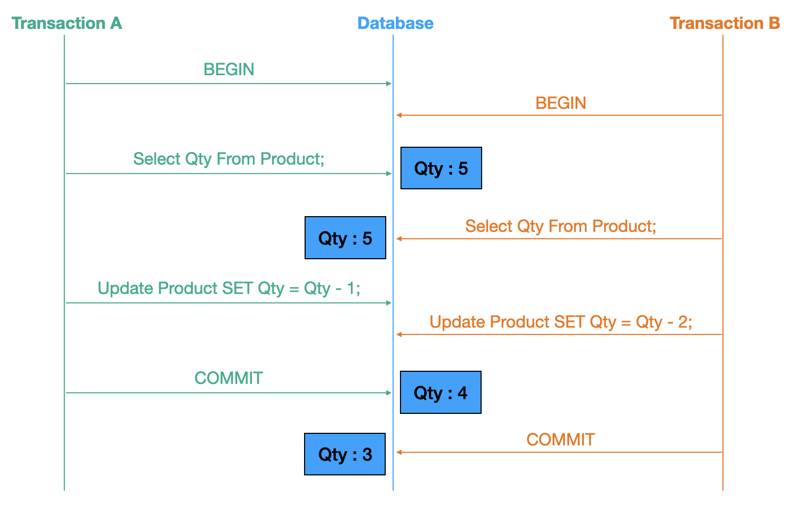
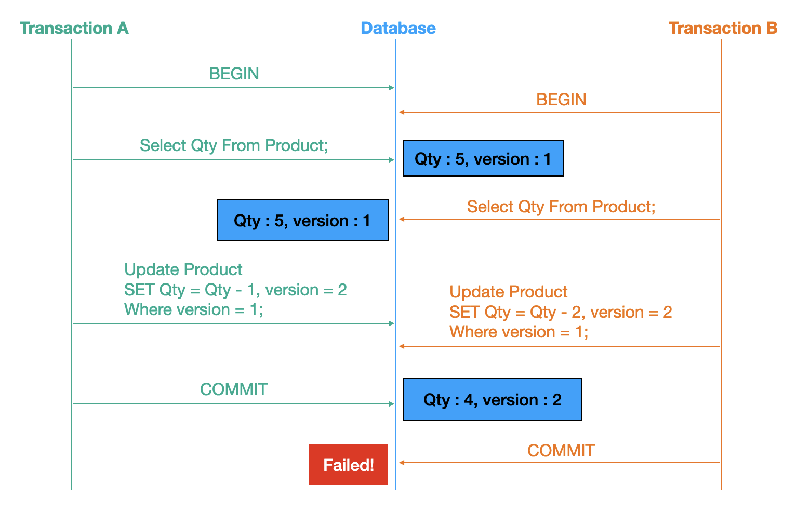
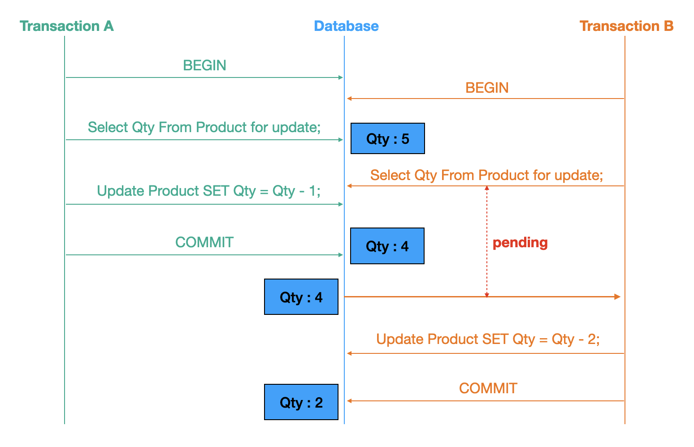

# JPA

## N+1

- 하위 엔티티의 데이터를 첫 쿼리 시 한 번에 가져오지 않고 지연 로딩으로 필요할 때 가져오면서 쿼리가 실행 되는 문제
- 최조 조회 건 + 하위 엔티티 데이터 수 만큼 발생해 `N+1` 이라고 한다.
- N이 커질수록 조회 성능이 좋지 않다.

### 지연 로딩

- 당장 조회하지 않는 엔티티는 프록시 객체로 박아놓는다.
- 실제 DB에 쿼리하는 시점이 되면 영속성 컨텍스트를 통해 초기화되어 데이터를 가져온다.
- 연관 객체 조회 시 select 쿼리를 다시 친다.

### 즉시 로딩

- 엔티티 조회 시 연관 객체를 한번에 가져온다.
- 프록시 객체를 사용하지 않기 때문에 하위 엔티티가 영속화 되어있지 않다면 select 쿼리를 한 번 더 친다.

---

두 방법 다 N+1은 발생할 수 있다.

## N+1 대안

### EntityGraph

```java
@EntityGraph(attributePaths = "subjects")
@Query("select a from Academy a")
List<Academy> findAllEntityGraph();
```

- `@EntityGraph`에 바로 가져올 필드명을 지정한다.
- fetch 전략이 eager이기 때문에 성능 이슈가 발생할 수 있다.
- 실제 쿼리 시 outer join이 수행된다.
- 행 갯수를 곱한만큼 결과가 늘어나는 카테시안 곱이 발생한다.

### fetch join

```java
@Query("select a from Academy a join fetch a.subjects")
List<Academy> findAllJoinFetch();
```

- 바로 가지고 오고 싶은 필드를 join fetch에 지정한다. 
- N+1 문제에 가장 많이 사용하는 방법
- 실제 쿼리 시 inner join이 수행된다.
- 필드에 따라 eager, lazy 여부가 달라서 불필요한 쿼리문이 추가된다.
- 행 갯수를 곱한만큼 결과가 늘어나는 카테시안 곱이 발생한다.

---

둘다 카테시안 곱이 발생하는데, 여기엔 2가지 방안이 있다.

### Set 사용

```java
@OneToMany(cascade = CascadeType.ALL)
@JoinColumn(name = "academy_id")
// set은 중복을 허용하지 않고 순서가 보장되지 않는다.
// 순서를 보장하기 위해 LinkedHashSet을 사용한다.
private Set<Subject> subjects = new LinkedHashSet<>();
```

- 1:N 필드의 타입을 Set으로 선언한다.

### distinct 사용

```java
// join fetch
@Query("select DISTINCT a from Academy a join fetch a.subjects s join fetch s.teacher")
List<Academy> findAllWithTeacher();
```

```java
// entioty graph
@EntityGraph(attributePaths = {"subjects", "subjects.teacher"})
@Query("select DISTINCT a from Academy a")
List<Academy> findAllEntityGraphWithTeacher();
```

## 동시성 문제



- 트랜잭션(A)에서는 제품의 수량을 1개 차감하고
- 트랜잭션(B)에서는 제품의 수량을 2개 차감하려고 한다.
- 처음 재고가 5개 였기때문에 작업이 모두 끝나고 나서 남은 수량은 2개(5-2-1)가 되어야 한다.
- 간발의 차로 늦게 요청된 (B)에서는 (A)가 커밋되기 전에 트랜잭션을 시작했기 때문에 재고를 조회했을 때 동일하게 재고를 5개로 보게 되고, (A)의 커밋여부와 관계 없이 update가 덮어씌워지게 된다.

### 낙관적 락



```text
org.springframework.orm.ObjectOptimisticLockingFailureException : 
Batch update returned unexpected row count from update [0]; 
actual row count: 0; expected: 1; statement executed: 
HikariProxyPreparedStatement@1180375415 wrapping sql : 'update user.users set 
login_at=?, updated_at=?, version=? where id=? and version=?', 
parameters : [null,null,null,null,null];
...
```

- 나만 그 데이터에 수정할 것이라고 가정하는 낙관적인 방식
- 버전이나 시간 칼럼을 둬서 수정할 때마다 값을 갱신한다.
- 버전이나 시간이 동일해야 수정이 가능하고 아니면 실패한다.
- 모든 요청이 성공적으로 수행되어야 하는데 처음 트랜잭션만 성공하고 다시 재시도 해야하는 문제가 있다.

### 비관적 락



- 언제든 다른 요청이 들어올 수 있다고 생각하는 방식
- 해당 데이터에 lock을 걸어 트랜잭션이 끝날 때까지 다른 요청을 대기시킨다.
- 트랜잭션이 커밋이나 롤백되면 대기하고 있던 요청을 실행한다.

## 블럭과 넌블럭, 동기와 비동기


### Blocking

- 호출된 함수가 자신이 할 일을 모두 마칠 때까지 제어권을 가지고 호출한 함수에게 바로 돌려주지 않는 상황

block은 행위자의 행위 자체, 또는 그 행위로 인해 다른 것이 막혀버린, 제한된, 대기 상태다. 대개의 경우 다른 대상으로부터 내가 block 당하겠지만 어찌 됐든 개체 스스로의 상태를 의미한다.

### Non Blocking

- 호출된 함수가 자기 일을 다 마치지 않아도 바로 제어권을 넘겨(return) 호출한 함수가 다른 일을 진행하게 하는 상태

### Synchronous

- 호출된 함수의 수행 결과 및 종료를 호출한 함수가 신경 쓰는 상태

동시에 발생하는 것들(always plural)이다. 같은 시점 같은 시스템에서 같이, 함께 무언가 이루어지는 두 개 이상의 개체 혹은 이벤트를 의미한다.

### Asynchronous

- 호출된 함수의 수행 결과 및 종료를 호출된 함수 혼자 직접 신경쓰고 처리하는 상태

### Non Blocking & Synchronous

```text
나 : 대표님, 개발자 좀 더 뽑아주세요..
대표님 : 알겠습니다. 가서 볼 일 보세요.
나 : 넵!
대표님 : (채용 공고 등록.. 지원자 연락.. 면접 진행.. 연봉 협상..)
나 : 채용하셨나요?
대표님 : 아직요.
나 : 채용하셨나요?
대표님 : 아직요.
나 : 채용하셨나요?
대표님 : 아직요~!!!!!!
```

- 호출된 함수가 호출한 함수에게 제어건을 바로 건네주어 호출한 함수가 바로 업무를 불 수 있더라도
- 여전히 호출된 함수의 업무 결과에만 같이 신경쓰느라 자기 할일을 못하게 될 수 있다.

### Non-blocking & Asynchronous

```text
나 : 대표님, 개발자 좀 더 뽑아주세요..
대표님 : 알겠습니다. 가서 볼 일 보세요.
나 : 넵!
대표님 : (채용 공고 등록.. 지원자 연락.. 면접 진행.. 연봉 협상..)
나 : (열일중..)
대표님 : 한 분 모시기로 했습니다~!
나 : 😍
```

### Blocking & Synchronous

```text
나 : 대표님, 개발자 좀 더 뽑아주세요..
대표님 : 오케이, 잠깐만 거기 계세요!
나 : …?!!
대표님 : (채용 공고 등록.. 지원자 연락.. 면접 진행.. 연봉 협상..)
나 : (과정 지켜봄.. 궁금함.. 어차피 내 일 하러는 못 가고 계속 서 있음)
```

### Blocking & Asynchronous

```text
나 : 대표님, 개발자 좀 더 뽑아주세요..
대표님 : 오케이, 잠깐만 거기 계세요!
나 : …?!!
대표님 : (채용 공고 등록.. 지원자 연락.. 면접 진행.. 연봉 협상..)
나 : (안 궁금함.. 지나가는 말로 여쭈었는데 붙잡혀버림.. 딴 생각.. 못 가고 계속 서 있음)
```