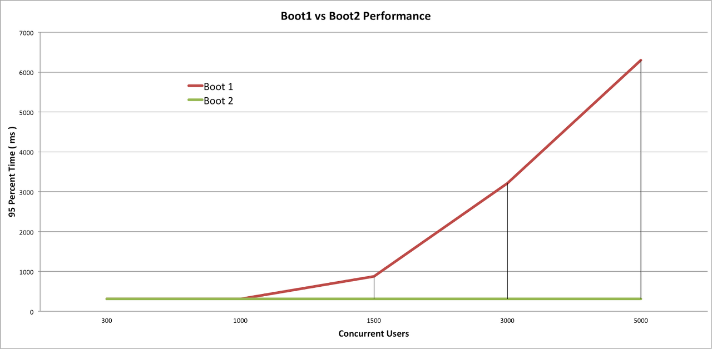
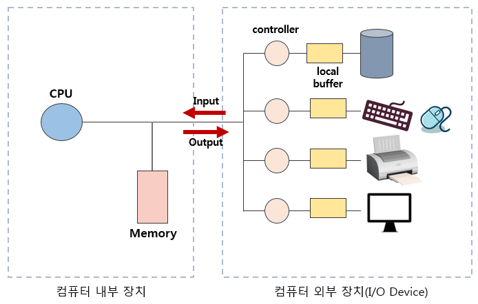
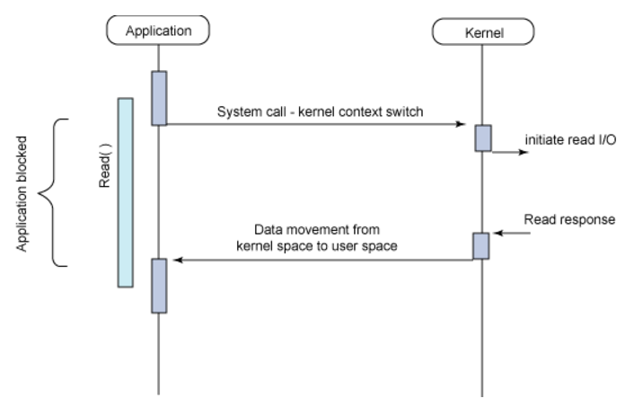
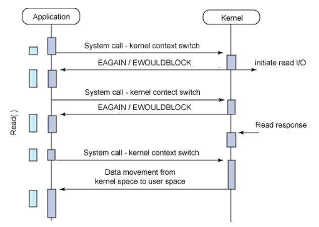
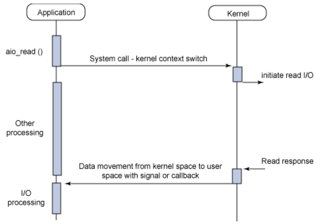
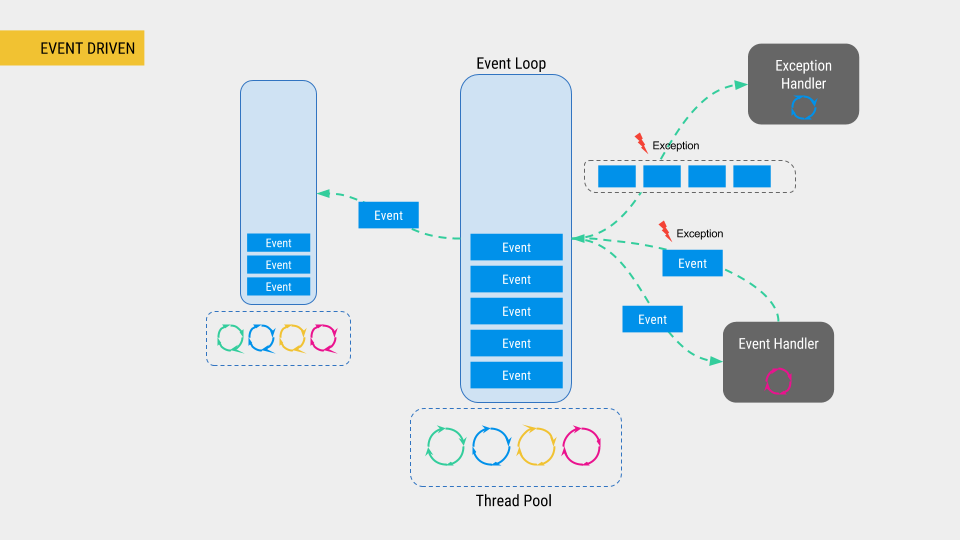
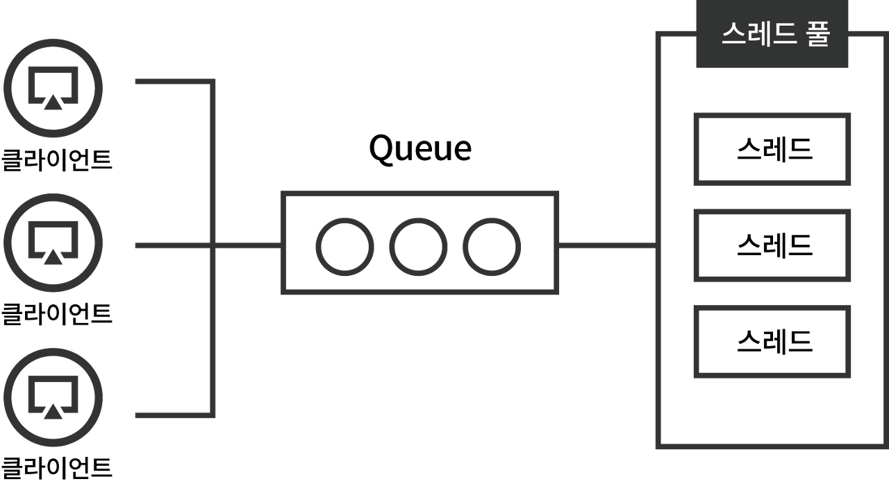
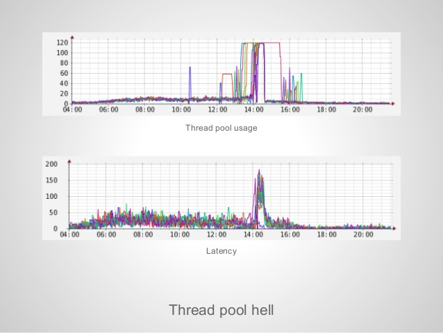

# Reactive Spring WebFlux

우리는 WebFlux보다 Spring MVC가 더 익숙하다. MVC는 Java EE의 Servlet에 기반해 만들어져 있어 blocking이고 동기 방식이다. 

비동기 처리 기능이 Spring Framework 3에서 추가되긴 했지만 여전히 서블릿은 응답을 기다리면서 pool의 쓰레드를 지연시킬 수 있다.

이렇게 되면 전체가 reactive 해야 하는 상황을 충족시킬 수 없어 Spring Framework 5부터는 그 대안으로 WebFlux를 내놓았다. 웹 요청을 reactive하게 처리하는 일에 초점을 맞춘다.



위의 그래프에서 Boot1은 Spring WebFlux, Boot2는 Spring MVC를 나타낸다. 유저가 많아질 수록 둘의 차이는 극명하게 드러난다.

이런 차이가 나는 이유는 I/O, Event-Driven의 원리가 Spring Framework에 녹아있기 때문이다.

## I/O

```text
Why was Spring WebFlux created?

Part of the answer is the need for a non-blocking web stack to handle concurrency with a small number of threads and scale with fewer hardware resources.
```

Spring 공식 문서에서는 non-blocking 때문에 WebFlux를 만들었다고 말한다. 하드웨어 리소스를 많이 쓰지 않고도 스레드의 동시성(여러 작업을 동시에 수행)을 다룰 수 있게 하기 위함이다.



I/O를 처리하는 과정은 아래와 같다.

1. 사용자가 I/O를 요청한다.
2. CPU가 I/O Controller에 요청한다.
3. I/O Controller가 파일을 다 가져오면 메모리에 적재한다.
4. CPU에 완료되었다고 알린다.

즉, CPU -> I/O Controller -> CPU의 흐름으로 진행된다. 

핵심은 I/O를 가져오는 주체가 CPU가 아닌 I/O Controller라는 것이다. CPU는 작업을 위임하고 완료되는 동안 다른 일을 수행할 수 있다. 이처럼 I/O를 처리하는 데에는 몇 가지 방법이 있다.

### Blocking I/O



가장 기본적인 I/O 모델이다. Spring MVC와 RDB를 쓴다면 대부분 이 모델을 사용한다.

애플리케이션에서 I/O 요청을 하면 완료되기 전까지는 block 되어서 다른 작업을 수행할 수 없다. 이렇게 되면 자원을 효율적으로 사용하지 못한다.

그런데 사실 애플리케이션은 blocking 방식임에도 block이 안된 것처럼 동작한다. 바로 멀티 스레드 때문이다. 시스템이 block 상태가 되면 다른 스레드가 동작해 이 문제를 해소하는 것이다.

하지만 스레드 간 전환하는 context switching에 비용이 많이 들기 때문에 여러 I/O를 처리하기 위해 스레드를 여러 개 돌리는 것은 비효율적이다.

### Synchronous Non-Blocking I/O



애플리케이션에서 I/O를 요청한 후 바로 return 되어 다른 작업을 수행하다가 특정 시간에 데이터가 준비 됐는지 확인한다. 데이터 준비가 끝날 때까지 틈틈이 확인을 하다가 완료되면 종료한다.

이렇게 주기적으로 체크하는 방식을 polling이라고 한다. 이 방식은 작업이 완료되기 전까지 주기적으로 호출하기 때문에 자원을 불필요하게 낭비한다.

### Asynchronous Non-blocking I/O



이 방식도 마찬가지로 I/O 요청을 하면 바로 리턴된다. 하지만 데이터 준비가 완료되면 이벤트를 발생시켜 알려주거나 미리 등록한 callback으로 이후 작업이 진행된다.

이전처럼 blocking이나 polling이 없기 때문에 자원을 효율적으로 사용할 수 있다.

## Event-Driven

Event-Driven 프로그래밍은 프로그램 실행 흐름이 이벤트에 의해 결정되는 것이다. 이벤트라 하면 마우스 클릭, 키 누르기, 메시지 같은 작업을 의미한다.

과거에는 순차적으로 진행됐던 방식과 달리 유저에 의해 종잡을 수 없이 흘러가면서 Event-Driven 방식이 많은 주목을 받고 있다.



예전에는 Event를 일일이 제어해야 했지만 지금은 단순히 Listener에 행위를 등록만 하면 간편하게 Event를 제어할 수 있다. 

즉, Event Loop를 돌면서 요청을 감지하고 적합한 handler에 위임해주는 부분은 언어 레벨에서 처리해준다.

이러한 이벤트 처리는 서버에도 적합하다. HTTP Request라는 이벤트가 발생하기 때문이다. 그래서 Node.js, Spring WebFlux 등은 Event-Driven 형태로 아키텍처를 구현했다.

## One Request Per Thread Model



유저로부터 HTTP 요청이 들어오면 요청은 큐에 담긴다. 스레드 풀이 수용할 수 있는 사이즈(thread pool size)까지만 요청이 동시에 처리된다. 만약 그 사이즈를 넘으면 큐에서 대기한다. 즉, 하나의 요청은 하나의 스레드를 요구한다.

스레드는 생성하는 비용이 크기 때문에 미리 pool에 만들어두고 효율적으로 재사용한다. 과도하게 스레드를 생성하지 않고 서버 성능에 맞게 스레드의 최대 수치를 제한한다.



만약 대량의 트래픽이 들어와 thread pool size를 초과한다면 작업이 처리될 때까지 queue에서 계속 기다려야 한다. 그러면 전체 대기 시간도 증가한다. 이런 현상을 `thread pool hell`이라고 한다.

보통 시스템이 느려지는 이유는 DB, 네트워크 등 I/O가 일어나는 부분에 문제가 있기 때문이다. WebFlux는 Non-blocking I/O를 이용해 효율적으로 작업을 처리하게 해준다.

## Spring WebFlux


WebFlux의 구조를 보면 위와 같다. 사용자 요청이 들어오면 Event Loop을 통해 작업을 처리한다. 

One Request Per Thread Model과 다르게 많은 요청을 적은 스레드로 커버할 수 있다. worker thread default size는 서버의 코어 개수로 설정된다. 서버 코어가 4개면 worker thread는 4개다. 이렇게 적은 스레드로도 트래픽을 감당할 수 있다.

요즘 유행하는 MSA에서는 수 많은 마이크로 서비스가 네트워크를 통해 서로를 호출한다. 즉, 네트워크 I/O가 많이 발생하므로 Non-blocking I/O를 이용해 성능을 올릴 수 있다.

## 한계

성능을 최대치로 끌어올리려면 모든 I/O 작업이 Non-blocking으로 동작해야 한다. blocking이 한 곳이라도 되어 버리면 안 하느니만 못하다.

예를 들어 멀티 코어라면 처리할 수 있는 스레드는 2개다. blocking이 걸리는 API를 10명이 동시에 호출한다면 결국 Spring MVC처럼 8명이 I/O가 끝날 때까지 기다려야 한다.

이에 MongoDB, Redis 등의 NoSQL은 DB connection을 non-blocking으로 지원하는 라이브러리를 제공한다.

또한, 소수의 스레드에 의해 수 많은 요청을 처리하고 순서대로 작업을 하는 것이 아니라, 이벤트에 기반해 엉킨 실타래처럼 작업이 진행되기 때문에 트래킹 하기가 힘들다.


따라서 동시 접속 유저가 굉장히 많아서 필요한 상황이 아니라면 굳이 쓰지 않아도 된다. 실제로 스프링 공식 문서에서는 동기 방식이 코드를 작성하고 이해, 디버깅 하는 것이 더 쉬워 생산성이 높아진다고 말한다.

위에서 성능이 동일한 구간은 결국 스레드 풀이 감당할 수 있을 정도의 요청이기 때문에 비동기적으로 잘 수행하다가 이후에 queue에 쌓여 점점 느려졌던 것이다.

[Spring WebFlux는 어떻게 적은 리소스로 많은 트래픽을 감당할까?](https://alwayspr.tistory.com/44)