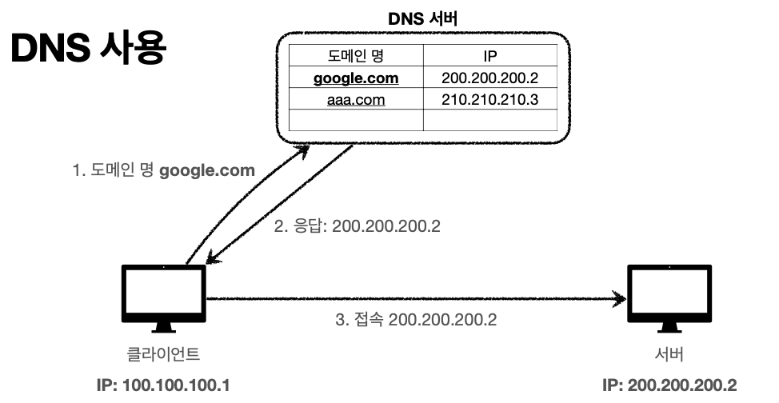

# DNS

- 도메인 네임 시스템(Domain Name System)
- IP는 기억하기 어렵고 변경될 수도 있다. 따라서 중간에 전화번호부 같은 서버를 둬서, 도메인 명을 등록하면 IP로 변환할 수 있게 한다.

DNS 서버에 도메인을 어디선가 사서 등록해둔다. 클라이언트가 도메인 명으로 요청하면 DNS 서버는 알맞은 IP 주소로 응답을 보낸다. 그럼 해당 IP 주소로 접근하게 된다. IP가 추후 바뀌어도 DNS 서버는 도메인을 통해 연결해줄 수 있다.

