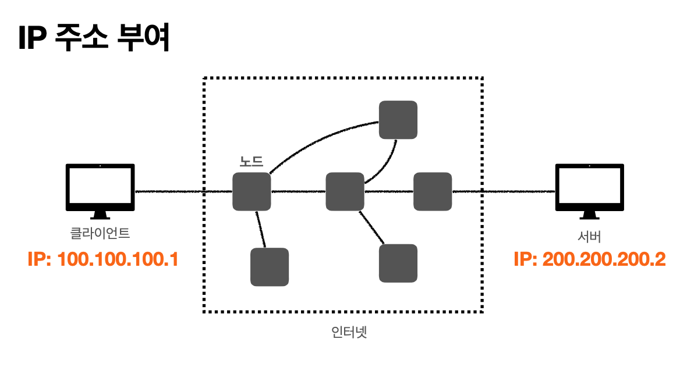
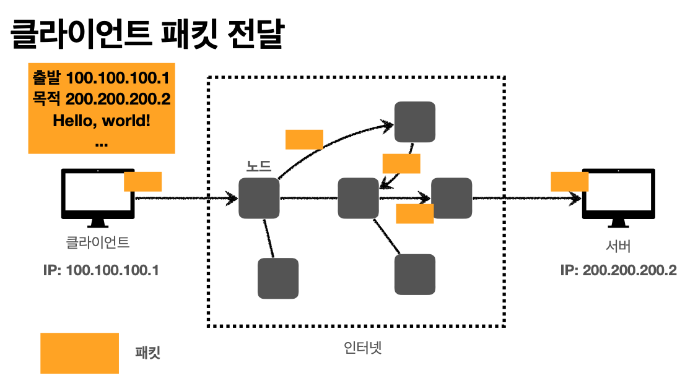
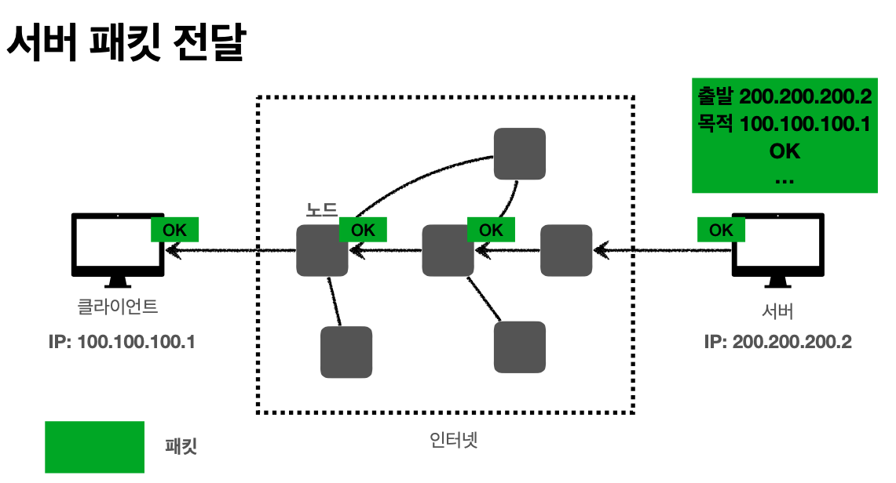
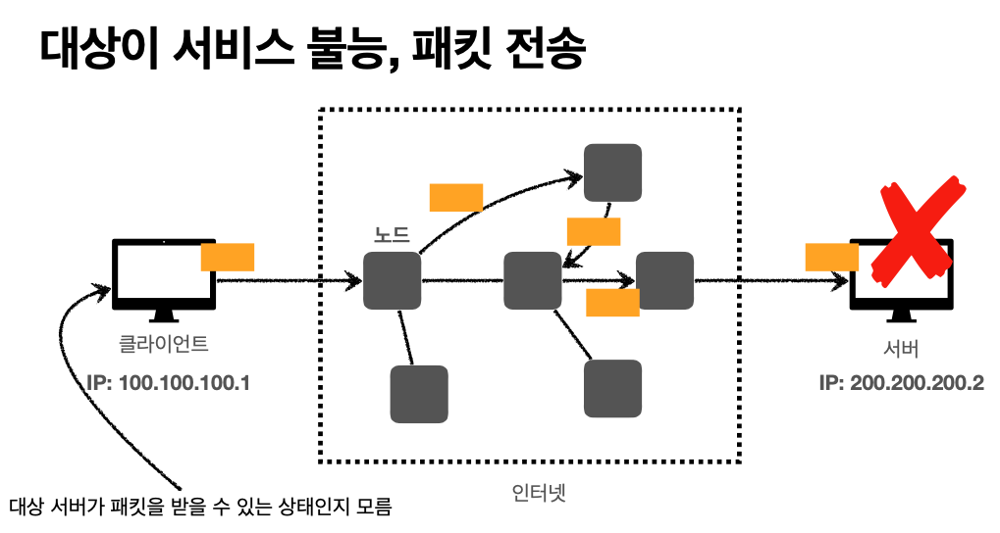
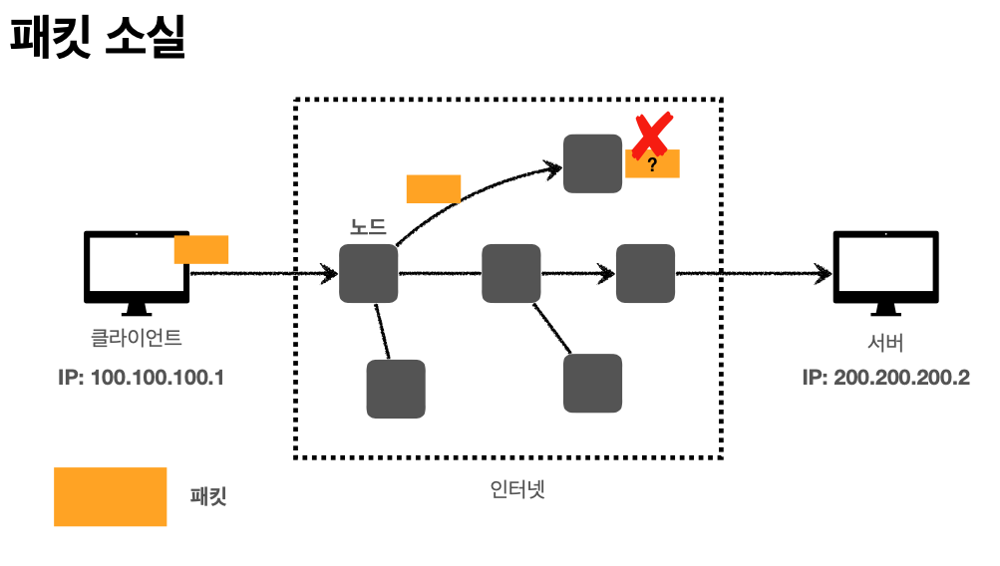
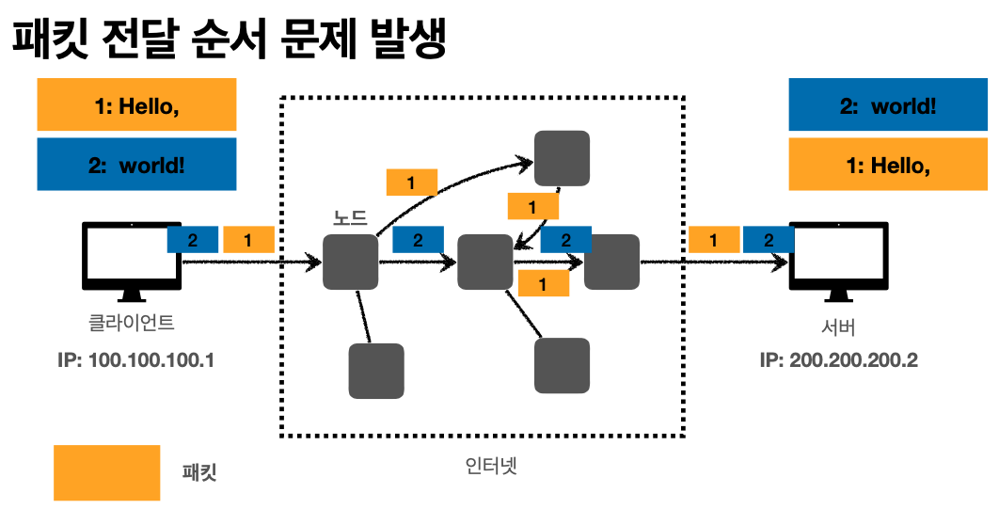

# IP(인터넷 프로토콜)

복잡한 인터넷 세상에서 데이터를 보내려면 규칙이 있어야 한다.

상대에게 데이터를 보내려면, 클라이언트인 나와 데이터를 받는 상대방에게 IP 주소가 필요하다. 예제에서 내 주소는 `100.100.100.1`, 서버는 `200.200.200.2` 이다.

## IP의 역할

- 지정한 IP 주소에 데이터 전달
- 패킷이라는 통신 단위로 데이터 전달

## IP 패킷 정보

데이터는 IP 패킷이라는 규칙에 따라 보내야 한다.

- 출발지 IP
- 목적지 IP
- 보낼 데이터
- 기타 필요한 데이터

규칙에 맞춰 보내면 노드끼리 서로 주고 받으며 도착지에 도착하게 된다.

그럼 데이터를 받은 상대방도 같은 방식으로 잘 받았다는 내용을 전달한다.

## IP 프로토콜의 한계

### 비연결성

상대방이 받을 상황이 되지 않더라도 무작정 보낼 수 있다. 즉, 패킷을 받을 대상이 없거나 서비스가 불능 상태여도 패킷을 전송할 수 있다.

### 비신뢰성

패킷이 중간에 사라지거나

여러 개의 패킷이 순서대로 도착하지 않을 때가 있다.

### 프로그램 구분

같은 IP에서 여러 프로그램을 돌리고 있을 때 어떤 곳에 전송해야 하는지 모른다.