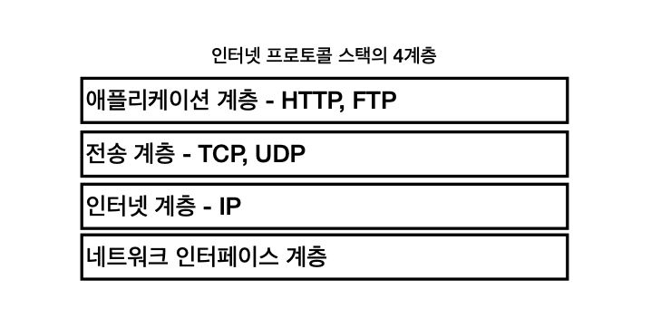
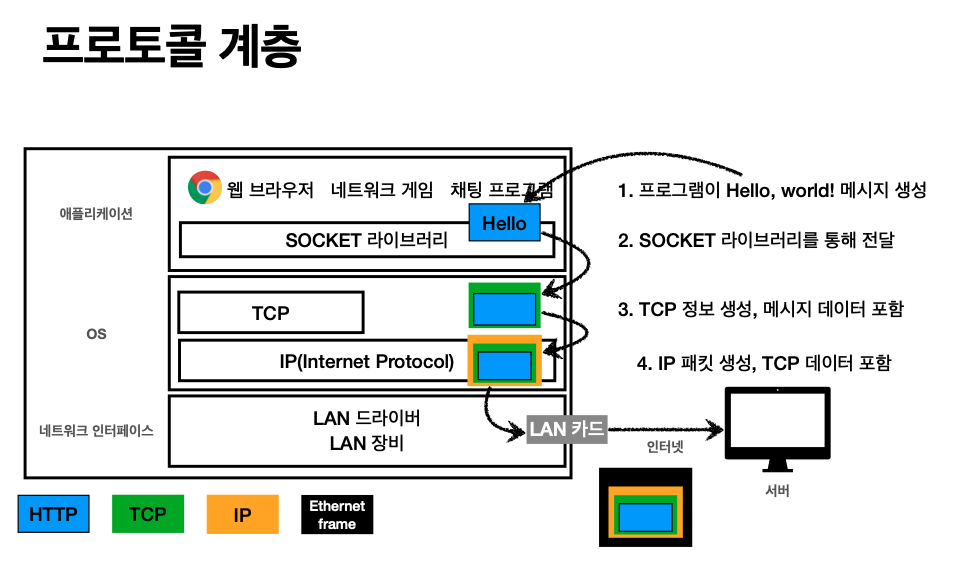
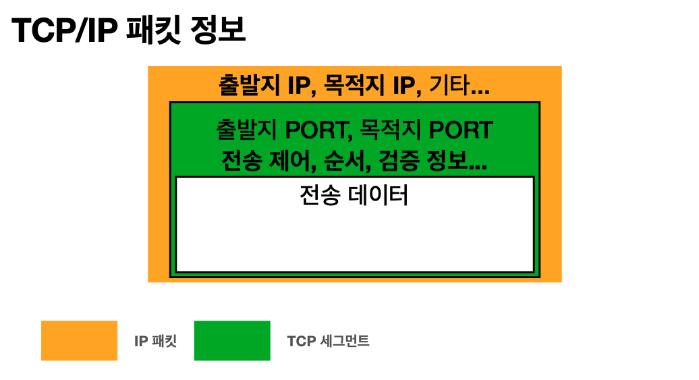
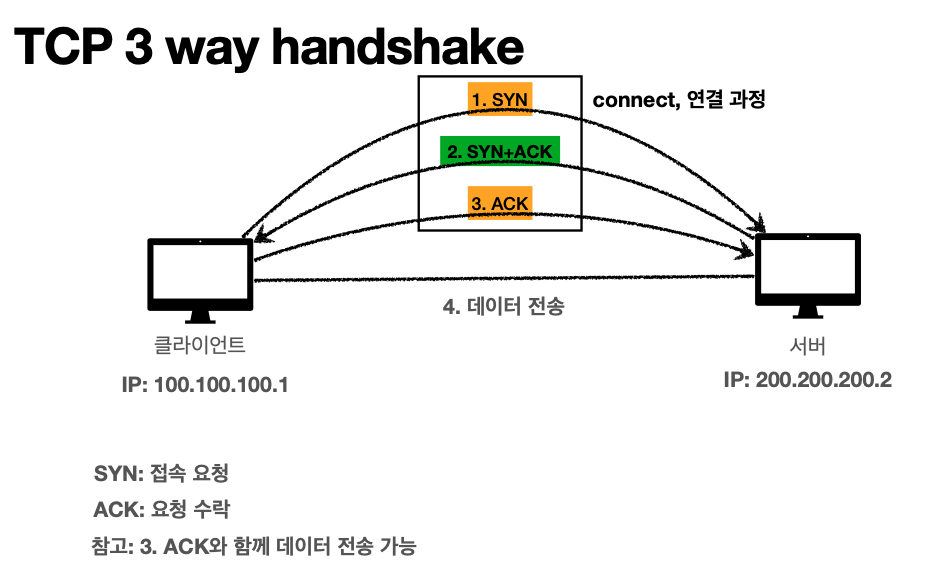
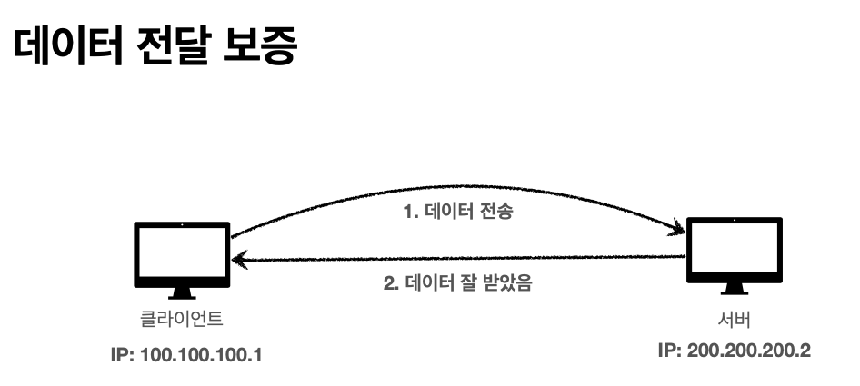
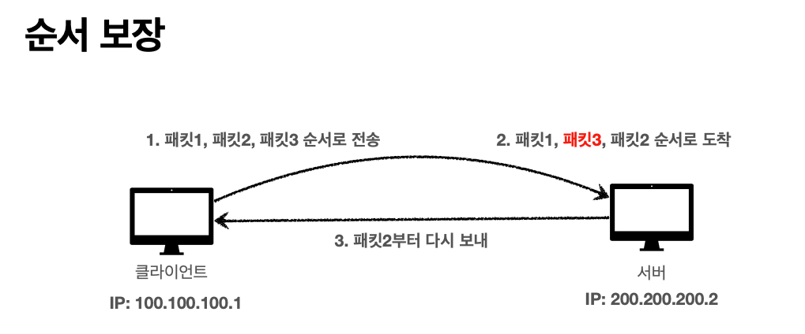

# TCP, UDP

## 인터넷 프로토콜 스택의 4계층

TCP는 IP에 살짝 TCP를 얹어서 IP의 문제를 보완해준다고 생각하면 된다.

만약 채팅 애플리케이션을 만들었다고 가정한다면, 먼저 `Socket 라이브러리` 라는 것을 사용해 OS 계층에 `Hello, world!` 라는 메시지를 넘긴다.

그럼 OS 쪽에서는 `Hello, world!` 라는 메시지에 TCP 정보를 씌우고(초록색), 그 아래인 IP 쪽으로 내려서 IP 정보를 또 씌운다(노란색). 이렇게 IP 패킷이
생성된다.

이 데이터가 실제 랜 카드를 통해 나갈 때는 `Ethernet frame` 을 포함해서 나간다(검정색). `Ethernet frame` 에는 실제 물리적인 정보까지 들어있다.

## IP 패킷 정보

### 패킷

패키지와 버킷의 합성어

TCP 계층에서는 출발지와 목적지의 port, 전송 제어, 순서, 검증에 대한 정보가 저장된다.

## TCP의 특징

- 전송 제어 프로토콜(Transmission Control Protocol)
- 신뢰할 수 있는 프로토콜이며 현재 대부분이 사용하고 있다.

### 연결 지향 - TCP 3 way handshake

- 상대방과 연결이 됐는지 확인 후에 메시지를 보낸다.
- 하지만 이건 진짜 연결된 것이 아니다. 개념적으로 연결된 상태다.
    - 옛날엔 실제로 케이블을 통해 연결되었는데, 이제는 SYN과 ACK을 주고 받은 걸로 연결이 잘 됐다고 가정하기 때문이다.
- 실제로 클라이언트와 서버 사이에는 수 많은 노드가 있는데 그 노드가 다 연결이 됐는지는 모르는 것이다.

1. 클라이언트에서 서버로 연결해달라는 의미로 SYN 이라는 메시지를 보낸다.
2. 서버는 받았다는 의미의 ACK과 함께 자기도 연결해달라고 SYN을 보낸다.
3. 클라이언트도 받았다는 의미로 ACK을 보낸다.
4. 연결이 다 되고 난 후에 데이터를 전송한다.

요즘엔 최적화가 많이 되어서, 3번 ACK을 보낼 때 데이터를 같이 전송한다.

### 데이터 전달 보증

- 메시지를 보낼 때 중간에 패킷이 누락되었는지 알 수 있다.

### 순서 보장

- 패킷 순서가 바뀌어서 도착하면 그 직전 패킷부터 다시 보내달라고 요청한다.

## UDP 특징

사용자 데이터그램 프로토콜(User Datagram Protocol)

- 하얀 도화지에 비유할 정도로 기능이 거의 없다.
- TCP의 연결 지향, 데이터 전달 보증, 순서 보장은 없다.
- 즉, IP와 거의 같고 port와 체크섬(메시지 검증해주는 데이터) 정도만 추가되어있다.
- 데이터 전달 및 순서가 보장되지 않지만 단순하고 빠르다.
- 애플리케이션에서 추가 작업이 필요하다.
    - 최적화가 필요하다면 UDP 위에 애플리케이션 레벨에서 뭔가를 만들어내면 된다.
    - 지금까지는 영상처럼 실시간성이 중요한 데이터까지도 TCP가 점령했는데, 최근에는 handshake하는 과정까지 줄여보자는 목적으로 UDP가 각광받고 있다.