# URI(Uniform Resource Identifier)

## URI

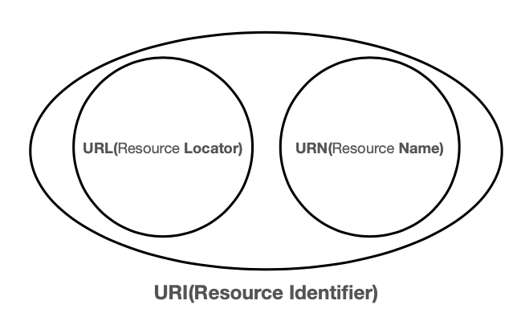

자원이 어디에 있는지 자원 자체를 식별하는 방법이다. locator나 name 혹은 둘 다 추가로 분류될 수 있다.

- Uniform
    - 리소스를 식별하는 통일된 방식
- Resource
    - 자원, URI로 식별할 수 있는 모든 것(제한 없음)
    - 웹 브라우저의 파일만 뜻하는 게 아니다. 실시간 교통정보 등 우리가 구분할 수 있는 것은 모든 게 리소스다.
- Identifier
    - 다른 항목과 구분하는데 필요한 정보

## URL

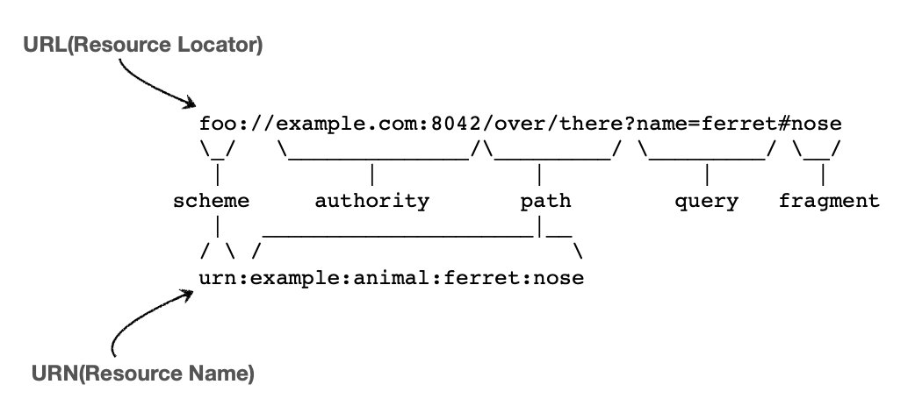

리소스의 위치를 뜻한다.

## URN

리소스의 이름을 의미한다. 리소스가 이름에 매핑되어 있어야 하기 때문에 이름으로 부여하면 거의 찾기가 힘들다. 그래서 대부분 URL만 쓴다.

---

위치는 변할 수 있지만, 이름은 변하지 않는다. 변하지 않는 게 좋아보이지만 이름만으로 실제 리소스를 찾는 방법은 보편화되지 않았다. 책으로 예를 들면 `isbn1234567`이 어떤 책인지는 알기 어렵다.

따라서 앞으로 URI는 URL과 같은 의미로 이해하면 된다.

## URL 분석
### 전체 문법

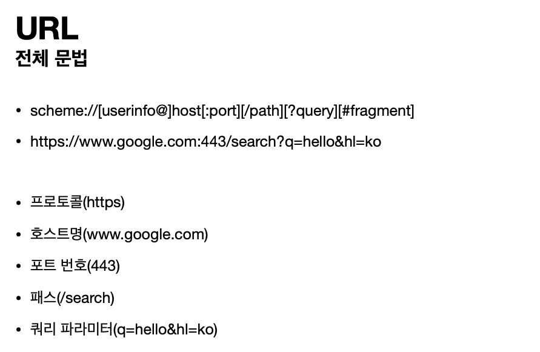

### scheme

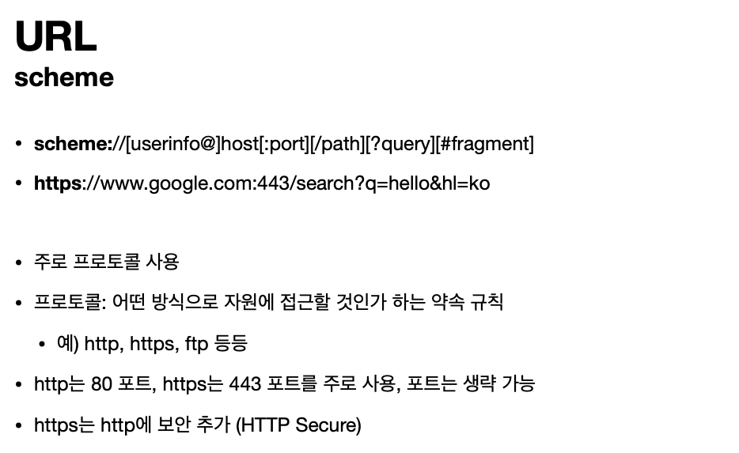

### user-info

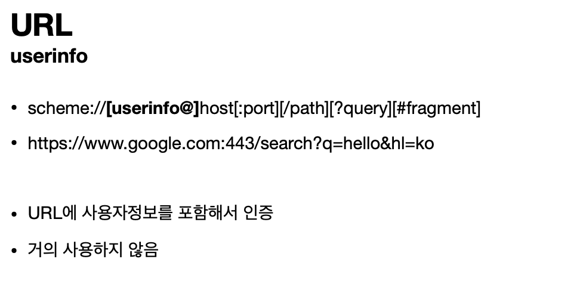

### host

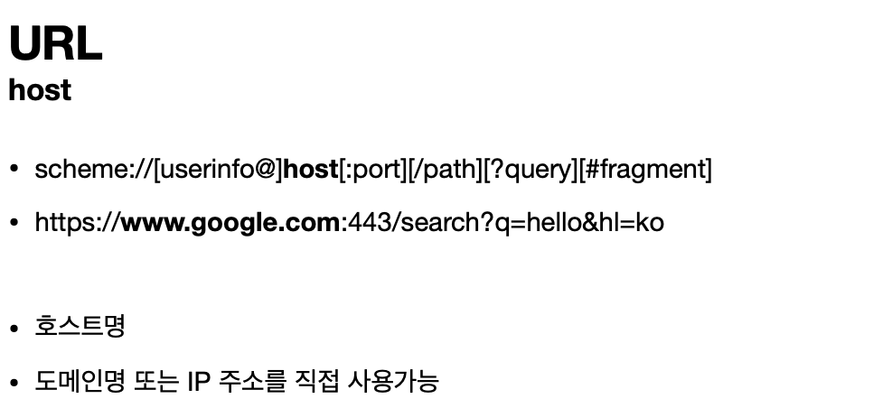

### port

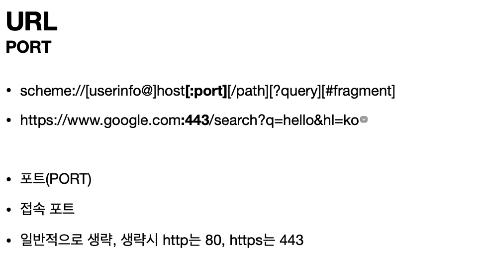

### path

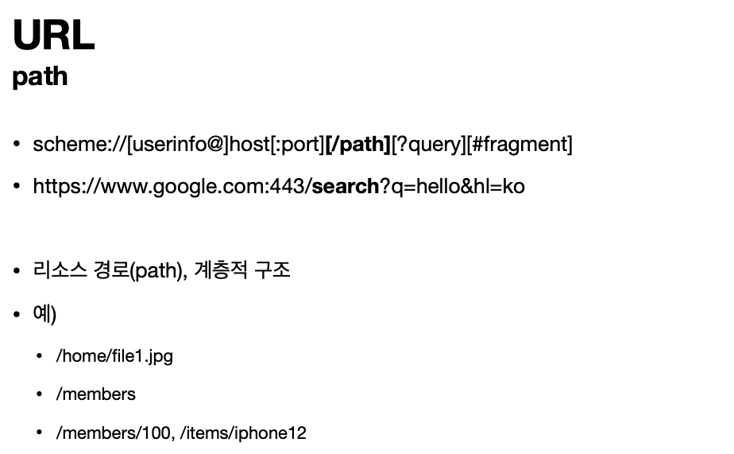

### query

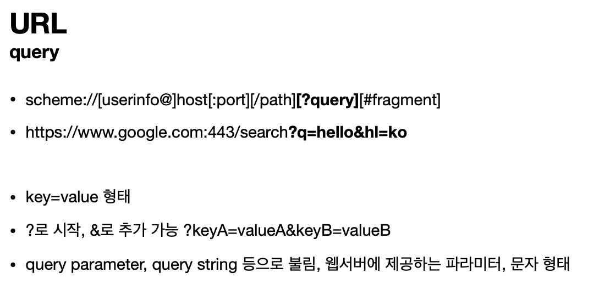

숫자를 넣어도 다 문자 형태로 보내지기 때문에 `query string` 으로 불린다.

### fragment


## 웹 브라우저의 요청 흐름

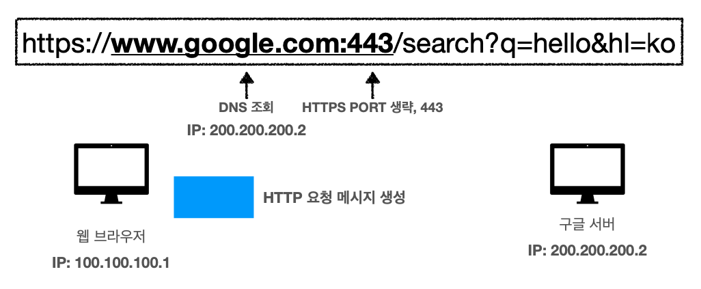

1. DNS 서버를 조회해서 IP와 포트 정보를 받는다.
2. HTTP 요청 메시지를 생성한다.

### HTTP 메시지 전송


```text
GET /search?q=hello&hl=ko HTTP/1.1 Host: [www.google.com](http://www.google.com/)
```

전송 데이터 HTTP 메시지는 위와 같은 형태다.

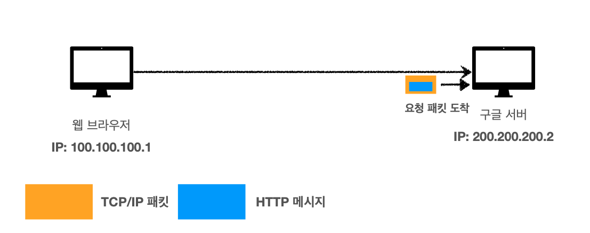

서버는 패킷을 받으면 TCP/IP 패킷을 다 까서 버리고 HTTP 메시지만 가지고 해석을 한다. `쿼리는 hello고 hl이 한국이구나` 등의 내용을 파악하고 데이터를 찾는다.

### HTTP 응답


그 후 html 데이터를 포함한 응답 메시지를 만들어서 클라이언트에 반환한다.

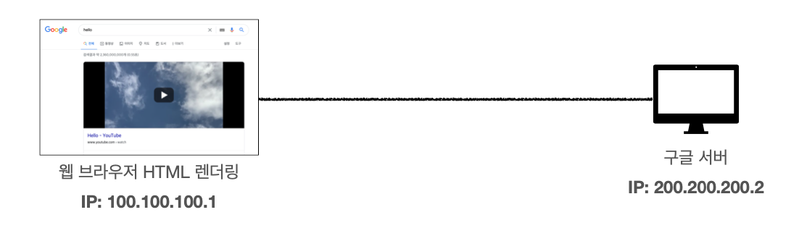

클라이언트는 받은 html 데이터를 화면에 렌더링한다.