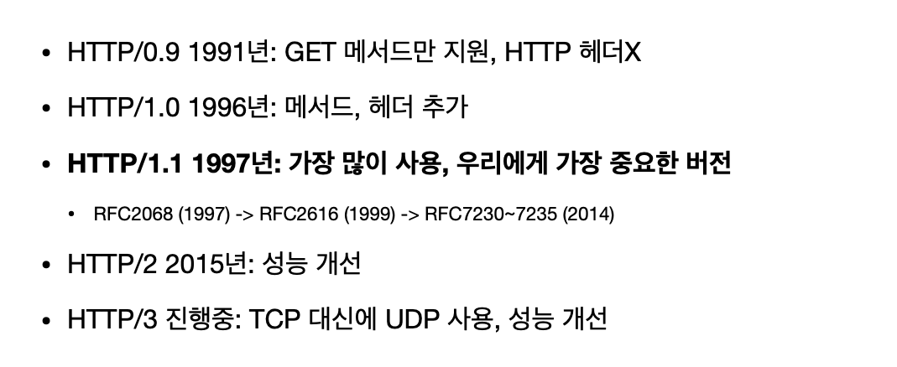
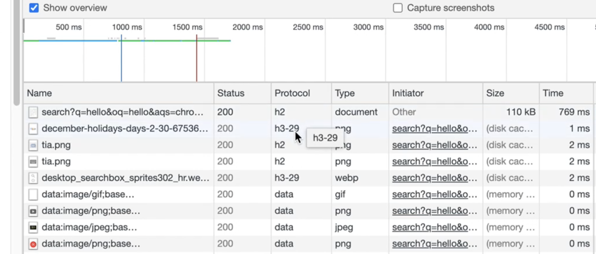

# HTTP 기본

HTTP는 모든 것을 전송한다. 서버 간에 통신할 때도 TCP를 직접 연결하기 보다는 대부분 HTTP를 사용한다.

- HTML, TEXT
- 이미지, 음성, 영상, 파일
- JSON, XML

### HTTP의 역사

HTTP/1.1에 대부분의 기능이 들어있고 2, 3은 성능 개선에 초점이 맞춰져 있기 때문에 1.1이 제일 중요하다.

### 기반 프로토콜

HTTP/1.1과 2는 대부분 TCP 위에서 동작한다. HTTP/3는 UDP 기반으로 개발이 되어있다. TCP는 3 way handshake도 있고, 넣어야 할 데이터도 많고, 속도가 빠른 구조가 아니기 때문에 UDP를 사용하게 되었다.

`Protocol` 에 h2가 HTTP/2, h3가 HTTP/3를 의미한다.
