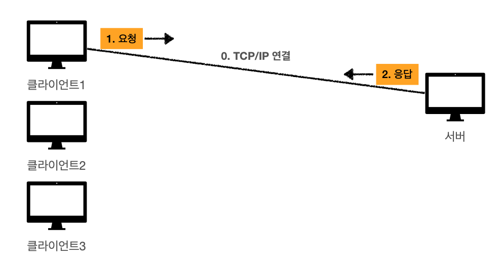
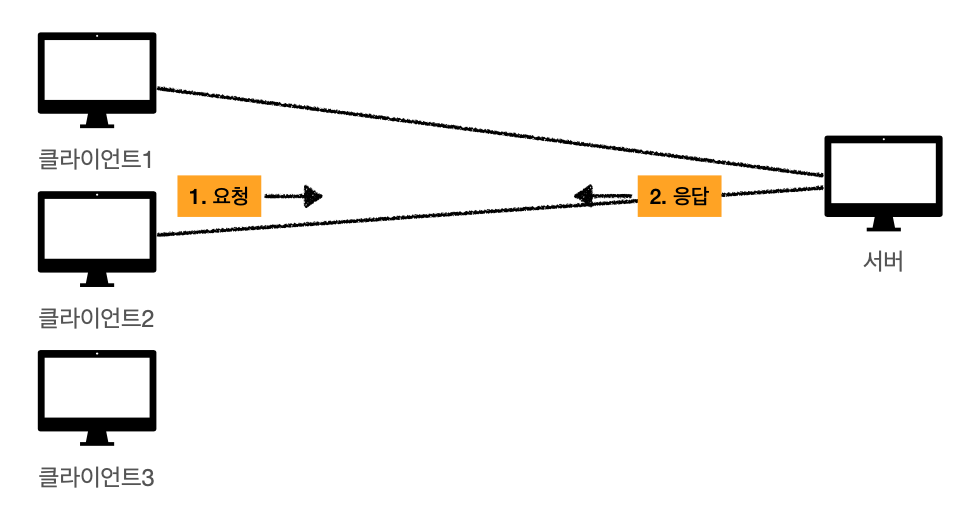
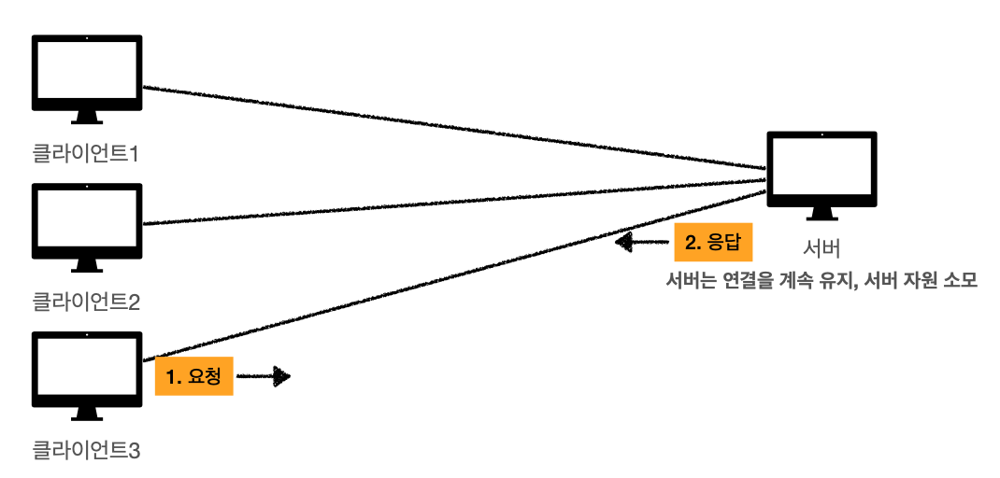
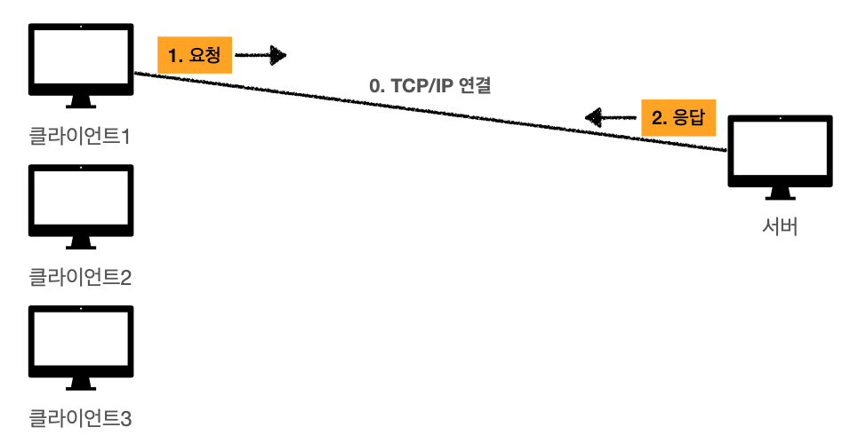
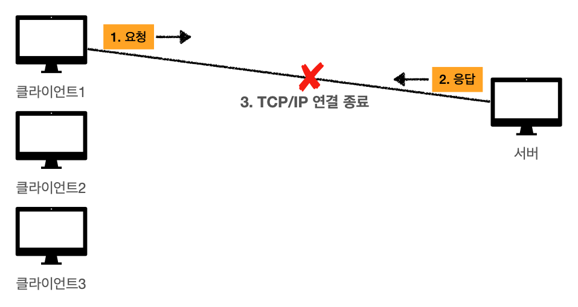
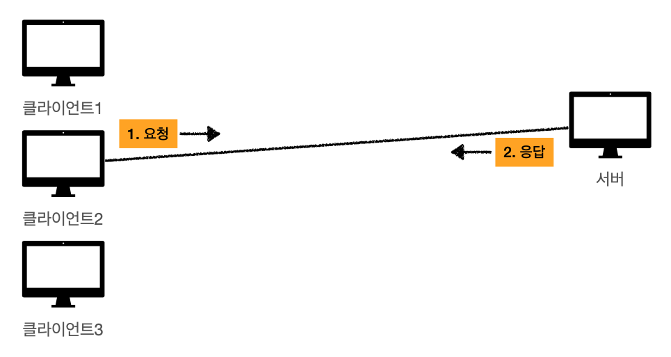
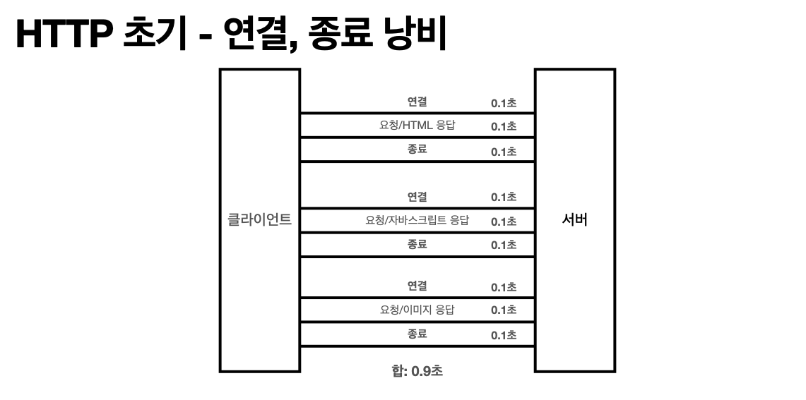
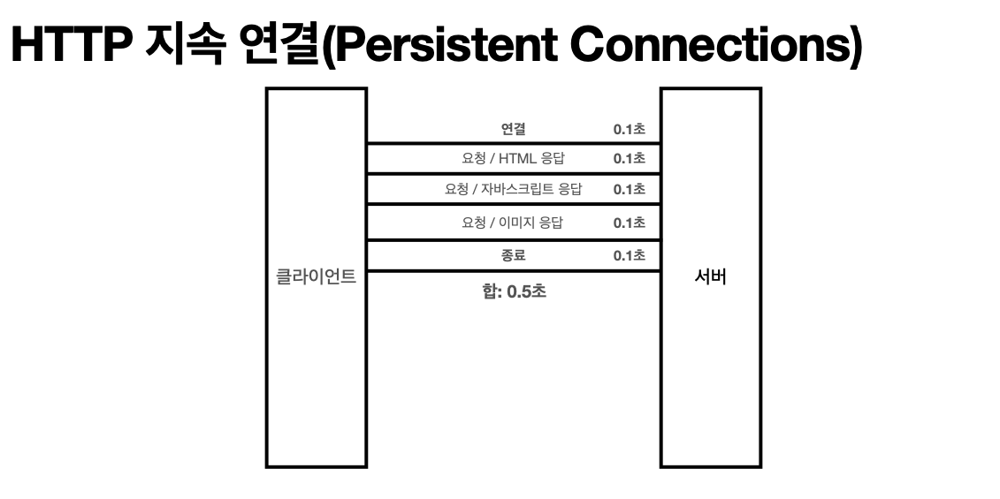

# 비연결성

## 연결을 유지하는 모델

클라이언트 1이 TCP/IP 연결을 통해 요청과 응답을 받는 상황을 생각해보자.

클라이언트 2, 3이 요청을 보낼 때에도 클라이언트 1은 계속 연결되어 있다. 이렇게 하는 동안 이 연결을 유지하는 데에 서버의 자원이 소모된다.

## 연결을 유지하지 않는 모델

클라이언트 1이 요청에 대한 응답을 받으면 연결을 종료한다.

서버는 현재 요청을 주고 받을 때에만 연결을 유지해, 사용하는 자원을 최소한으로 줄일 수 있다.

## 비연결성 특징

- HTTP는 기본이 연결을 유지하지 않는 모델이다.
- 일반적으로 초 단위 이하의 빠른 속도로 응답한다.
- 1시간 동안 수 천명이 서비스를 사용해도 실제 서버에서 동시에 처리하는 요청은 수 십개 이하로 매우 작다.
    - 필요한 것만 주고 받은 뒤 끊어 버린다면, 실제로 동시에 처리하는 요청은 얼마 안된다.
    - 웹 브라우저에서 연속으로 검색 버튼을 누르지는 않는다. 검색하고 한참 보고 또 누르고 이런 식으로 진행되기 때문에 가능하다.
- 서버 자원을 매우 효율적으로 사용할 수 있다.

## 한계점

- TCP/IP 연결을 매번 새로 해야 한다.
    - 따라서 3 way handshake 하는 시간이 추가된다.
- 웹 브라우저로 사이트를 요청하면 HTML에 자바스크립트, CSS, 이미지 등 많은 자원을 매번 다 같이 다운 받아야 해서 비효율적이다.

## 한계점 극복

- 현재는 HTTP 지속 연결(Persistent Connections)로 문제를 해결하고 있다.
- HTTP/2, HTTP/3 이 문제가 많이 최적화 되었다.

초기에는 클라이언트가 요청하면 HTML을 응답하고, 받고 보니 자바 스크립트가 필요하면 또 응답하고 이런 식으로 됐었다.

대신, 요청을 보내고 응답을 보낸 뒤 연결을 유지한다. 유지한 상태에서 계속 요청을 보내고 응답을 받는 것이다. 그렇게 작업이 다 종료된 이후에 연결을 종료한다.

## 서버 개발자들이 어려워하는 업무

- 이벤트처럼 같은 시간에 딱 맞춰 대용량 트래픽이 몰리면 비 연결성 이런것이 소용이 없어진다.
- 그래서 최대한 stateless 하게 설계하는 것이 중요하다.
- 보통 이벤트 첫 페이지는 로그인도 필요없는 정적 페이지로 뿌린다. 아무 상태 없이 html만 있고, 사람들이 거기서 어느 정도 머물다가 이벤트에 참여할 수 있도록 한다.