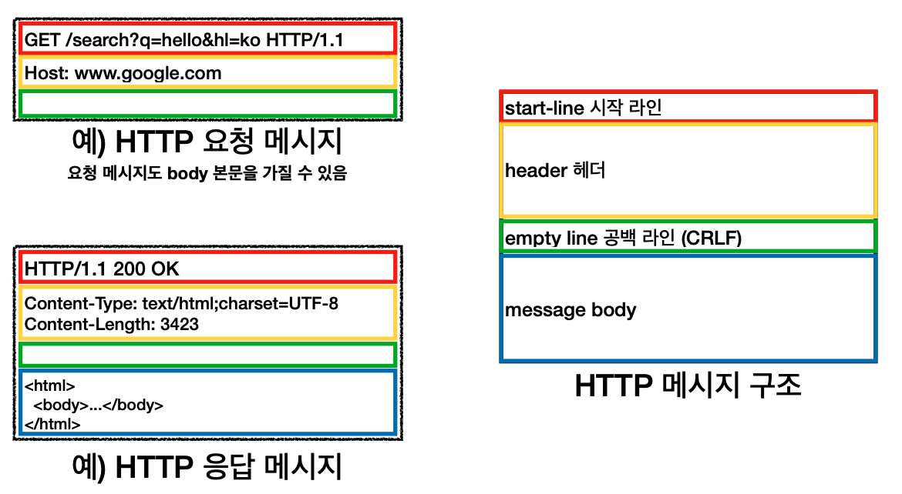
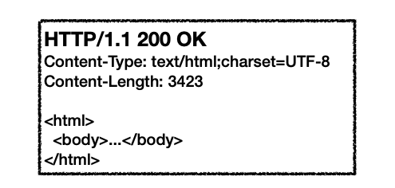
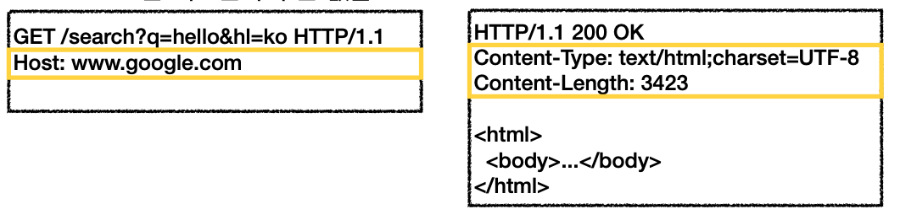

# HTTP 메시지



HTTP 메시지는 시작 라인, 헤더, 공백 라인, 바디로 구성되어 있다. 공백 라인은 반드시 있어야 한다. 만약 보낼 바디가 없다면 공백만 넣고 끝내면 된다.

## 시작 라인

```
start-line = request-line + status-line
```

## 요청 메시지(request-line)


### http method + SP(공백)

- `GET`, `POST` 등
  
### request target(path) + SP(공백)
   
- `/search?q=hello&hl=ko`
- `absolute-path[?query]` (절대경로[?쿼리])
- 절대 경로란 `/`로 시작하는 경로다. `*` 혹은 `http://...?x=y` 와 같은 형태도 있다.

### http version + CRLF(엔터)

- http 버전

## 응답 메시지(status-line)



### http version + SP(공백)

- http 버전

### status-code + SP(공백)

- 클라이언트가 보낸 요청이 성공인지 실패인지 나타낸다.
- 200: 성공
- 400: 클라이언트 요청 오류
- 500: 서버 내부 오류

### reason-phrase + CRLF(엔터)
   
- 사람이 이해할 수 있는 짧은 상태 코드 설명이다.

## HTTP 헤더



### field-name + `:` + OWS(띄어쓰기 허용)

- 대소문자 구분이 없다.
- host + **공백** + `:` 는 안된다.

### field-value OWS(띄어쓰기 허용)

- 대소문자 구분이 있다.

### 헤더의 용도

- HTTP 전송에 필요한 모든 부가 정보를 담고 있다.
    - 메시지 바디의 내용(html인지 등)
    - 메시지 바디의 크기
    - 압축 여부
    - 인증
    - 요청 클라이언트(브라우저) 정보
    - 서버 애플리케이션 정보
    - 캐시 관리 정보
    - etc
- 표준 헤더가 너무 많다.
- 필요하다면 임의의 헤더를 추가할 수 있다.
    - `helloworld:` `hihi`

## HTTP 메시지 바디

- 실제 전송할 데이터를 담는다.
- HTML 문서, 이미지, 영상, JSON 등 byte로 표현할 수 있는 모든 데이터를 전송할 수 있다.

## 정리

HTTP는 단순하다. 스펙 읽어볼만 하다. 메시지도 단순하다. 크게 성공하는 표준 기술은 단순하지만 확장 가능한 기술이다.

- HTTP 메시지에 모든 것을 전송
- HTTP/1.1을 기준으로 학습
- 클라이언트 서버 구조
- 무상태 프로토콜(stateless)
- HTTP 메시지 구조
- 단순함, 확장 가능
- 지금은 HTTP 시대