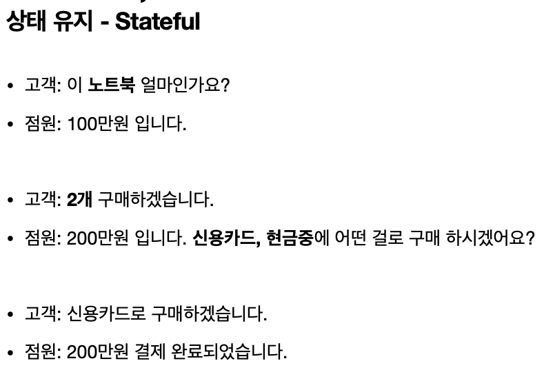
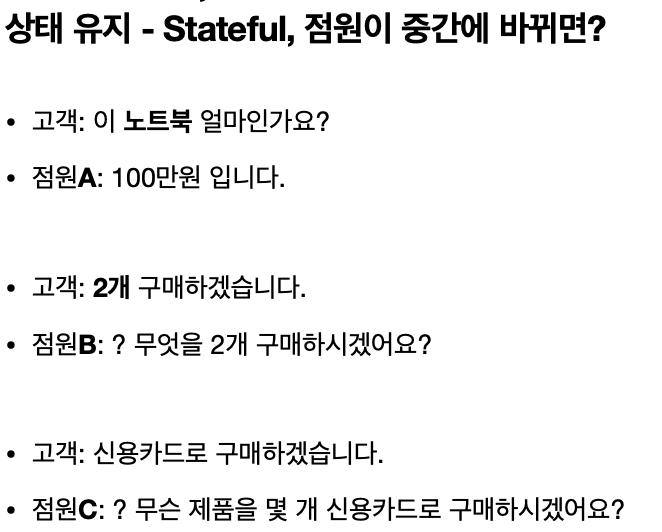
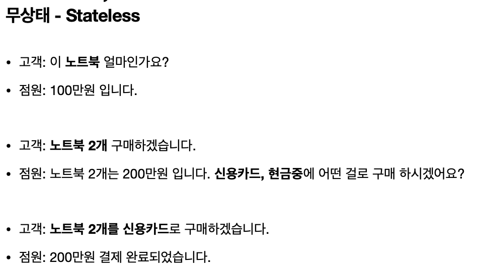
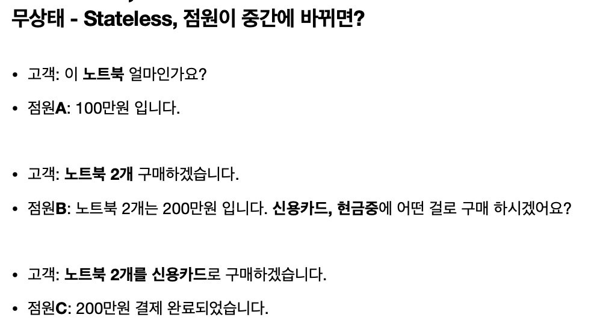
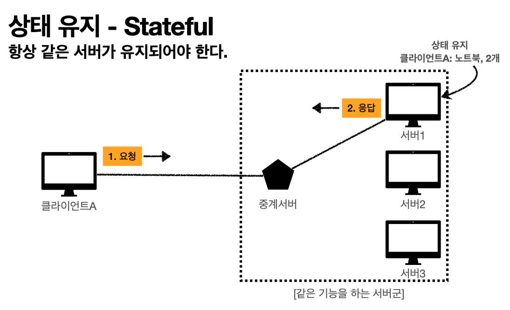
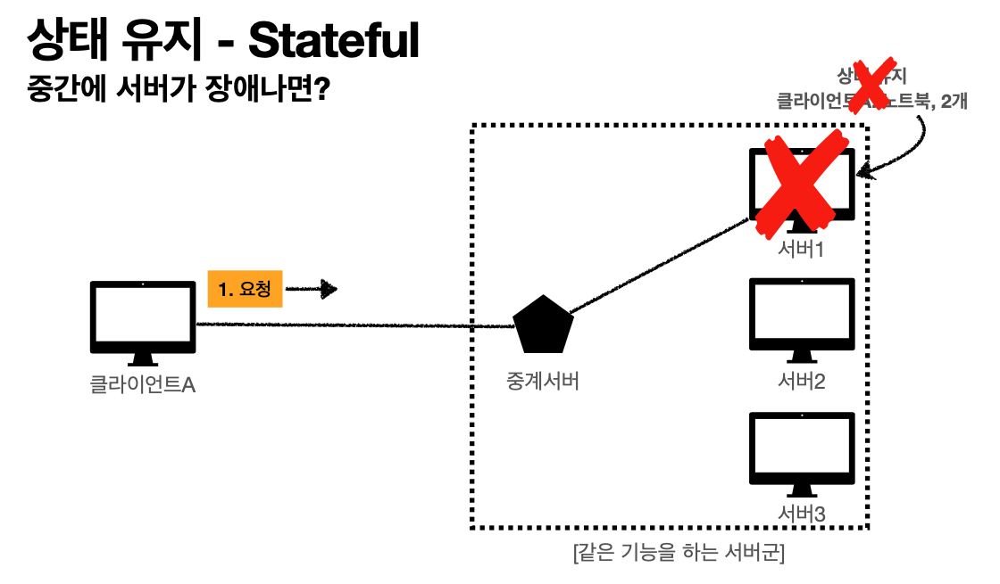
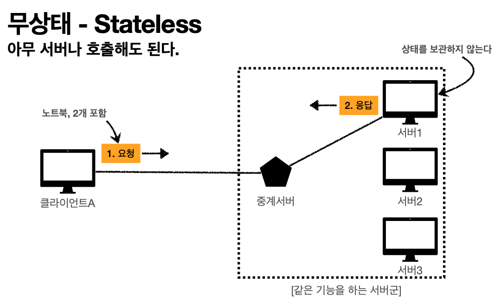
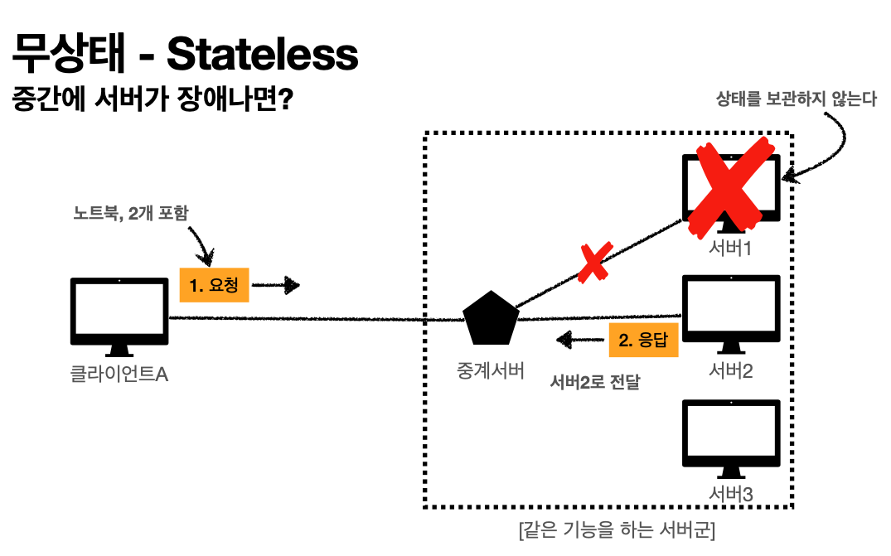
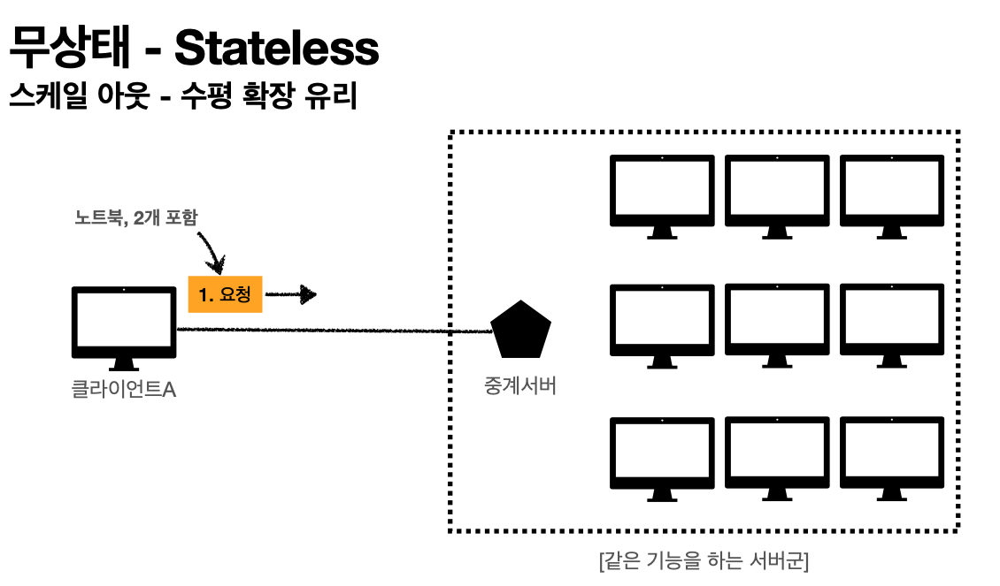

# 무상태 프로토콜

서버는 클라이언트의 상태를 보존하지 않는다.

보통 물건을 구매하면 점원 한 명만 통하므로 컨텍스트를 계속 알고 있어 바로 소통이 된다.

하지만 점원 A에게 물어보던 내용을 점원 B, C에게 이어서 물어본다면 둘은 당황스러울 것이다. B와 C는 컨텍스트를 모르기 때문이다.

정리하자면, 첫 번째 케이스는 클라이언트가 노트북을 구매하고 싶다는 상태를 알고 있다. 그 상태를 알고 있기 때문에 결제 수단을 물어본다. 최종적으로 노트북 산다, 2개를 산다, 신용카드로 구매한다는 상태를 유지하게 된다.

하지만 두 번째 케이스의 경우, 점원이 고객의 상태를 유지하지 않는다. 따라서 고객은 물어볼 때마다 매번 무엇을 몇개, 어떤 결제 수단을 사용할지 말해줘야 한다.

무상태는 점원이 바뀌더라도 고객이 매번 명확하게 말해주기 때문에 올바른 결과를 받을 수 있다. 따라서 무상태로 설계하면 무한적 확장할 수 있는 가능성이 생긴다.

### 정리

- 상태 유지
    - 중간에 다른 점원으로 바뀌면 안된다.
    - 중간에 다른 점원으로 바뀐다면 상태 정보를 다른 점원에게 미리 알려줘야 한다.
- 무상태
    - 중간에 다른 점원으로 바뀌어도 된다.
    - 갑자기 고객이 증가해도 점원을 대거 투입할 수 있다.
    - 갑자기 클라이언트 요청이 증가해도 서버를 대거 투입할 수 있다.
    - 응답 서버를 쉽게 바뀔 수 있다.
    - 즉, 무한한 서버 증설이 가능하다.

## stateful

stateful 하면 서버 1이 내 정보를 갖고 있기 때문에 계속 서버 1하고만 통신을 해야 한다. 중간에 서버 1에 장애가 생기면 클라이언트 A는 일을 처음부터 다시 해야한다.

## stateless

stateless는 클라이언트가 필요한 데이터를 애초에 다 담아서 보낸다. 서버는 상태를 보관하지 않고 필요한 응답만 한다. 갑자기 서버 1이 장애가 나도 중계 서버는 서버 2로 클라이언트의 요청을 던져서 제대로 응답을 받을 수 있다.

서버를 쫙 늘리는 걸 scale-out(수평 확장)이라고 하는데, stateless는 이렇게 하는 데에 굉장히 유리하다.

## stateless의 한계점

- 모든 것을 무상태로 설계할 수 없다.
    - 이벤트 소개 페이지처럼 아무 정보를 담을 필요가 없는 페이지는 무상태로 만들기가 쉽다.
    - 하지만 로그인처럼 유저가 로그인하고 있다는 상태를 유지해야 한다.
        - 상태를 유지하지 않으면 로그인이 풀려버린다.
        - 이 경우엔 브라우저에 있는 쿠키와 세션을 조합해 상태 유지 기능을 사용하기도 한다.
        - 어쩔 수 없는 경우에만 상태 유지를 최소한으로 사용한다.
- 데이터를 너무 많이 보낸다.