# HTTP 메서드
## HTTP API를 만들어보자
### 요구 사항

- 회원 목록 조회
- 회원 조회
- 회원 등록
- 회원 수정
- 회원 삭제

## API URL 설계

- 회원 목록 조회 → `/read-member-list`
- 회원 조회 → `/read-member-by-id`
- 회원 등록 → `/create-member`
- 회원 수정 → `/update-member`
- 회원 삭제 → `/delete-member`

이게 과연 좋은 URI 설계일까?

## API URI 고민

URI에서 제일 중요한 건 리소스 식별이다.

### 리소스

- 회원을 `등록`하고 `수정`하고 `조회`하는 게 리소스가 아니다.
    - ex. 미네랄을 캐라 → 미네랄이 리소스
    - `회원` 이라는 개념 자체가 바로 리소스다.
- 리소스를 어떻게 식별하는 게 좋을까?
    - 회원을 등록, 수정, 조회하는 것을 모두 배제한다.
    - 회원이라는 리소스만 식별하면 되므로 회원 리소스를 URI에 매핑한다.
- 계층 구조상 상위를 컬렉션으로 보고 복수 단어를 사용하는 것이 좋다.

---

- 회원 목록 조회 → `/members`
- 회원 조회 → `/members/{id}`
- 회원 등록 → `/members/{id}`
- 회원 수정 → `/members/{id}`
- 회원 삭제 → `/members/{id}`

조회, 등록, 수정, 삭제는 URI가 같은데 어떻게 구분해야 할까?

### 리소스와 행위의 분리

- URI는 리소스만 식별한다.
- 리소스와 해당 리소스를 대상으로 하는 행위를 분리한다.
    - 리소스: 회원
    - 행위: 조회, 등록, 삭제, 변경

리소스는 명사, 행위는 동사가 된다. 그럼 행위는 어떻게 구분할까?

## HTTP 메서드

- GET: 리소스 조회
- POST: 요청 데이터 처리, 주로 등록에 사용
- PUT: 리소스를 대체, 해당 리소스가 없으면 생성
- PATCH: 리소스 부분 변경
- DELETE: 리소스 삭제

---

- HEAD: GET과 동일하지만 메시지 부분을 제외하고 상태 줄과 헤더만 반환. 즉, 바디 빼고 헤더까지만 준다.
- OPTIONS: 대상 리소스에 대한 통신 가능 옵션(메서드)를 설명한다. 주로 CORS에서 사용한다.
- CONNECT: 대상 자원으로 식별되는 서버에 터널 설정
- TRACE: 대상 리소스에 대한 경로를 따라 메시지 루프백 테스트 수행

## GET

- 리소스 조회에 사용
- 서버에 전달하고 싶은 데이터는 query(쿼리 파라미터, 쿼리 스트링)을 통해 전달
- 메시지 바디로 데이터를 전달할 수 있지만 지원하는 곳이 많지 않아서 권장하지 않는다.

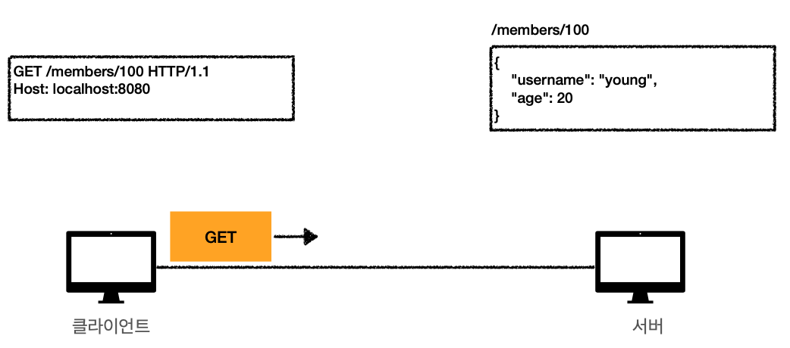

클라이언트가 100번 유저를 달라고 요청한다.

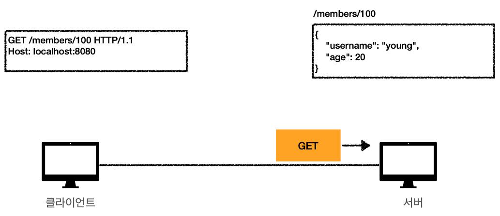

서버에 GET 메시지가 도착한다.

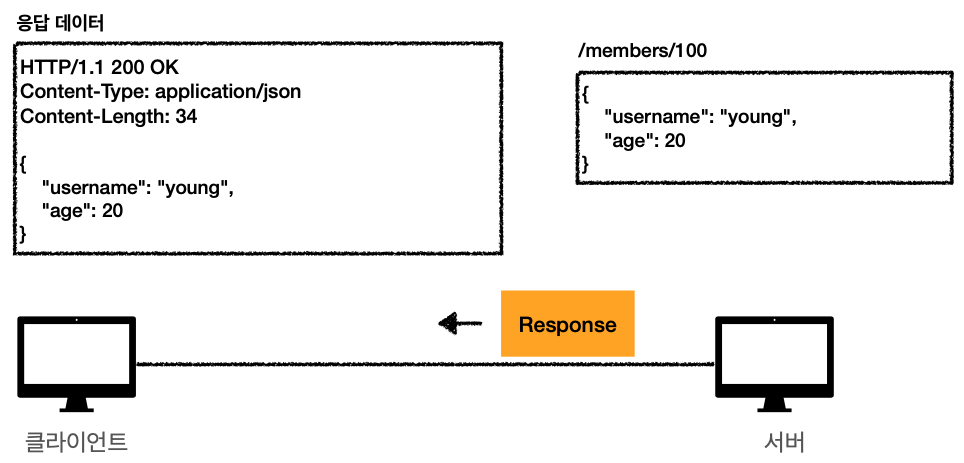

서버는 해당하는 데이터를 가져와 응답 메시지를 만들어 보낸다.

## POST

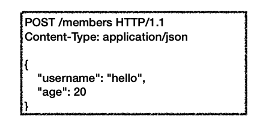

- 요청 데이터 처리
- 메시지 바디를 통해 서버로 요청 데이터 전달
- 서버는 요청 데이터를 처리
    - 요청으로 들어온 데이터를 처리하는 모든 기능을 다 수행한다.
    - 신규 리소스 등록이나 프로세스 처리 등에 사용한다.

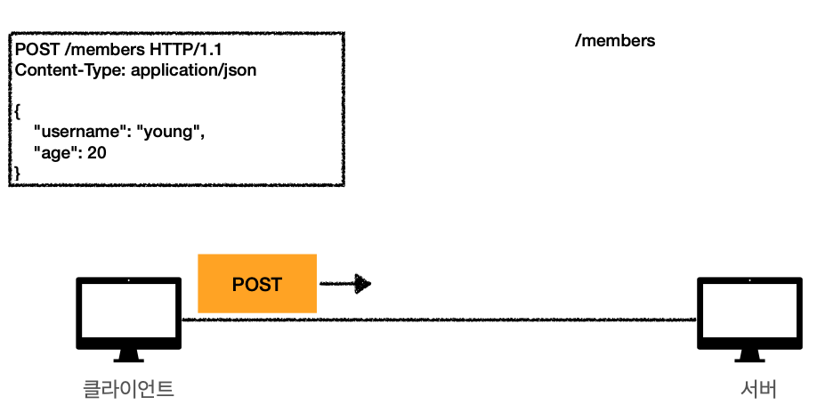

POST 방식으로 데이터를 담아 보낸다.

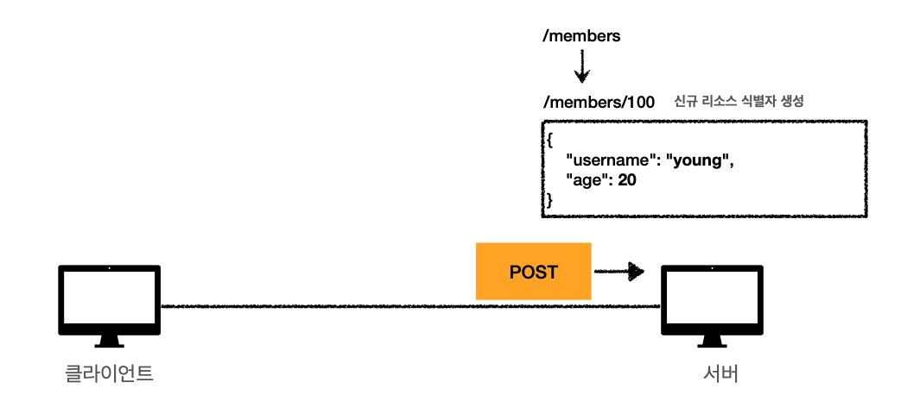

서버는 POST로 신규 등록하는 요청이란 걸 알고 처리한다.

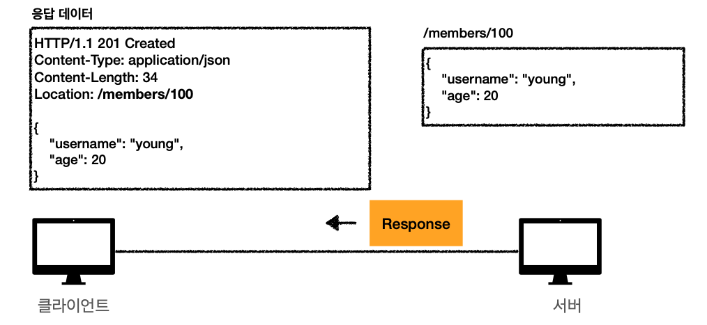

신규 자원 생성은 200이나 201로 응답을 보낸다. 자원이 생성된 경로(location)과 데이터도 보낼 수 있다.

### POST는 요청 데이터를 어떻게 처리한다는 뜻일까?

POST는 리소스의 고유한 의미 체계에 따라 요청에 들어있는 표현을 처리하도록 요청하는 메서드다. POST는 다음과 같은 기능에 사용된다.

- HTML 양식에 입력된 필드와 같은 데이터 블록을 데이터 처리 프로세스에 제공한다.
    - HTML 폼에 입력한 정보로 회원 가입, 주문
- 게시판, 뉴스 그룹, 메일링 리스트, 블로그 또는 유사한 기사 그룹에 메시지를 게시한다.
    - 게시판 글쓰기, 댓글 쓰기
- 서버가 아직 식별하지 않은 새 리소스를 생성한다.
    - 신규 주문 생성
- 기존 자원에 데이터를 추가한다.
    - 한 문서 끝에 내용 추가

리소스 URI에 POST 요청이 오면 요청 데이터를 어떻게 처리할지 리소스마다 따로 정해야 한다. 정해진 것이 없기 때문이다.

### 정리

- 새 리소스 생성, 등록
    - 서버가 아직 식별하지 않은 새 리소스 생성
- 요청 데이터 처리
    - 단순히 데이터를 생성하거나 변경하는 것을 넘어서 프로세스를 처리해야 하는 경우
        - `주문 → 결제 완료 → 배달 시작 → 배달 완료` 처럼 단순한 값 변경을 넘어 프로세스의 상태가 변경되는 경우
    - POST의 결과로 새로운 리소스가 생성되지 않을 수도 있다.
        - POST /orders/{orderId}/start-delivery
        - 리소스 단위로 설계해야 하지만 리소스로는 안될 때가 있다. 그럴 땐 어쩔 수 없이 이렇게라도 설계해야 한다.
    - 다른 메서드로 처리하기 애매한 경우
        - JSON으로 조회를 위한 데이터를 넘겨야 하는데 GET 메서드를 사용하기 어려운 경우
        - 애매하면 POST를 쓴다.
            - POST는 모든 것을 할 수 있다.
            - 하지만 GET으로 조회를 하면 캐싱을 할 수 있기 때문에 조회엔 되도록 GET을 쓴다.
            - 정말 어쩔 수 없는 경우에 사용한다.

## PUT

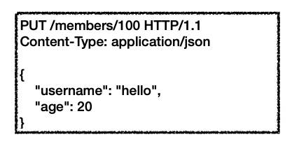

- 리소스를 대체한다.
    - 리소스가 있으면 기존 것을 지우고 `완전히` 대체해버린다.
    - 없으면 새로 생성한다.
    - 쉽게 얘기해서 덮어버린다.
- 클라이언트가 리소스를 식별한다.
    - `/members/100` → 리소스의 위치를 알고 있다.
    - 이것이 POST와의 큰 차이점이다.
        - POST는 `/members`

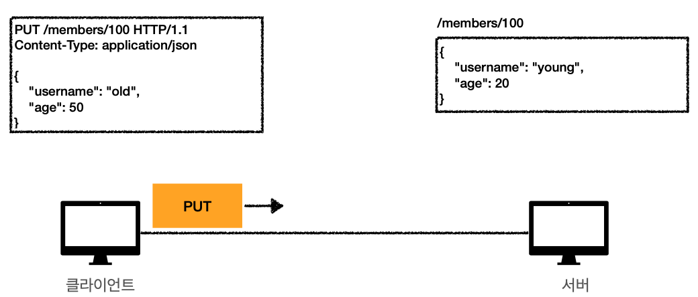

100번 유저에게 리소스를 보내겠다고 요청한다.

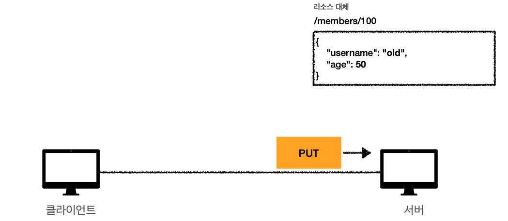

기존에 데이터가 있었다면 완전히 대체된다.

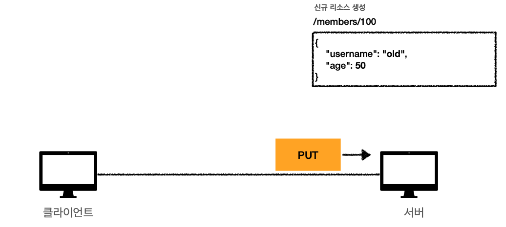

리소스가 없다면 신규로 생성한다.

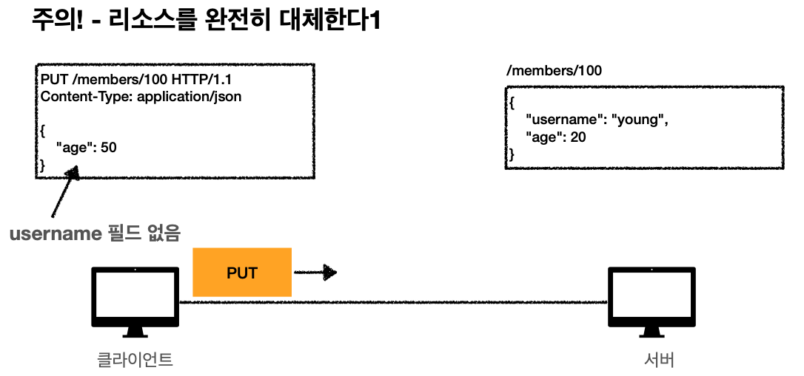

만약 부분적으로 요청을 보낸다면

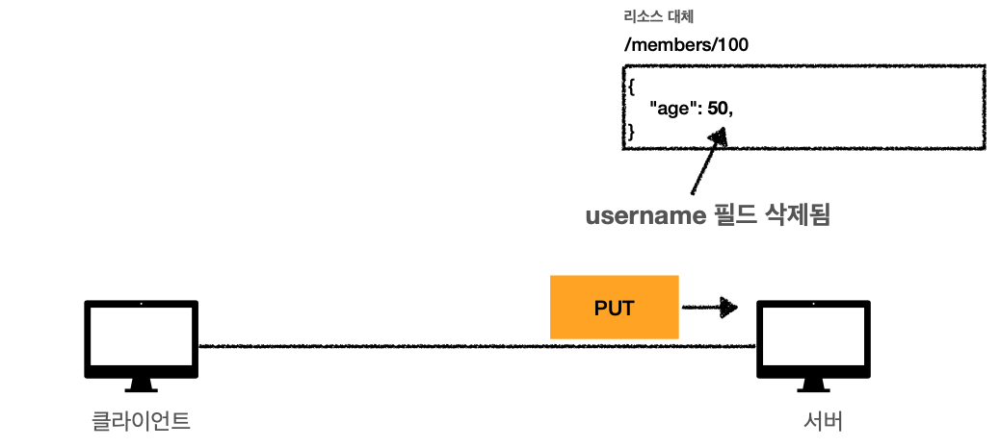

요청을 보낸 그 데이터로 완전히 대체해버린다.

## PATCH

- 리소스 부분 변경

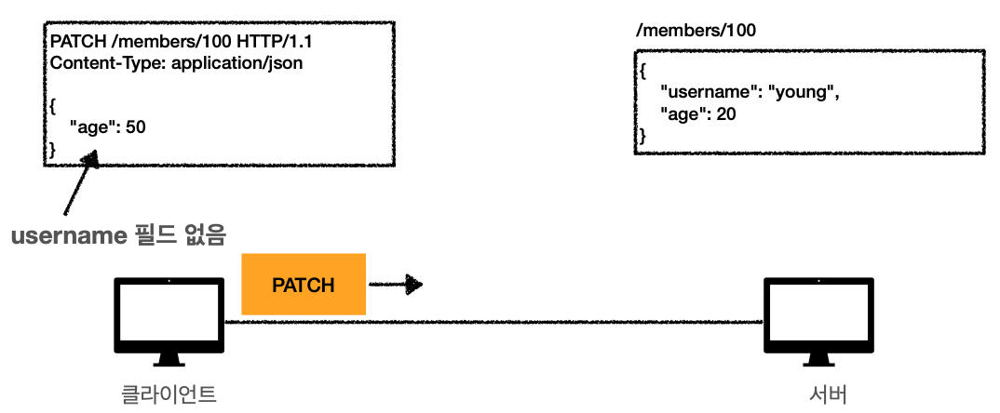

부분적으로 데이터를 보내도

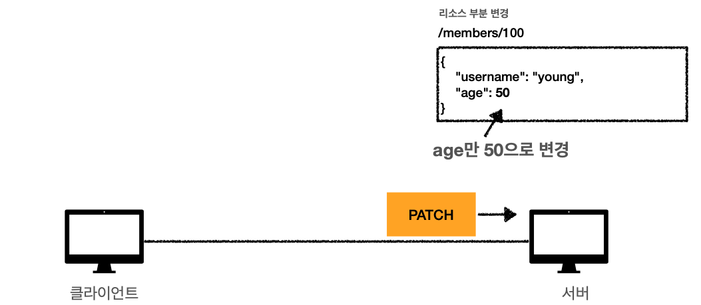

그 데이터만 변경된다.

## DELETE

- 리소스 제거

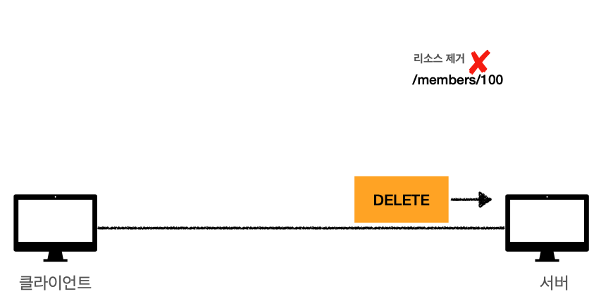

제거할 때는 DELETE를 보내면 된다.

## HTTP 메서드의 속성

### 안전

- 호출해도 리소스를 변경하지 않는 성질 
  
GET은 단순 조회만 하기 때문에 안전하다. POST, DELETE, PATCH, PUT은 당연히 안전하지 않다.

GET이 안전하다고 해도 계속 호출해서 수 많은 로그를 쌓다가 서버가 터져버린다면? → 안전은 해당 리소스가 변하는지 여부만 고려하기 때문에 이런 부분은 신경쓰지 않아도 된다.

### 멱등

- f(f(x)) = f(x)
- 한 번 호출하든, 두 번 호출하든, 100번 호출하든 결과가 동일한 것

- GET: 몇 번 호출하든 같은 결과가 조회된다.
- PUT: 똑같은 파일에 똑같은 요청을 하면 기존 것을 날리고 새로운 것을 덮기 때문에 항상 같다.
- DELETE: 같은 요청을 여러 번 해도 삭제된 결과는 같다.
- POST: 멱등이 `아니다.` 두 번 호출하면 같은 결제가 중복으로 발생할 수 있다.

### 멱등 활용 범위

- 자동 복구 메커니즘
- 서버가 TIMEOUT 등으로 정상 응답을 주지 못했을 때, 클라이언트가 같은 요청을 해도 되는지에 대한 판단 근거가 된다.

하지만 재요청을 하는 중간에 다른 곳에서 리소스를 변경해버린다면 멱등이 적용되지 않는 건 아닐까?

- 사용자 1: GET username: A, age: 20
- 사용자 2: PUT username: A, age: 30
- 사용자 1: GET username: A, age:30
    - 사용자 2의 PUT 때문에 바뀐 데이터를 조회한다.

멱등은 외부 요인으로 중간에 리소스가 변경되는 것까지는 고려하지 않는다.

### 캐시 가능

응답 결과로 온 리소스를 캐시에 저장해두고 사용해도 될까?

- GET, HEAD, POST, PATCH는 캐시를 사용할 수 있다.
- 하지만 실제로는 GET, HEAD 정도만 캐시로 사용한다.
- 캐시를 사용하려면 똑같은 리소스랑 키가 맞아야 하는데, POST와 PATCH는 본문 내용까지 고려하기가 복잡하기 때문이다.
- GET은 딱 URI만 키로 잡고 캐시하면 돼서 간단하다.