# 클라이언트에서 서버로 데이터 전송

## 전달 방식

### 쿼리 파라미터

- GET
- 주로 검색어를 넣거나 정렬 조건을 넣을 때 사용

### 메시지 바디

- POST, PUT, PATCH
- 회원 가입, 주문, 리소스 등록, 리소스 변경에 사용

---

클라이언트에서 서버로 데이터 전송하는 상황에는 4가지가 있다.

## 정적 데이터 조회

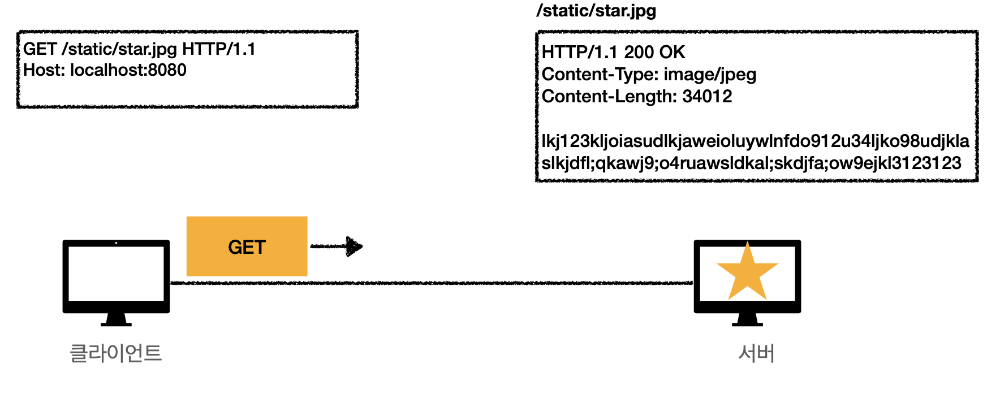

- 이미지, 정적 텍스트 문서 전달
- GET 사용
- 쿼리 파라미터 없이 리소스 경로로 단순하게 조회 가능

쿼리 파라미터로 추가적인 데이터 전달 없이 경로만 넣으면 그냥 이미지 리소스를 만들어서 보내준다.

## 동적 데이터 조회

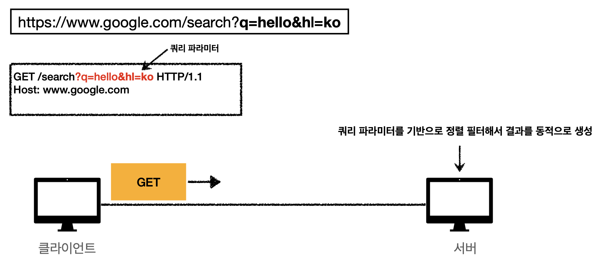

- 주로 검색, 게시판 목록 정렬 필터 등에 사용
    - 조회 조건을 줄여주는 필터, 조회 결과를 정렬하는 정렬 조건 등
- GET 사용
    - 쿼리 파라미터를 사용해 데이터 전달

경로에 검색어나 추가 조건을 쿼리 파라미터에 넣어 보낸다. 그럼 서버는 쿼리 파라미터를 키, 밸류로 꺼내서 결과를 만들어 보낸다.

## HTML Form 데이터 전송

### POST

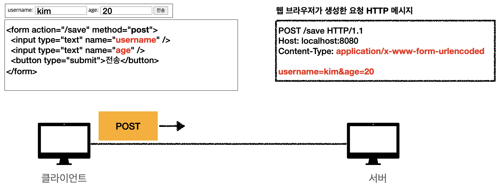

form submit 버튼을 누르면 폼의 데이터를 읽어서 http 메시지를 생성해준다.

- `Content-Type: application/x-www-form-urlencoded`
- `username=kim&age=20`
    - 쿼리 파라미터처럼 생긴 모습으로 http body에 넣는다.

### GET

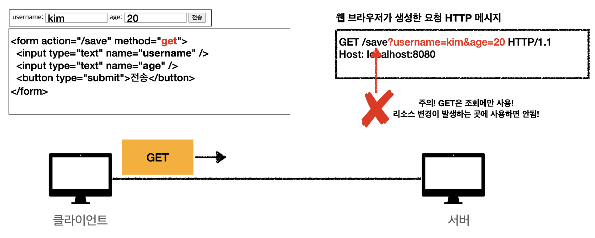

만약 GET으로 바꿔서 폼 데이터를 전송한다면, 웹 브라우저는 http 메시지를 GET처럼 쿼리 파라미터로 만든다. 하지만 GET은 조회에만 사용하므로 **절대 이렇게 사용하면
안된다**.

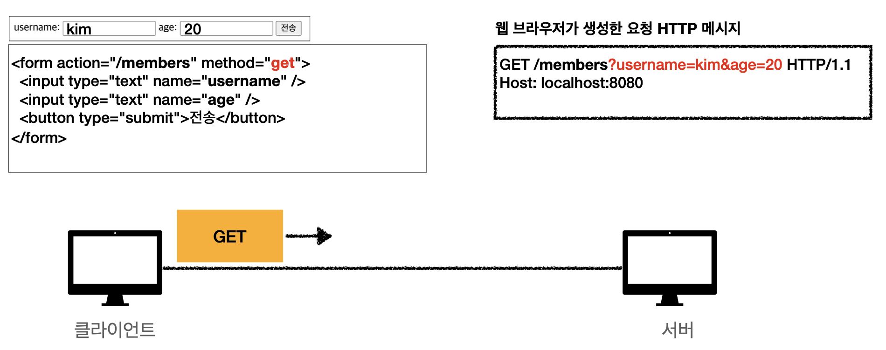

이렇게 조회용으로 사용한다면 괜찮다.

## 파일 전송

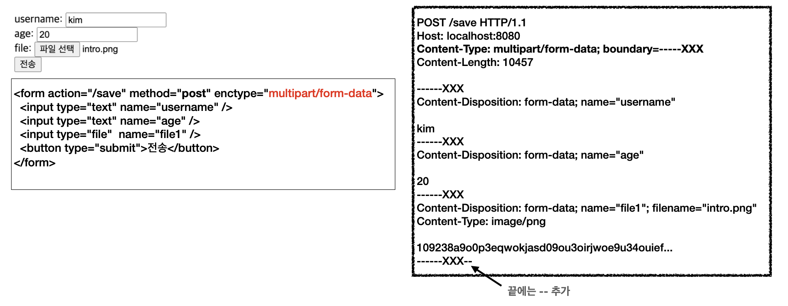

- `multipart/form-data`
    - Content-Type의 기본값은 `application/x-www-form-urlencoded`
      -`multipart/form-data` 로 하면 byte로 되어있는 바이너리 파일을 같이 보낼 수 있다. 그럼 `boundary` 라는 애가 자동으로 경계를 잘라준다.

### 정리

- POST 전송
    - 예) 회원 가입, 상품 주문, 데이터 변경
    - `Content-Type: application/x-www-form-urlencoded` 사용
        - form의 내용을 메시지 바디를 통해서 전송(key=value, 쿼리 파라미터 형식)
        - 전송 데이터를 url encoding 처리
            - 예) abc김 -> abc%EA%B9%80
- GET 전송
    - `Content-Type: multipart/form-data`
        - 파일 업로드 같은 바이너리 데이터 전송시 사용
        - 다른 종류의 여러 파일과 폼의 내용 함께 전송 가능(그래서 이름이 multipart)
- HTML Form 전송은 **GET, POST만 지원**

## HTTP API 데이터 전송

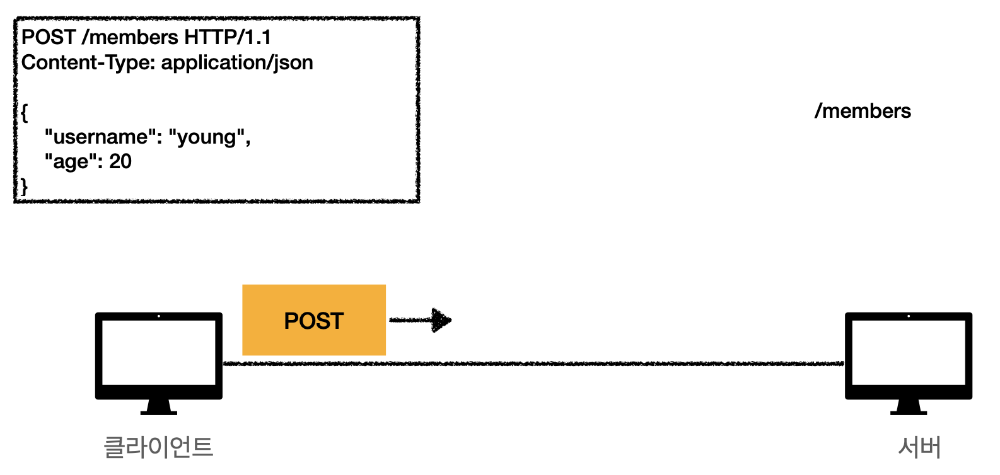

- 서버끼리 서로 통신할 때
    - html 같은 것이 전혀 없으니까 데이터만 전송한다.
- 앱 클라이언트에서 데이터를 전송할 때
- 웹 클라이언트와 통신할 때
    - html의 form 전송 대신, 자바 스크립트를 통해 전송 = AJAX 통신
    - react, vue 같은 웹 클라이언트와 API 통신

### 특징

- POST, PUT, PATCH 사용 시
    - 메시지 바디로 데이터 전송
- GET 사용 시
    - 조회
    - 쿼리 파라미터로 데이터 전달
- `Content-Type: application/json` 을 주로 사용한다.
    - 사실상 표준
    - TEXT, XML, JSON 등이 있는데 이젠 JSON이 대부분 사용됨

## HTTP API 컬렉션

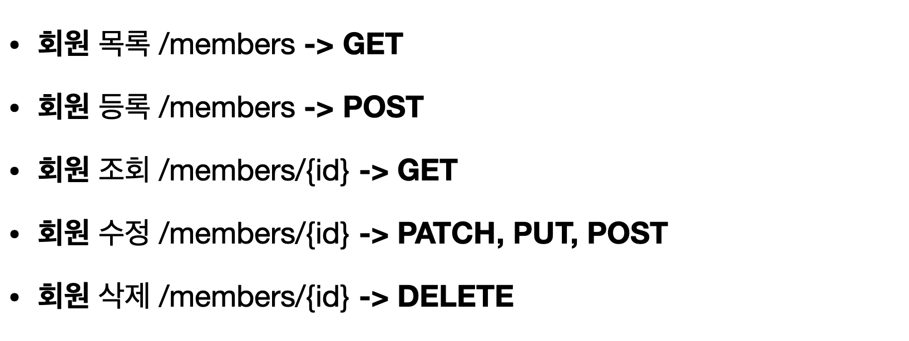

API는 리소스만 관리해야 한다. 어떻게 할지는 HTTP 메서드로 푼다.

- 수정에서 PUT은 완전히 덮어쓰는 기능이므로 부분 업데이트를 하는 PATCH를 쓰는 게 가장 좋다.
- 게시글을 수정하는 경우라면 완전히 덮어쓸 수 있으므로 PUT을 사용할 수 있다. 이것도 저것도 애매하다면 POST를 사용한다.

### POST로 신규 자원 등록

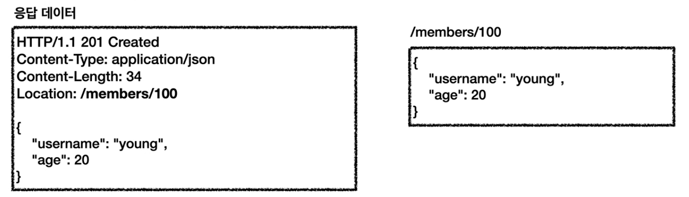

- 클라이언트는 등록될 리소스의 URI를 모른다.
- 서버가 새로 등록된 리소스 URI를 생성해준다.
    - `Location: /members/100`
    - `100` 이라는 식별자가 서버에서 만들어진다.
- 컬렉션
    - 서버가 관리하는 리소스 디렉토리
    - 서버가 리소스의 URI를 생성하고 관리함
    - 여기서 컬렉션은 `/members` 를 의미함

## HTTP API 스토어

### PUT으로 신규 자원 등록

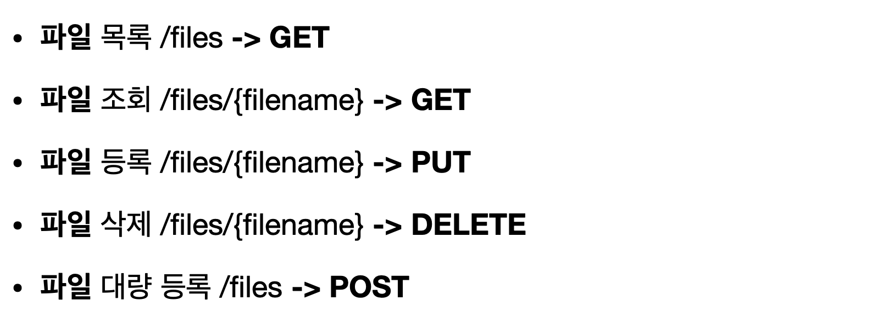

파일을 새로 업로드 할 때는 PUT이 적합하다. 기존 파일이 있으면 지우고 다시 올려야 하기 때문이다. PUT을 자원 등록으로 사용하고 있기 때문에 POST를 임의로 정할 수
있다. 여기서는 파일 대량 등록을 POST로 지정했다.

- 클라이언트가 리소스 URI를 알고 있어야 한다.
    - `files/{filename}` → `filename` 이라는 식별자를 알고 있어야 한다.
- 클라이언트가 직접 리소스의 URI를 지정하고 관리한다.
    - POST로 생성할 때는 데이터만 넘기면 서버가 알아서 만들어 내려준다.
- 스토어
    - 클라이언트가 관리하는 리소스 저장소
    - 클라이언트가 리소스의 URI를 알고 관리
    - 여기서 스토어는 `/files` 를 의미함

---

대부분 POST로 생성한다. 파일과 같은 특수한 경우에만 PUT를 사용한다.

## HTML FORM 사용

순수한 HTML FORM만 사용한다면 GET, POST만 쓸 수 있다.

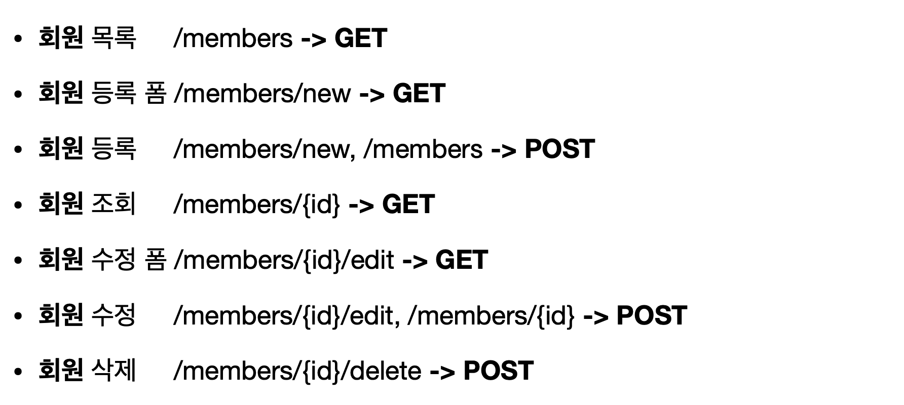

폼에 데이터를 입력하고 submit해서 등록할 때는 두 가지를 선택할 수 있다.

- `/members/new`
    - 폼을 불러올 때와 실제 데이터를 등록할 때 같은 URI를 써서 메서드만 다르게 요청하는 방법
- `/members`
    - 폼을 불러올 때만 `/new` 를 쓰고 실제 등록할 때는 `/members` 를 사용하는 방법
- 같은 URI를 사용하면서 메서드만 다르게 하는 것을 선호한다.
    - 데이터에 문제가 있어서 서버에 보낸 값을 다시 폼에 던져야할 때가 있다. 이때 URI가 통일되어 있으면 경로를 수정하지 않고도 깔끔하게 해결할 수 있다.
    - 통일하지 않으면 리프레시를 하거나 경로를 벗어나면 다시 그 경로로 돌아갈 수가 없다.

---

수정 폼도 실제 수정하는 게 아니라 폼을 불러오기만 할 뿐이므로 GET을 사용한다. 이때 실제 수정할 때도 두 가지 방법이 있다.

- `/members/{id}/edit`
    - 등록과 같은 이유로 통일하는 방법을 추천한다.
- `/members/{id}`

### 컨트롤 URI

HTML FORM은 delete를 쓰지 못하므로 삭제할 때는 어쩔 수 없이 `/delete` 를 붙여서 컨트롤 URI라는 형태로 사용해야 한다.

- GET, POST만 지원하므로 제약이 있다.
- 이런 제약을 해결하기 위해 동사로 된 리소스 경로를 사용한다.
- POST의 `/new` , `/edit` , `/delete` 가 컨트롤 URI가 된다.
- HTTP 메서드로 해결하기 애매한 경우 사용한다.
    - HTTP API에서도 적용된다.
    - 하지만 최대한 리소스 개념을 가지고 설계하고, 정말 안될때만 사용한다.

## 참고하면 좋은 URI 설계 개념

### 문서(document)

- 단일 개념
    - 파일 하나, 객체 인스턴스, 데이터베이스 row 등
    - `/members/100`, `/files/star.jpg`

### 컬렉션(collection)

- 서버가 관리하는 리소스 디렉토리
- 서버가 리소스의 URI를 생성하고 관리
- `/members`

### 스토어(store)

- 클라이언트가 관리하는 자원 저장소
- 클라이언트가 리소스의 URI를 알고 관리
- `/files`

### 컨트롤러(controller), 컨트롤 URI

- 문서, 컬렉션, 스토어로 해결하기 어려운 추가 프로세스 실행
- 동사를 직접 사용
- `/members/{id}/delete`

[REST Resource Naming Guide - REST API Tutorial](https://restfulapi.net/resource-naming)