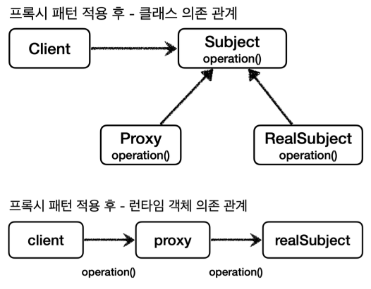
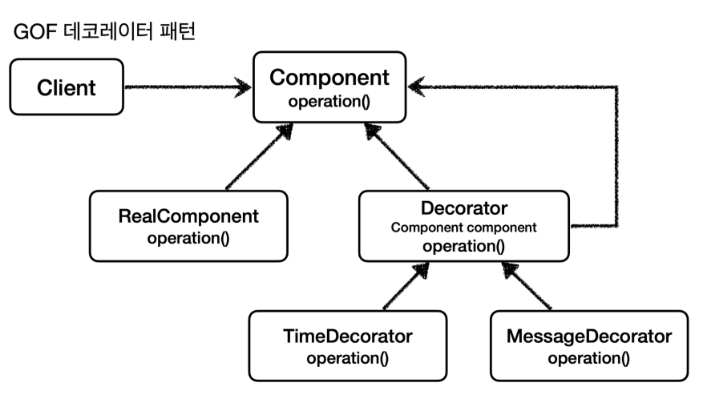

# 프록시 패턴과 데코레이터 패턴

## 프록시의 주요 기능

- 접근 제어
    - 권한에 따른 접근 차단
    - 캐싱
    - 지연 로딩
- 부가 기능 추가
    - 원래 서버가 제공하는 기능에 더해서 부가 기능을 수행
    - ex. 요청, 응답 값을 중간에 변형한다.
    - ex. 실행 시간을 측정해서 추가 로그를 남긴다.

프록시 패턴과 데코레이터 패턴은 똑같이 프록시를 사용하지만 의도에 따라 구분한다.

- 프록시 패턴
    - 접근 제어가 목적
- 데코레이터 패턴
    - 새로운 기능 추가가 목적

프록시와 프록시 패턴은 다르며 프록시 패턴만 프록시를 사용하는 게 아니라 데코레이터 패턴도 사용한다.

## 프록시 패턴


 

```java
public interface Subject {
    String operation();
}
```

 

```java

@Slf4j
public class RealSubject implements Subject {
    @Override
    public String operation() {
        log.info("실제 객체 호출");
        sleep(1000);
        return "data";
    }

    private void sleep(int millis) {
        try {
            Thread.sleep(millis);
        } catch (InterruptedException e) {
            throw new RuntimeException(e);
        }
    }
}
```



```java
public class ProxyPatternClient {

    private Subject subject;

    public ProxyPatternClient(Subject subject) {
        this.subject = subject;
    }

    public void execute() {
        subject.operation();
    }
}

```



```java
public class ProxyPatternTest {

    @Test
    void noProxyTest() {
        RealSubject realSubject = new RealSubject();
        ProxyPatternClient client = new ProxyPatternClient(realSubject);

        client.execute();
        client.execute();
        client.execute();
    }
}
```

 



 

```java
public interface Subject {
    String operation();
}
```

 

```java

@Slf4j
public class RealSubject implements Subject {
    @Override
    public String operation() {
        log.info("실제 객체 호출");
        sleep(1000);
        return "data";
    }

    private void sleep(int millis) {
        try {
            Thread.sleep(millis);
        } catch (InterruptedException e) {
            throw new RuntimeException(e);
        }
    }
}
```



```java
public class ProxyPatternClient {

    private Subject subject;

    public ProxyPatternClient(Subject subject) {
        this.subject = subject;
    }

    public void execute() {
        subject.operation();
    }
}

```



```java

@Slf4j
public class CacheProxy implements Subject {

    private Subject target;
    private String cacheValue;

    public CacheProxy(Subject target) {
        this.target = target;
    }

    @Override
    public String operation() {
        log.info("프록시 호출");

        if (cacheValue == null) {
            cacheValue = target.operation();
        }

        return cacheValue;
    }
}

```



```java
public class ProxyPatternTest {

    @Test
    void cacheProxyTest() {
        CacheProxy cacheProxy = new CacheProxy(new RealSubject());
        ProxyPatternClient client = new ProxyPatternClient(cacheProxy);

        client.execute();
        client.execute();
        client.execute();
    }
}
```

 

## 데코레이터 패턴

 

```java
public interface Component {
    String operation();
}
```

 

```java

@Slf4j
public class RealComponent implements Component {

    @Override
    public String operation() {
        log.info("RealComponent 실행");
        return "data";
    }
}

```



```java

@Slf4j
public class DecoratorPatternClient {

    private Component component;

    public DecoratorPatternClient(Component component) {
        this.component = component;
    }

    public void execute() {
        String result = component.operation();
        log.info("result = {}", result);
    }
}
```



```java

@Slf4j
public class MessageDecorator implements Component {

    private Component component;

    public MessageDecorator(Component component) {
        this.component = component;
    }

    @Override
    public String operation() {
        log.info("MessageDecorator 실행");
        String result = component.operation();
        return "*****" + result + "*****";
    }
}
```



```java

@Slf4j
public class DecoratorPatternTest {

    @Test
    void decorator1() {
        RealComponent realComponent = new RealComponent();
        MessageDecorator messageDecorator = new MessageDecorator(realComponent);
        DecoratorPatternClient client = new DecoratorPatternClient(messageDecorator);
        client.execute();
    }
}
```

 

프록시는 체인이 가능하기 때문에 아래처럼 여러 개를 추가할 수 있다.

 

```java

@Slf4j
public class TimeDecorator implements Component {

    private Component component;

    public TimeDecorator(Component component) {
        this.component = component;
    }

    @Override
    public String operation() {
        log.info("TimeDecorator 실행");

        long startTime = System.currentTimeMillis();
        String result = component.operation();
        long endTime = System.currentTimeMillis();

        long resultTime = endTime - startTime;
        log.info("TimeDecorator 종료. resultTime = {}", resultTime);
        return result;
    }
}

```

 

```java

@Slf4j
public class DecoratorPatternTest {

    @Test
    void decorator2() {
        RealComponent realComponent = new RealComponent();
        TimeDecorator timeDecorator = new TimeDecorator(realComponent);
        MessageDecorator messageDecorator = new MessageDecorator(timeDecorator);
        DecoratorPatternClient client = new DecoratorPatternClient(messageDecorator);
        client.execute();
    }
}
```

 

- 런타임에 client -> time -> message -> real로 의존성이 생긴다.
- 클라이언트를 전혀 변경하지 않고 데코레이터를 계속 추가할 수 있었다.



- 내부 호출 대상인 component를 속성으로 가지고 component를 항상 호출하는 부분이 중복되므로 Decorator라는 추상 클래스를 만들어 뺄 수도 있다.
    - 어떤 게 데코레이터인지 쉽게 알 수 있는 장점이 있다.

## 정리

- 프록시를 사용하고 해당 프록시가 접근 제어를 한다면 프록시 패턴이다.
- 새로운 기능을 추가하는 것이 모적이면 데코레이터 패턴이다.

## 적용

```java

@Configuration
public class InterfaceProxyConfig {

    @Bean
    public OrderControllerV1 orderController(LogTrace logTrace) {
        OrderControllerV1Impl controllerImpl = new OrderControllerV1Impl(orderService(logTrace));
        return new OrderControllerInterfaceProxy(controllerImpl, logTrace);
    }

    @Bean
    public OrderServiceV1 orderService(LogTrace logTrace) {
        OrderServiceV1Impl serviceImpl = new OrderServiceV1Impl(orderRepository(logTrace));
        return new OrderServiceInterfaceProxy(serviceImpl, logTrace);
    }

    @Bean
    public OrderRepositoryV1 orderRepository(LogTrace logTrace) {
        OrderRepositoryV1Impl repositoryImpl = new OrderRepositoryV1Impl();
        return new OrderRepositoryInterfaceProxy(repositoryImpl, logTrace);
    }

}
```

- 이제 실제 객체가 아니라 프록시를 스프링 빈으로 등록한다.
- 이제 실제 객체는 스프링 컨테이너와는 관련이 없다. 그저 프록시를 통해 참조될 뿐이다.
- 프록시 객체는 스프링 컨테이너가 관리하고 자바 힙 메모리에도 올라간다.
- 실제 객체는 자바 힙 메모리에는 올라가지만 스프링 컨테이너가 관리하지는 않는다.