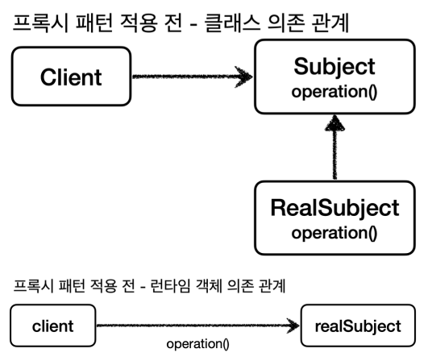

# 프록시 패턴과 데코레이터 패턴

## 프록시 패턴

### 프록시의 주요 기능

- 접근 제어
    - 권한에 따른 접근 차단
    - 캐싱
    - 지연 로딩
- 부가 기능 추가
    - 원래 서버가 제공하는 기능에 더해서 부가 기능을 수행
    - ex. 요청, 응답 값을 중간에 변형한다.
    - ex. 실행 시간을 측정해서 추가 로그를 남긴다.

프록시 패턴과 데코레이터 패턴은 똑같이 프록시를 사용하지만 의도에 따라 구분한다.

- 프록시 패턴
    - 접근 제어가 목적
- 데코레이터 패턴
    - 새로운 기능 추가가 목적

프록시와 프록시 패턴은 다르며 프록시 패턴만 프록시를 사용하는 게 아니라 데코레이터 패턴도 사용한다.



 

```java
public interface Subject {
    String operation();
}
```

 

```java

@Slf4j
public class RealSubject implements Subject {
    @Override
    public String operation() {
        log.info("실제 객체 호출");
        sleep(1000);
        return "data";
    }

    private void sleep(int millis) {
        try {
            Thread.sleep(millis);
        } catch (InterruptedException e) {
            throw new RuntimeException(e);
        }
    }
}
```



```java
public class ProxyPatternClient {

    private Subject subject;

    public ProxyPatternClient(Subject subject) {
        this.subject = subject;
    }

    public void execute() {
        subject.operation();
    }
}

```



```java
public class ProxyPatternTest {

    @Test
    void noProxyTest() {
        RealSubject realSubject = new RealSubject();
        ProxyPatternClient client = new ProxyPatternClient(realSubject);

        client.execute();
        client.execute();
        client.execute();
    }
}
```

 


 

```java
public interface Subject {
    String operation();
}
```

 

```java

@Slf4j
public class RealSubject implements Subject {
    @Override
    public String operation() {
        log.info("실제 객체 호출");
        sleep(1000);
        return "data";
    }

    private void sleep(int millis) {
        try {
            Thread.sleep(millis);
        } catch (InterruptedException e) {
            throw new RuntimeException(e);
        }
    }
}
```



```java
public class ProxyPatternClient {

    private Subject subject;

    public ProxyPatternClient(Subject subject) {
        this.subject = subject;
    }

    public void execute() {
        subject.operation();
    }
}

```



```java

@Slf4j
public class CacheProxy implements Subject {

    private Subject target;
    private String cacheValue;

    public CacheProxy(Subject target) {
        this.target = target;
    }

    @Override
    public String operation() {
        log.info("프록시 호출");

        if (cacheValue == null) {
            cacheValue = target.operation();
        }

        return cacheValue;
    }
}

```



```java
public class ProxyPatternTest {

    @Test
    void cacheProxyTest() {
        CacheProxy cacheProxy = new CacheProxy(new RealSubject());
        ProxyPatternClient client = new ProxyPatternClient(cacheProxy);

        client.execute();
        client.execute();
        client.execute();
    }
}
```

 


