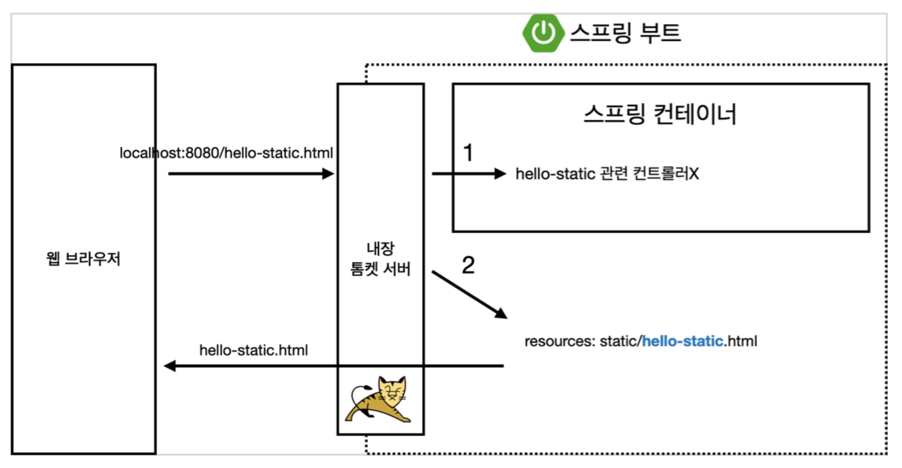
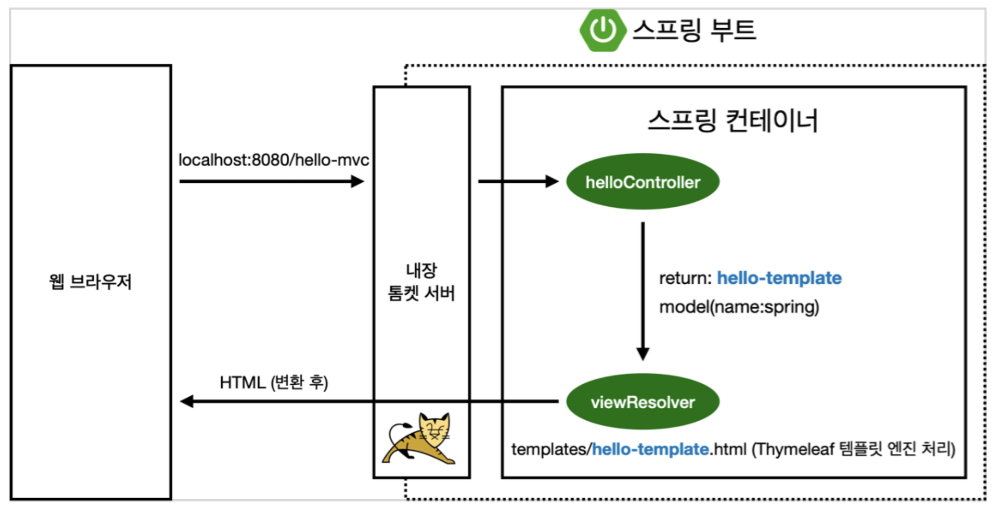
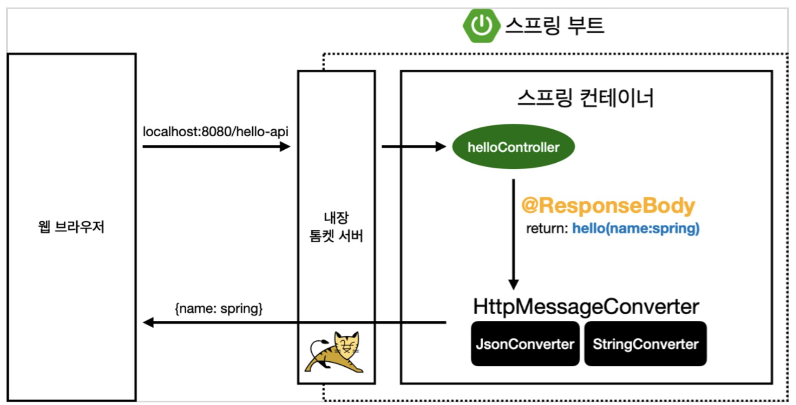

# 스프링 웹 개발 기초

웹 개발에는 정적 컨텐츠, MVC와 템플릿 엔진, API 라는 세 가지 방식이 있다.

## 정적 컨텐츠 

- 이전에 웰컴 페이지 했던 것처럼 서버에서 뭐 하는 것 없이 파일을 그냥 내려주는 것
- `resources` - `static` 에 html 등 아무 리소스 파일을 만들면 `http://localhost:8080/hello-static.html` 로 접속할 수 있다.



1. 웹 브라우저에서 `localhost:8080/hello-static.html` 을 치면 내장 톱캣 서버가 요청을 받는다.
2. 이런 요청이 왔다고 스프링에게 넘긴다.
3. 먼저 `hello-static` 이라는 컨트롤러가 있는지 찾아본다. 즉, 컨트롤러에 우선순위가 있다.
4. 없으면 `resources` 안에 있는 `static/hello-static.html` 을 찾아서 반환한다.

** Reference **

[Static Content](https://docs.spring.io/spring-boot/docs/current/reference/html/spring-boot-features.html#boot-features-spring-mvc-static-content)

## MVC와 템플릿 엔진

html을 서버에서 뭔가 동적으로 바꿔서 내려주기 위해 MVC 패턴으로 개발하는 것. 정적 컨텐츠는 파일을 그냥 그대로 내려주는 것이고 이 방식은 서버에서 뭔가 변형을 해서 내려준다.

### MVC

Model, View, Controller

```java
@Controller
public class HelloController {
	@GetMapping("hello-mvc")
	public String helloMvc(@RequestParam("name") String name, Model model) {
		model.addAttribute("name", name);
	return "hello-template"; 
	}
}
```

```html
<html xmlns:th="http://www.thymeleaf.org"> 
<body>
<p th:text="'hello ' + ${name}">hello! empty</p> 
</body>
</html>
```

옛날에는 컨트롤러와 뷰가 나눠져있지 않았다. `http://localhost:8080/hello-mvc?name=dodeon` → 파라미터로 넘어온 name을 모델에 넘겨주면 return 하는 `hello-template` 에 표시된다.



1. 웹 브라우저가 `/hello-mvc` 를 던지면 내장 톰캣 서버가 스프링에 던진다. 스프링은 `hello-mvc` 가 매핑된 컨트롤러의 메서드로 연결한다. 메서드 로직에 따라 name은 spring으로 `hello-template` 을 리턴한다.
2. 뷰를 찾아서 템플릿을 연결시켜주는 `viewResolver`가 return한 `hello-template` 이라는 똑같은 이름의 파일을 찾아서 thymeleaf 템플릿 엔진에게 처리해달라고 넘긴다.
3. thymeleaf 템플릿 엔진은 html로 변환을 해서 웹 브라우저에 반환한다.

## API

- json이라는 데이터 포맷으로 클라이언트에게 전달하는 것
- 데이터를 내려주면 프론트에서 알아서 보여준다.
- 서버는 어떤 데이터를 어떻게 다루는지만 신경쓰면 된다.

### ResponseBody

```java
@Controller
public class HelloController {
  @GetMapping("hello-string")
  @ResponseBody  // 중요
  public String helloString(@RequestParam("name") String name) {
    return "hello " + name;
  }
}
```

- `http://localhost:8080/hello-string?name=dodeon`
- http에서 response의 body에 직접 `hello` + `name` 을 넣어주겠다는 의미다.
- view 없이 그냥 리턴하는 값 그대로 대답한다.

### Json으로 반환

```java
@Controller
public class HelloController {

  @GetMapping("hello-api")
  @ResponseBody
  public Hello helloApi(@RequestParam("name") String name) {
    Hello hello = new Hello();
    hello.setName(name);
    return hello;
  }

  static class Hello {

    private String name;

    public String getName() {
      return name;
    }

    public void setName(String name) {
      this.name = name;
    }
  }
}
```

- `hello-api` 를 요청하면 `{"name":"dodeon"}` 이렇게 객체로 반환하는 것을 볼 수 있다.
- 최근 프로젝트는 다 이 방식으로 하면 된다.

```java
private String name;

    public String getName() {
      return name;
    }

    public void setName(String name) {
      this.name = name;
    }
```

이렇게 getter, setter 방식으로 만들어서 private인 name에 바로 접근하지 않고 public 메서드로 접근하는 것을 `자바 빈 표준 방식` 혹은 `프로퍼티 접근 방식`이라고 한다.



- `ResponseBody`
    - http의 body에 문자 내용을 직접 반환한다.
- `viewResolver` 대신 `HttpMessageConverter`가 동작한다.
    - `StringHttpMessageConverter`
        - 기본 문자를 처리한다.
    - `MappingJackson2HttpMessageConverter`
        - 기본 객체를 처리한다.
        - json으로 반환해주는 라이브러리. gson이라는 것도 있는데 이 라이브러리가 스프링에 기본으로 들어가있다.
    - byte 등 기타 여러 `HttpMessageConverter`가 기본으로 등록되어 있다.
- 클라이언트의 HTTP Accept 해더와 서버의 컨트롤러 반환 타입 정보를 조합해서 `HttpMessageConverter` 가 선택된다. 더 자세한 내용은 스프링 MVC 강의에서 설명할 예정이다.

웹브라우저에서 요청이 들어오면 톰캣이 스프링에 던진다. 스프링은 `hello-api` 라는 컨트롤러를 찾는다. 근데 보니까 `@ResponseBody` 라는 애너테이션이 붙어있다. 원래 이게 안붙어 있으면 `viewResolver`에게 던지는데 이제는 http response를 그대로 넘겨야겠다고 판단한다.

근데 그냥 String이 아니라 Hello라는 객체이기 때문에 json 방식으로 만들어서 반환한다. 이때 `HttpMessageConverter` 라는 게 동작한다. 단순 String이라면 `StringConverter`, json이라면 `JsonConverter` 를 이용해 바꾼다.