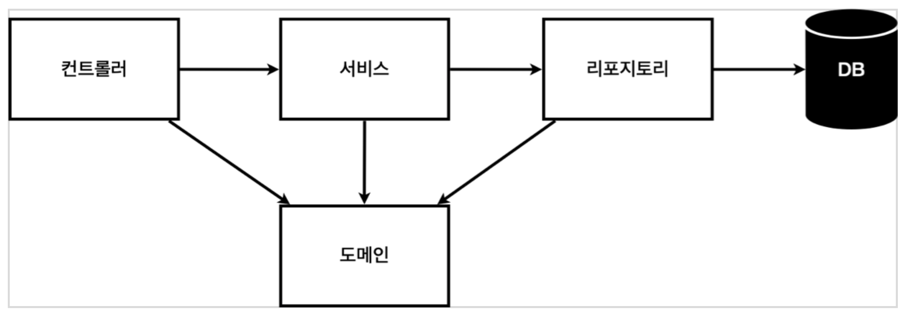
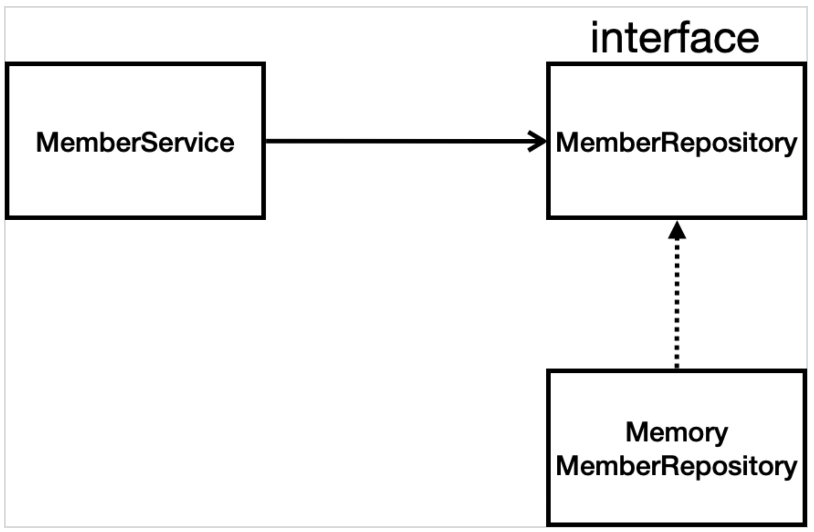

# 회원 관리 예제 - 백엔드

## 비즈니스 요구사항 정리

### 데이터

- 회원 ID
- 이름

### 기능

- 회원 등록
- 회원 조회
- 아직 데이터 저장소는 선정되지 않음

## 일반적인 웹 애플리케이션 구조



### 컨트롤러

- 웹 MVC의 컨트롤러 역할

### 서비스

- 핵심 비즈니스 로직 구현

### 도메인

- 비즈니스 도메인 객체
- 회원, 주문, 쿠폰 등 주로 데이터베이스에 저장하고 관리되는 데이터를 말한다.

### 리파지토리

- 데이터 베이스에 접근 하는 객체
- 도메인 객체를 DB에 저장하고 관리한다.

## 클래스 의존 관계 설정



- 아직 DB가 정해지지 않았으므로 우선 인터페이스로 구현 클래스를 변경할 수 있도록 설계한다.
- DB는 RDB, NoSQL 등 다양한 저장소를 고민중인 상황으로 가정한다.
- 개발을 진행하기 위해 초기 개발 단계에서는 가벼운 메모리 기반의 데이터 저장소를 사용한다.

### 회원 객체

```java
package hello.hellospring.domain;

public class Member {

  private Long id;
  private String name;

  public Long getId() {
    return id;
  }

  public void setId(Long id) {
    this.id = id;
  }

  public String getName() {
    return name;
  }

  public void setName(String name) {
    this.name = name;
  }
}
```

### 회원 Repository

```java
package hello.hellospring.repository;

import hello.hellospring.domain.Member;
import java.util.List;
import java.util.Optional;

public interface MemberRepository {

  Member save(Member member);

  Optional<Member> findById(Long id);

  Optional<Member> findByName(String name);

  List<Member> findAll();
}
```

```java
package hello.hellospring.repository;

import hello.hellospring.domain.Member;
import java.util.*;

public class MemoryMemberRepository implements MemberRepository {

  /**
   * 동시성 문제가 고려되어 있지 않음, 실무에서는 ConcurrentHashMap, AtomicLong 사용 고려
   */
  private static Map<Long, Member> store = new HashMap<>();
  private static long sequence = 0L;

  @Override
  public Member save(Member member) {
    member.setId(++sequence);
    store.put(member.getId(), member);

    return member;
  }

  @Override
  public Optional<Member> findById(Long id) {
    return Optional.ofNullable(store.get(id));
  }

  @Override
  public List<Member> findAll() {
    return new ArrayList<>(store.values());
  }

  @Override
  public Optional<Member> findByName(String name) {
    // name과 일치하는 것 중 아무거나 반환하는데, optional이므로 null이면 null도 포함해서 반환한다.
    return store.values().stream()
        .filter(member -> member.getName().equals(name))
        .findAny();
  }

  public void clearStore() {
    store.clear();
  }
}
```

** Reference **

[atomic vs volatile vs synchronized](https://mygumi.tistory.com/112)

### 테스트

```java
class MemoryMemberRepositoryTest {

  MemoryMemberRepository repository = new MemoryMemberRepository();

  @AfterEach
  void tearDown() {
    repository.clearStore();
  }

  @Test
  void save() {
    Member member = new Member();
    member.setName("spring");

    repository.save(member);
    Member result = repository.findById(member.getId()).get();
    Assertions.assertEquals(member, result);
  }

  @Test
  void findByName() {
    Member member1 = new Member();
    member1.setName("spring1");
    repository.save(member1);

    Member member2 = new Member();
    member2.setName("spring2");
    repository.save(member2);

    Member result = repository.findByName("spring1").get();
    assertThat(result).isEqualTo(member1);
  }

  @Test
  void findAll() {
    Member member1 = new Member();
    member1.setName("spring1");
    repository.save(member1);

    Member member2 = new Member();
    member2.setName("spring2");
    repository.save(member2);

    List<Member> result = repository.findAll();

    assertThat(result.size()).isEqualTo(2);
  }
}
```

- After Each
    - 한 번에 여러 테스트를 하면 메모리 DB에 직전 테스트의 결과가 남을 수 있다. 그럼 다음 테스트에 영향이 가므로 각 테스트가 종료될 때마다 메모리 DB에 저장된
      데이터를 삭제한다.
    - 테스트는 각각 독립적으로 실행되어야 한다. 테스트 순서에 의존 관계가 있으면 좋지 않다.

### 회원 Service

```java
public class MemberService {

  private final MemberRepository memberRepository = new MemoryMemberRepository();

  /**
   * 회원 가입
   */
  public Long join(Member member) {
    // 같은 이름이 있는 중복 회원은 제외한다.
    validateDuplicateMember(member);

    memberRepository.save(member);
    return member.getId();
  }

  /**
   * 전체 회원 조회
   */
  public List<Member> findMembers() {
    return memberRepository.findAll();
  }

  public Optional<Member> findOne(Long memberId) {
    return memberRepository.findById(memberId);
  }

  private void validateDuplicateMember(Member member) {
    memberRepository.findByName(member.getName()).ifPresent(m -> {
      throw new IllegalStateException("이미 존재하는 회원입니다.");
    });
  }

}
```

위 코드는 회원 Service가 Repository를 직접 생성하고 있다.

```java
public class MemberService {

  private final MemberRepository memberRepository;

  public MemberService(MemberRepository memberRepository) {
    this.memberRepository = memberRepository;
  }
 
	...
}
```

회원 Service를 생성할 때 DI 하도록 변경한다.

### 테스트

```java
class MemberServiceTest {

  MemberService memberService;
  MemoryMemberRepository memberRepository;

  @BeforeEach
  void setUp() {
    // 테스트가 서로 영향이 없도록 항상 새로운 객체를 생성해 의존 관계를 맺어준다.
    memberRepository = new MemoryMemberRepository();
    memberService = new MemberService(memberRepository);
  }

  @AfterEach
  void tearDown() {
    memberRepository.clearStore();
  }

  @Test
  void 회원가입() {
    // given
    Member member = new Member();
    member.setName("hello");

    // when
    Long saveId = memberService.join(member);

    // then
    Member findMember = memberService.findOne(saveId).get();
    Assertions.assertThat(member.getName()).isEqualTo(findMember.getName());
  }

  @Test
  void 중복_회원_예외() {
    // given
    Member member1 = new Member();
    member1.setName("spring");

    Member member2 = new Member();
    member2.setName("spring");

    // when
    memberService.join(member1);

    // then
    IllegalStateException e = assertThrows(IllegalStateException.class,
        () -> memberService.join(member2));

    // 예외의 메시지도 검증 가능
    Assertions.assertThat(e.getMessage()).isEqualTo("이미 존재하는 회원입니다.");
  }
}
```

- BeforeEach
    - 각 테스트 실행 전에 호출되는 메서드