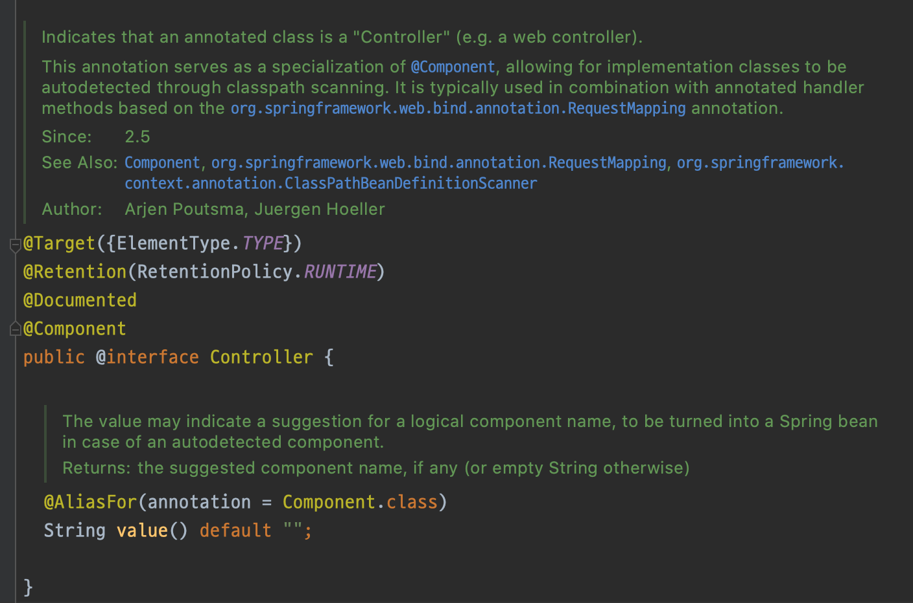
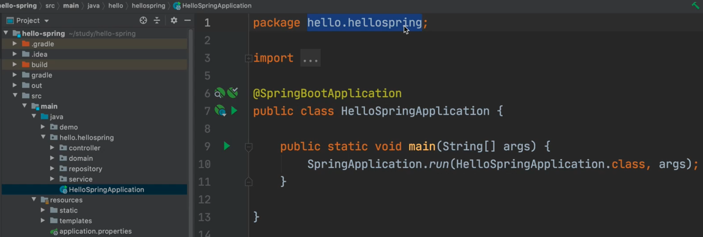
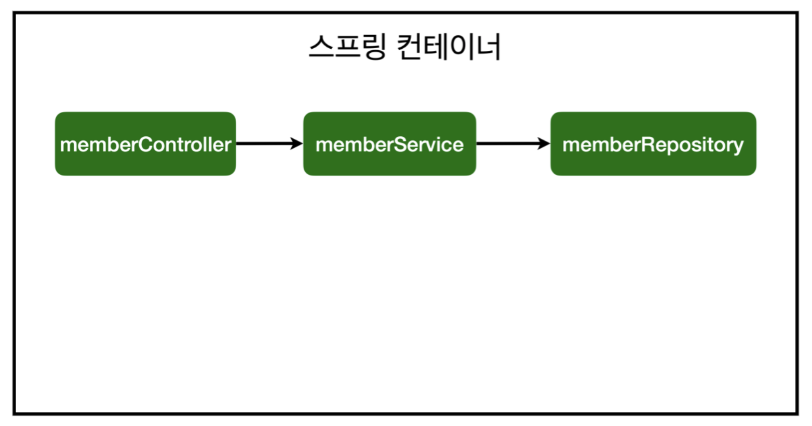

# 스프링 빈과 의존 관계

스프링 빈 등록에는 두 가지 방법이 있다.

- 컴포넌트 스캔과 자동 의존 관계 설정
- 자바 코드로 직접 스프링 빈 등록

## 컴포넌트 스캔과 자동 의존 관계 설정

```java
// 애너테이션을 붙이면 스프링 컨테이너가 MemberController를 생성해서 컨테이너에 넣어두고 관리한다.
@Controller
public class MemberController {

  private final MemberService memberService;

  @Autowired
  public MemberController(MemberService memberService) {
    this.memberService = memberService;
  }
}
```

생성자에 `@Autowired` 가 있으면 스프링이 연관된 객체를 스프링 컨테이너에서 찾아서 넣어준다. 이렇게 객체 의존 관계를 외부에서 넣어주는 것을 의존성 주입이라고 한다.
이전 코드에서는 개발자가 직접 주입했지만 여기서는 `@Autowired` 덕분에 스프링이 주입해준다.

하지만 이렇게 하면 아래의 오류가 발생한다.

```text
Consider defining a bean of type 'hello.hellospring.service.MemberService' in your configuration.
```

`MemberService` 가 스프링 빈으로 등록되어 있지 않기 때문이다. `MemberController` 는 `@Controller` 가 달렸기 때문에 스프링 빈으로 등록되어
문제가 없다.

### 컴포넌트 스캔

`@Component`가 있으면 스프링 빈으로 자동 등록된다.



`@Controller`가 달린 컨트롤러가 빈으로 자동 등록된 이유도 이 애너테이션에 `@Component`가 포함되어 있어 컴포넌트 스캔이 되기 때문이다. `@Service`
, `@Repository` 도 마찬가지다.

스프링이 실행될 때 컴포넌트 관련 애너테이션이 있으면 다 스캔해서 스프링 컨테이너에 등록한다. `@Autowired`는 그걸 연결시켜주는 역할이다.



`SpringBootApplication`이 붙은 곳부터 하위 패키지만 스캔하기 때문에 demo에 있는 클래스는 애넡이션이 붙어있어도 스캔하지 않는다.

### 회원 Service 스프링 빈 등록

```java

@Service
public class MemberService {

  private final MemberRepository memberRepository;

  @Autowired
  public MemberService(MemberRepository memberRepository) {
    this.memberRepository = memberRepository;
  }
}
```

Service에도 `@Service` 를 붙여 빈으로 등록해준다.

- 생성자에 `@Autowired` 를 붙이는 방식은 객체를 생성하는 시점에 해당 스프링 빈을 찾아 주입한다.
- 생성자가 1개만 있다면 `@Autowired` 는 생략할 수 있다.

### 회원 Repository 스프링 빈 등록

```java

@Repository
public class MemoryMemberRepository implements MemberRepository {

}
```

### 스프링 빈 등록 상태



이제 `MemberService`와 `MemberRepository`가 스프링 컨테이너에 빈으로 등록되었다.

스프링은 스프링 컨테이너에 스프링 빈을 등록할 때, 싱글톤으로 등록한다. 즉, 하나만 등록해서 공유한다. 따라서 같은 스프링 빈이면 같은 인스턴스다. 설정으로 싱글톤이 아니게 바꿀
수 있지만 대부분 싱글톤을 사용한다.

## 자바 코드로 직접 스프링 빈 등록

Service와 Repository의 `@Service`, `@Repository`, `@Autowired` 를 제거하고 진행한다.

```java

@Configuration
public class SpringConfig {

  // 스프링 빈으로 등록하겠다.
  @Bean
  public MemberService memberService() {
    return new MemberService(memberRepository());
  }

  @Bean
  public MemberRepository memberRepository() {
    return new MemoryMemberRepository();
  }

  /*
   * 1. 스프링이 실행될 때 configuration을 읽고 MemberService와 MemberRepository를 빈으로 등록한다.
   * 2. 빈으로 등록된 MemberRepository를 MemberService에 넣어준다.
   * */
}
```

지금은 `MemoryMemberRepository` 를 사용하지만 다른 Repository로 변경할 예정이므로, 컴포넌트 스캔 대신 자바 코드로 빈을 설정하면 쉽게 바꿀 수 있다.

```java

@Configuration
public class SpringConfig {

  ...

  @Bean
  public MemberRepository memberRepository() {
    return new NewMemberRepository();
  }
}
```

이런 식으로 다른 Repository로 변경해주면 된다.

하지만 정형화된 컨트롤러, 서비스, 리파지토리는 컴포넌트 스캔을 사용한다. 정형화되지 않거나, 상황에 따라 구현 클래스를 변경해야 하면 설정을 통해 스프링 빈으로 등록하는 방식이
좋다.

## DI 종류

### 필드 주입

```java

@Controller
public class MemberController {

  @Autowired
  private final MemberService memberService;
}
```

스프링을 실행할 때 처음 주입한 뒤로는 바꿀 수 있는 방법이 없다.

### Setter 주입

```java

@Controller
public class MemberController {

  private MemberService memberService;

  @Autowired
  public void setMemberService(MemberSerivce memberService) {
    this.memberService = memberService;
  }
}
```

생성은 생성대로 되고 setter는 나중에 호출되면서 memberService를 주입한다. 컨트롤러를 호출할 때 setter가 public으로 노출되어야 하기 때문에 누군가가 잘못
바꾸면 문제가 될 수 있다.

### 생성자 주입

```java

@Controller
public class MemberController {

  private final MemberService memberService;

  @Autowired
  public void setMemberService(MemberSerivce memberService) {
    this.memberService = memberService;
  }
}
```

생성하는 시점에만 넣어두고 변경을 막을 수 있다. 의존 관계가 런타임 때 다른 것으로 바꿔치기 되는 즉, 동적으로 변하는 경우는 거의 없으므로 생성자 주입을 권장한다.

## Autowired 주의 사항

`@Autowired`를 통한 DI는 스프링이 관리하는 객체에서만 동작한다. 즉, 스프링 빈으로 등록하지 않고 직접 생성한 객체에서는 동작하지 않는다.

```java
public class MemberService {

  private MemberRepository memberRepository;

  @Autowired
  public MemberService(MemberRepository memberRepository) {
    this.memberRepository = memberRepository;
  }
}
```

```java
@Configuration
public class SpringConfig {

  @Bean
  public MemberService memberService() {
    return new MemberService(memberRepository());
  }

  @Bean
  public MemberRepository memberRepository() {
    return new MemoryMemberRepository();
  }

}
```

만약 `SpringConfig`에 빈으로 등록된 코드를 지우면, `@Autowired`는 동작하지 않아 실행에 실패한다.