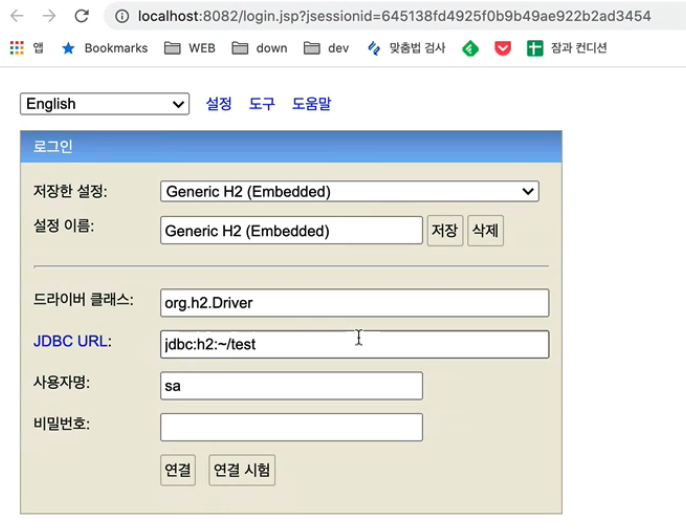
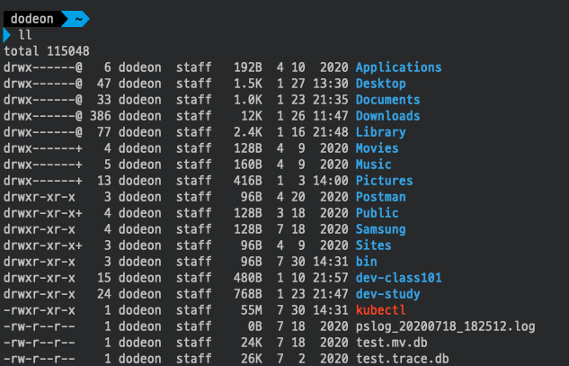
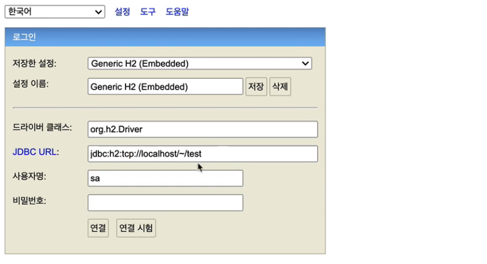

# 스프링 DB 접근 기술

## H2 데이터베이스

MacOS는 H2 설치 뒤 권한을 주어야 제대로 실행된다.

1. H2 다운 뒤 압축을 푼 폴더로 들어간다.
2. `h2/bin` 으로 들어가면 `h2.sh` 가 있다.
3. `chmod 755 h2.sh` 를 실행한다.
4. `./h2.sh`로 h2를 실행하면 아래와 같은 경로로 접속할 수 있다.


상황에 따라 IP가 잡히면서 안될 떄가 있는데, 뒤는 그대로 두고(세션 키가 있어서 중요함) `localhost`로 바꿔서 접속하면 된다.



- JDBC URL
    - 최초에는 데이터베이스 파일을 만드는데, 그 파일 경로를 의미한다.
    - 위 그림에서는 home에 있는 test 폴더를 의미한다.
- 사용자 명과 비밀번호는 그대로 두고 연결하면 접속된다.



실제로 home에서 파일을 찾아보면 `test.mv.db`가 존재해야 한다. 이후부터는 파일로 접근하게 되면 웹 콘솔과 애플리케이션이 서로 충돌할 수 있다.



이때는 JDBC URL에 `jdbc:h2:tcp://localhost/~/test`로 접속해야 충돌이 나지 않는다. 소켓으로 접속하는 방식이므로 여러 곳에서 접속할 수 있게 된다.

## 테이블 생성

```sql
drop table if exists member CASCADE;
create table member
(
    id   bigint generated by default as identity,
    name varchar(255),
    primary key (id)
);
```

- `generated by default as identity`
    - ID가 null 값일 때, DB가 자동으로 ID 값을 채워준다.

## 순수 JDBC

### 환경 설정

```groovy
implementation 'org.springframework.boot:spring-boot-starter-jdbc'
runtimeOnly 'com.h2database:h2'
```

`build.gradle` 파일에 jdbc, h2 데이터베이스 관련 라이브러리를 추가한다.

 

```properties
spring.datasource.url=jdbc:h2:tcp://localhost/~/test
spring.datasource.driver-class-name=org.h2.Driver
spring.datasource.username=sa
```

 

스프링 부트 데이터베이스 연결 설정을 추가한다.

스프링부트 2.4부터는 `spring.datasource.username=sa` 를 꼭 추가해주어야 한다. 그렇지 않으면 `Wrong user name or password`
오류가 발생한다.

```properties
spring.datasource.username=sa // 공백
```

참고로 위와 같이 마지막에 공백이 들어가면 같은 오류가 발생한다. 공백은 모두 제거해야 한다.

### JDBC 리파지토리 구현

참고로 이렇게 JDBC API로 직접 코딩하는 것은 20년 전 이야기다. 고대 개발자들이 이렇게 고생하고 살았구나 생각하고 정신 건강을 위해 참고만 하고 넘어가자.

 

```java
public class JdbcMemberRepository implements MemberRepository {

  private final DataSource dataSource;

  // 데이터베이스 커넥션을 획득할 때 사용하는 객체
  // 데이터베이스 커넥션 정보를 바탕으로 DataSource를 생성하고 스프링 빈으로 만들어 DI를 할 수 있다.
  public JdbcMemberRepository(DataSource dataSource) {
    this.dataSource = dataSource;
  }

  @Override
  public Member save(Member member) {
    String sql = "insert into member(name) values(?)";
    Connection conn = null;
    PreparedStatement pstmt = null;

    // 결과를 받는 객체
    ResultSet rs = null;
    try {
      conn = getConnection();

      // 실제 insert를 해야 id를 가질 수 있어서 Statement.RETURN_GENERATED_KEYS 옵션을 넘긴다.
      pstmt = conn.prepareStatement(sql, Statement.RETURN_GENERATED_KEYS);
      pstmt.setString(1, member.getName());

      // 실제 쿼리가 날아가는 부분
      pstmt.executeUpdate();

      // 키를 받는 부분
      rs = pstmt.getGeneratedKeys();

      // 값이 있으면 꺼낸다.
      if (rs.next()) {
        member.setId(rs.getLong(1));
      } else {
        throw new SQLException("id 조회 실패");
      }
      return member;
    } catch (Exception e) {
      throw new IllegalStateException(e);
    } finally {
      // 리소스 반환
      // 안 끊으면 데이터베이스 커넥션이 계속 쌓여서 장애가 날 수 있다.
      close(conn, pstmt, rs);
    }
  }

  @Override
  public Optional<Member> findById(Long id) {
    String sql = "select * from member where id = ?";
    Connection conn = null;
    PreparedStatement pstmt = null;
    ResultSet rs = null;
    try {
      conn = getConnection();
      pstmt = conn.prepareStatement(sql);
      pstmt.setLong(1, id);
      rs = pstmt.executeQuery();
      if (rs.next()) {
        Member member = new Member();
        member.setId(rs.getLong("id"));
        member.setName(rs.getString("name"));
        return Optional.of(member);
      } else {
        return Optional.empty();
      }
    } catch (Exception e) {
      throw new IllegalStateException(e);
    } finally {
      close(conn, pstmt, rs);
    }
  }

  @Override
  public List<Member> findAll() {
    String sql = "select * from member";
    Connection conn = null;
    PreparedStatement pstmt = null;
    ResultSet rs = null;
    try {
      conn = getConnection();
      pstmt = conn.prepareStatement(sql);
      rs = pstmt.executeQuery();
      List<Member> members = new ArrayList<>();
      while (rs.next()) {
        Member member = new Member();
        member.setId(rs.getLong("id"));
        member.setName(rs.getString("name"));
        members.add(member);
      }
      return members;
    } catch (Exception e) {
      throw new IllegalStateException(e);
    } finally {
      close(conn, pstmt, rs);
    }
  }

  @Override
  public Optional<Member> findByName(String name) {
    String sql = "select * from member where name = ?";
    Connection conn = null;
    PreparedStatement pstmt = null;
    ResultSet rs = null;
    try {
      conn = getConnection();
      pstmt = conn.prepareStatement(sql);
      pstmt.setString(1, name);
      rs = pstmt.executeQuery();
      if (rs.next()) {
        Member member = new Member();
        member.setId(rs.getLong("id"));
        member.setName(rs.getString("name"));
        return Optional.of(member);
      }
      return Optional.empty();
    } catch (Exception e) {
      throw new IllegalStateException(e);
    } finally {
      close(conn, pstmt, rs);
    }
  }

  // 같은 트랜잭션을 유지하려면 DataSourceUtils를 통해 가져와야 한다.
  private Connection getConnection() {
    return DataSourceUtils.getConnection(dataSource);
  }

  private void close(Connection conn, PreparedStatement pstmt, ResultSet rs) {
    try {
      if (rs != null) {
        rs.close();
      }
    } catch (SQLException e) {
      e.printStackTrace();
    }
    try {
      if (pstmt != null) {
        pstmt.close();
      }
    } catch (SQLException e) {
      e.printStackTrace();
    }
    try {
      if (conn != null) {
        close(conn);
      }
    } catch (SQLException e) {
      e.printStackTrace();
    }
  }

  // 닫을 때에도 DataSourceUtils를 통해서 닫아야 한다.
  private void close(Connection conn) throws SQLException {
    DataSourceUtils.releaseConnection(conn, dataSource);
  }
}
```

 

```java

@Configuration
public class SpringConfig {

  // 스프링이 properties에서 설정한 대로 DataSource를 빈으로 만들어준다.
  private final DataSource dataSource;

  public SpringConfig(DataSource dataSource) {
    this.dataSource = dataSource;
  }

  @Bean
  public MemberService memberService() {
    return new MemberService(memberRepository());
  }

  @Bean
  public MemberRepository memberRepository() {
//    return new MemoryMemberRepository();
    // 사용할 빈을 주입한다.
    return new JdbcMemberRepository(dataSource);
  }
}

```

 

`SpringConfig`만 손대면 기존 애플리케이션 관련 코드는 수정하지 않고 변경할 수 있다.


이런 방법을 `개방-폐쇄 원칙(OCP)`라고 한다. 확장에는 열려있고 수정, 변경에는 닫혀있는 것이다. 스프링의 DI를 사용하면 기존 코드를 전혀 손대지 않고 설정만으로 구현
클래스를 변경할 수 있다.

## 스프링 통합 테스트

DB를 직접 연결했으므로 스프링을 실행하고 DB를 연결해서 동작시키는 통합 테스트를 해보겠다.



```java
@SpringBootTest
@Transactional
class MemberServiceIntegrationTest {

  // 이전에는 BeforeEach로 직접 객체를 생성해서 넣었다면
  // 이제는 스프링 컨테이너한테 받아야 한다.
  // 테스트는 제일 끝단에 있기 때문에 제일 편한 방법을 써도 돼서
  // 생성자 인젝션 대신 그냥 필드 기반 @Autowired 한다.
  @Autowired
  MemberService memberService;
  
  @Autowired
  MemberRepository memberRepository;

  @Test
  public void 회원가입() throws Exception {
    //Given
    Member member = new Member();
    member.setName("hello");

    //When
    Long saveId = memberService.join(member);

    //Then
    Member findMember = memberRepository.findById(saveId).get();
    assertEquals(member.getName(), findMember.getName());
  }

  @Test
  public void 중복_회원_예외() throws Exception {
    //Given
    Member member1 = new Member();
    member1.setName("spring");
    Member member2 = new Member();
    member2.setName("spring");

    //When
    memberService.join(member1);
    IllegalStateException e = assertThrows(IllegalStateException.class,
            () -> memberService
                    .join(member2));//예외가 발생해야 한다. assertThat(e.getMessage()).isEqualTo("이미 존재하는 회원입니다.");
  }
}
```


```java
class MemberServiceTest {

  MemberService memberService;
  MemoryMemberRepository memberRepository;

  @BeforeEach
  void setUp() {
    // 테스트가 서로 영향이 없도록 항상 새로운 객체를 생성해 의존 관계를 맺어준다.
    memberRepository = new MemoryMemberRepository();
    memberService = new MemberService(memberRepository);
  }

  @AfterEach
  void tearDown() {
    memberRepository.clearStore();
  }

  @Test
  void 회원가입() {
    // given
    Member member = new Member();
    member.setName("hello");

    // when
    Long saveId = memberService.join(member);

    // then
    Member findMember = memberService.findOne(saveId).get();
    Assertions.assertThat(member.getName()).isEqualTo(findMember.getName());
  }

  @Test
  void 중복_회원_예외() {
    // given
    Member member1 = new Member();
    member1.setName("spring");

    Member member2 = new Member();
    member2.setName("spring");

    // when
    memberService.join(member1);

    // then
    IllegalStateException e = assertThrows(IllegalStateException.class,
        () -> memberService.join(member2));

    // 예외의 메시지도 검증 가능
    Assertions.assertThat(e.getMessage()).isEqualTo("이미 존재하는 회원입니다.");
  }
}
```



기존의 `MemberServiceTest`는 JVM 내에서 실행되고 끝나기 때문에 빠르다. `MemberServiceIntegrationTest`는 로그를 보면 알 수 있듯 스프링을 온전히 띄우고 테스트를 실행하느라 상대적으로 느리다.

### @SpringBootTest

스프링 컨테이너와 테스트를 함께 실행한다.

### @Transactional

테스트 케이스에 이 애너테이션이 있으면 테스트 시작 전에 트랜잭션을 시작하고 테스트 완료 후에 항상 롤백한다. 이렇게 하면 DB에 데이터가 남지 않아 다음 테스트에 영향을 주지 않는다. 테스트 메서드마다 다 적용된다. 하나 시작하고 끝나면 롤백하고, 하나 시작하고 끝나면 롤백하는 식이다.

### 단위 테스트는 그럼 왜 필요할까?

가급적이면 순수한 자바 코드로 만든 단위 테스트가 훨씬 좋은 테스트일 확률이 높다. 컨테이너 없이 테스트할 수 있도록 훈련해야 한다. 컨테이너까지 올릴 정도면 테스트 설계가 잘못됐을 수 있다.