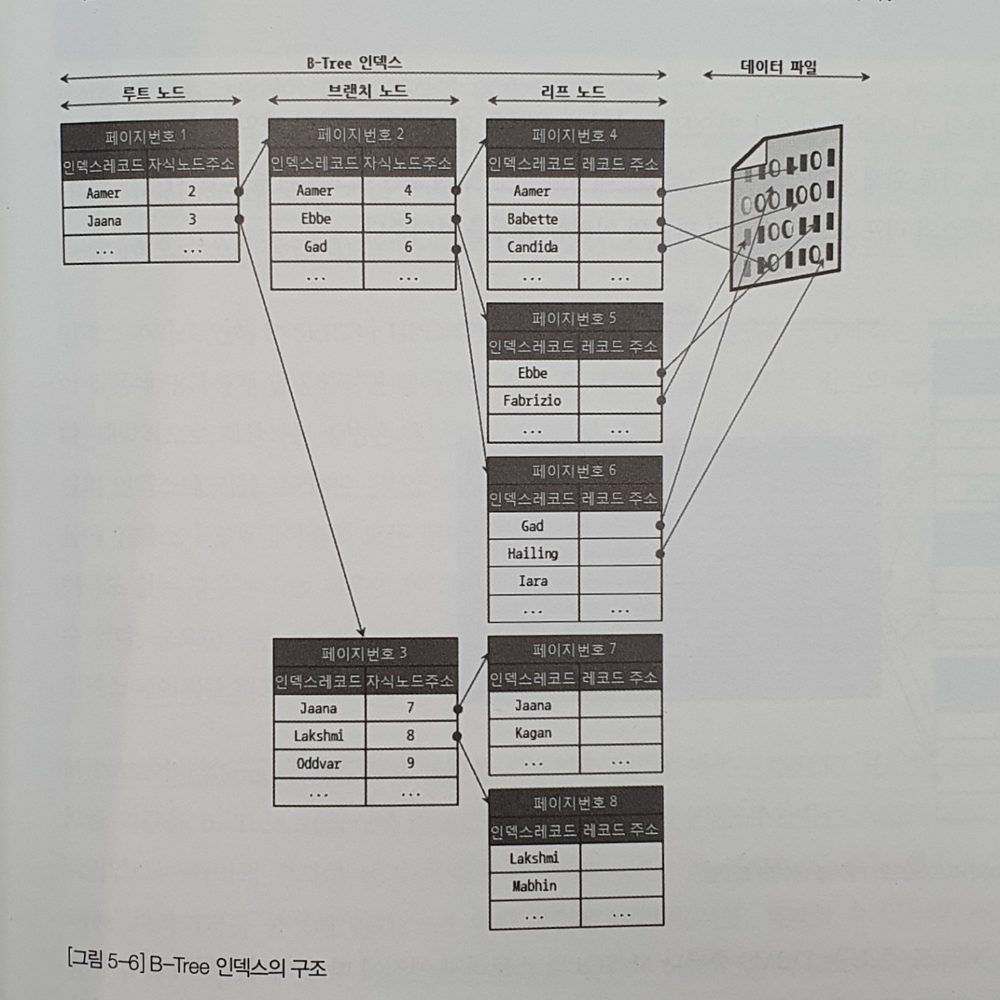
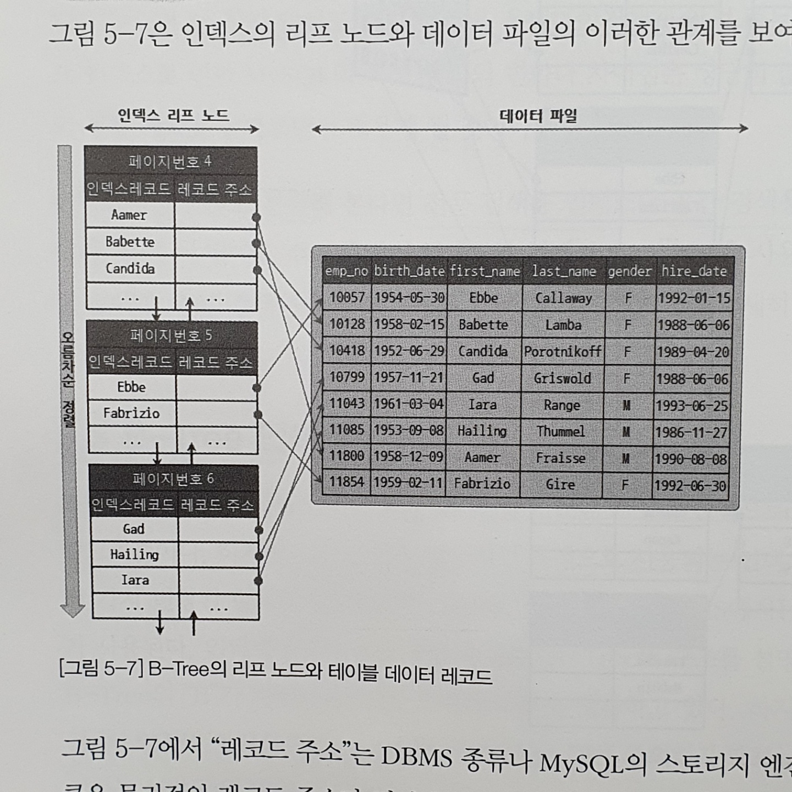

# B-Tree(Balanced) 인덱스

## 구조 및 특성

- 최상위에 루트노드가 존재하고 그 하위에 브랜치 노드, 가장 하위에 리프 노드가 있다.
    - 리프 노드는 항상 실제 데이터 레코드를 찾기 위한 주소 값을 가지고 있다.
- 인덱스의 키 값은 모두 정렬되어 있지만 데이터 레코드는 임의의 순서로 저장되어 있다.
    - INSERT만 수행하면 순서대로 있겠지만 그 밖에 변경이 일어나면서 삭제된 빈 자리를 채우기 때문이다.
- 하지만 InnoDB는 기본적으로 프라이머리 키 순서대로 정렬되어 클러스터로 저장된다.

인덱스는 테이블의 키 칼럼만 가지고 있다. 나머지 칼럼을 읽으려면 데이터 파일에서 레코드를 찾아야 한다. 그래서 인덱스의 리프 노드는 데이터 파일에 저장된 레코드 주소를 가진다.

InnoDB 테이블에서는 프라이머리 키에 의해 클러스터링 되므로 프라이머리 키 값 자체가 주소 역할을 한다. 따라서 MySQL 테이블의 인덱스는 인덱스 칼럼 값과 주소 값(프라이머리 키값)의 조합으로 구성된다.

## 인덱스 키 추가

테이블의 레코드를 저장, 변경하면 인덱스 추가, 삭제 작업이 발생한다.

1. 저장될 키 값을 이용해 B-Tree 상의 적절한 위치를 검색한다.
2. 위치가 결정되면 레코드 기 값과 대상 레코드의 주소 정보를 리프 노드에 저장한다.
3. 리프 노드가 꽉 찼을 경우 분리한다.
4. 분리할 경우 상위 브랜치 노드까지 처리해야 한다.

이러한 작업 때문에 상대적으로 쓰기 작업(새로운 키를 추가하는 작업)에 비용이 많이 든다.

### 작업 비용 계산

테이블에 레코드 추가 비용이 1이라고 하면 인덱스에 키를 추가하는 작업은 1~1.5 정도로 예측한다. 인덱스가 3개라면 1.5 * 3 + 1 = 5.5 정도의 비용을 예측한다. 이 비용의 대부분이 메모리와 CPU가 아니라 디스크에서 인덱스 페이지를 읽고 쓰는 시간이다. 

### 지연 처리

INSERT 문장 실행 후 바로 새로운 키 값을 B-Tree 인덱스에 반영하면 키를 추가하는 작업이 끝날 때까지 클라이언트는 쿼리 결과를 받지 못하고 기다려야 한다.

InnoDB 스토리지 엔진은 상황에 따라 인덱스 키 추가 작업을 지연시킬지 바로 처리할지 결정한다. 인서트 버퍼에 임시로 기록해두고 쿼리를 일단 완료한 뒤 백그라운드 작업으로 인덱스 키와 주소값을 머지한다.

MySQL 5.5부터는 INSERT뿐 아니라 DELETE 등에 의한 키 추가 및 삭제까지 버퍼링해서 지연 처리할 수 있게 한다. 그래서 이전에는 인서트 버퍼링이라고 했지만 5.5 이후로는 체인지 버퍼링이라고 한다.

## 인덱스 키 삭제

해당 키가 저장된 리프 노드를 찾아 삭제 마크만 하면 끝난다. 삭제 마킹된 공간은 계속 방치하거나 재활용한다. 삭제로 인한 마킹 또한 디스크 쓰기가 필요한 작업이라 버퍼링으로 지연 처리할 수 있다.

## 인덱스 키 변경

키값에 따라 저장될 리프 노드의 위치가 변경되므로 단순히 키 값만 변경하는 것은 불가능하다.

먼저 키값을 삭제하고 다시 새로운 키값을 추가하는 형태로 처리된다. 이 과정에서 발생하는 삭제와 추가는 위에서 설명한 것과 같은 절차로 처리된다.

## 인덱스 키 검색

루트 노드부터 브랜치 노드를 거쳐 최종 리프 노드까지 이동하면서 비교한다. 트리 탐색이라고도 부른다.

SELECT뿐 아니라 UPDATE, DELETE를 위해 그 레코드를 검색해야할 때에도 인덱스 덕분에 빠르게 검색할 수 있다.

|검색 가능|검색 불가|
|------|---|
|100% 일치하는 경우|부등호로 비교하는 경우|
|값의 앞부분이 일치하는 경우|값의 뒷부분이 일치하는 경우|
||키값 변형 후 비교하는 경우|

키값이 변경되면 B-Tree 인덱스에 존재하는 값이 아니다. 따라서 함수나 연산을 수행한 결과로 정렬하거나 검색하는 작업은 이미 값이 변경되었으므로 효과가 없다.

InnoDB는 검색한 인덱스를 잠근 후 테이블의 레코드를 잠그는 키 락, 레코드 잠금을 지원한다. UPDATE, DELETE가 실행될 때 사용할만한 인덱스가 없으면 불필요하게 많은 레코드를 잠근다. 모든 레코드를 잠글 수도 있다. 따라서 InnoDB에서는 인덱스 설계가 매우 중요하다.