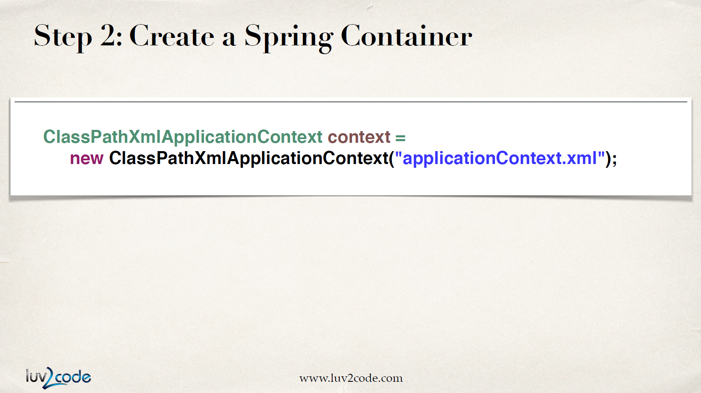

# XML Configuration

## What is a Spring Bean?

A `Spring Bean` is simply a Java object. when Java objects are created by the Spring Container, then Spring referes to them as `Spring Beans` .

`Spring Beans` are created from normal Java classes, just like Java objects.

## Configuring your Spring Beans

### id

별명같은 것이다. 아무렇게나 지어도 된다. 

### class

실제로 사용할 예정이고 이 별명을 붙이려고 하는 클래스를 써준다.

## **Create a Spring Container**

### **ApplicationContext**

In the Spring world, a Spring container is generally known as `ApplicationContext` .

`ClassPathXmlApplicationContext` 를 이용해 XML 파일을 읽어온다. 불러올 XML 파일의 이름을 써주면 된다.

## **Retrieve Beans from Spring Container**

애플리케이션이 `Coach` 오브젝트를 요청하면 스프링 오브젝트 팩토리에서 XML 파일 내용을 토대로 `Coach` 오브젝트를 implement한 클래스를 돌려준다.

