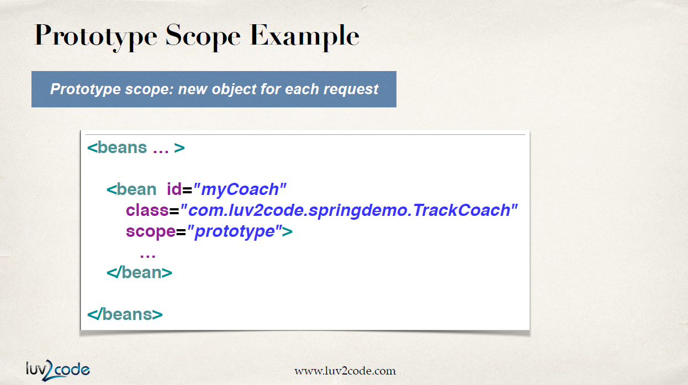
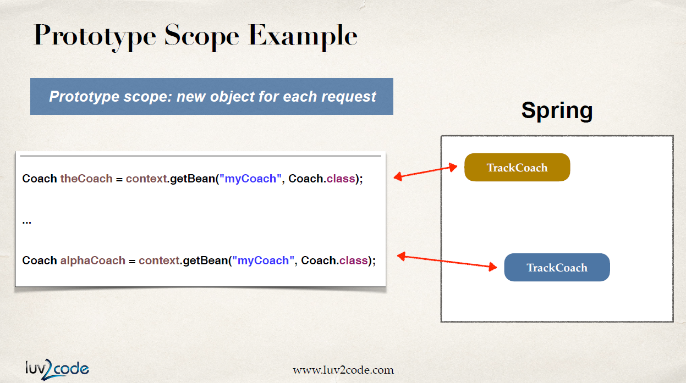
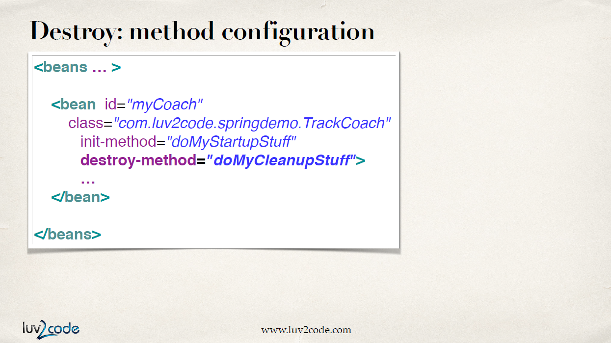

## Singleton

빈은 이렇게 한 번 등록하면 기본적으로 `singleton`이다. 

`singleton`이란 스프링 컨테이너가 딱 한 번 만드는 인스턴스다. 메모리에 cash 되면 빈을 요청할 때마다 항상 같은 레퍼런스를 공유한다. 즉, 같은 bean을 돌려 쓴다.

이렇게 언제 어떻게 가져다 쓰든 똑같은 오브젝트를 공유하면서 사용한다.

`singleton`이 아닌 다른 방식을 쓰고 싶다면 위와 같이 `scope`을 따로 설정할 수 있다.

`scope`의 종류는 위와 같다.

## Prototype

`prototype`은 요청할 때마다 새로운 instance를 만든다.

위의 예시처럼 빈을 호출할 때마다 다른 reference를 가진 class를 반환한다.

## Bean Lifecycle

1. 컨테이너가 동작을 시작하면 bean이 초기화 된다.
2. dependency가 주입된다.
3. 빈 팩토리에서 스프링의 내부 프로세스가 진행된다.
4. 내가 만든 메소드가 초기화 된다. 이 시점에 빈은 사용할 준비가 되어 메소드를 호출하고 빈으로 작업하는 것이 가능해진다.
5. `context.close()`로 컨테이너가 종료된다. 이때 실제 애플리케이션이 종료되거나 bean lifecycle이 끝나기 이전에 특정 작업을 하도록 설정할 수 있다.

위의 그림 상에서 오렌지 색으로 표시된 부분 즉, 메소드를 생성하고 종료하는 부분에 custom code를 넣을 수 있다.

### Bean Initialization

설정 파일에서 `init-method` 부분에 실행할 메소드 이름을 적으면 빈을 초기화 할 때 커스텀 한 메소드를 호출하거나 DB, socket, file 같은 리소스에 대한 세팅을 할 수 있다.

### Bean Destruction

`destroy-method`에 메소드 이름을 적으면 빈을 소멸시킬 때 커스텀 한 메소드를 호출할 수 있다. 리소스를 clean up 하는 코드를 넣을 수도 있다.

단, `prototype`일 경우에 스프링은 `destroy-method`를 호출하지 않는다.