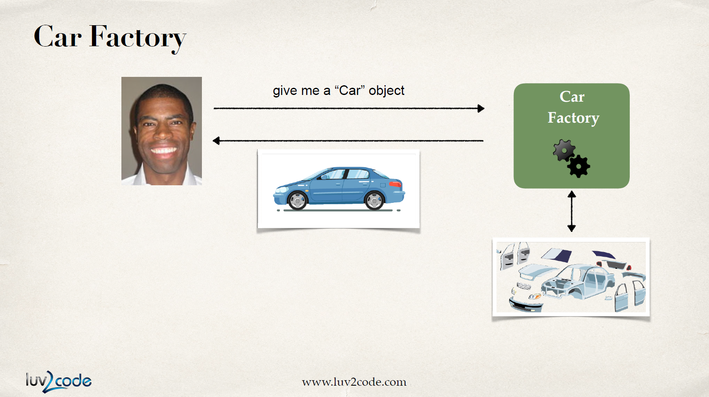

말이 어렵다. 예를 들어보자.

차를 공장에 주문한다고 생각해보자. 자동차는 각기 다른 엔진, 타이어, 의자를 가지며 엔지니어가 이들을 조합해서 전달한다. 공장이 대신해서 부품을 `주입` 하는 것이다.

내 오브젝트를 만들고 주입하는 일을 `오브젝트 팩토리`에 아웃소싱 맡긴다고 생각하면 된다. `의존성`이란 오브젝트 만드는 일을 잘 처리하기 위한 `helper object`다.

내가 손수 오브젝트를 조립하고 의존성을 해결하는 대신 스프링 팩토리가 모든 것을 처리해준다. `BaseballCoach`, `Hockey Coach`, `CricketCoach` 등의 오브젝트들을 사용할 수 있도록 미리 준비해준다.

의존성 주입에는 다양한 방법이 있다.

- Constructor Injection
- Setter Injection
- `autowired` Annotation

`autowired` 부분은 후에 다루기로 한다.