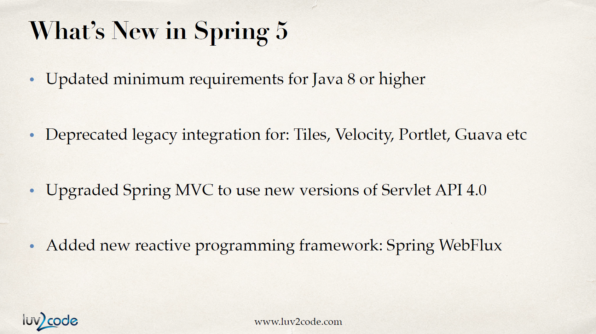
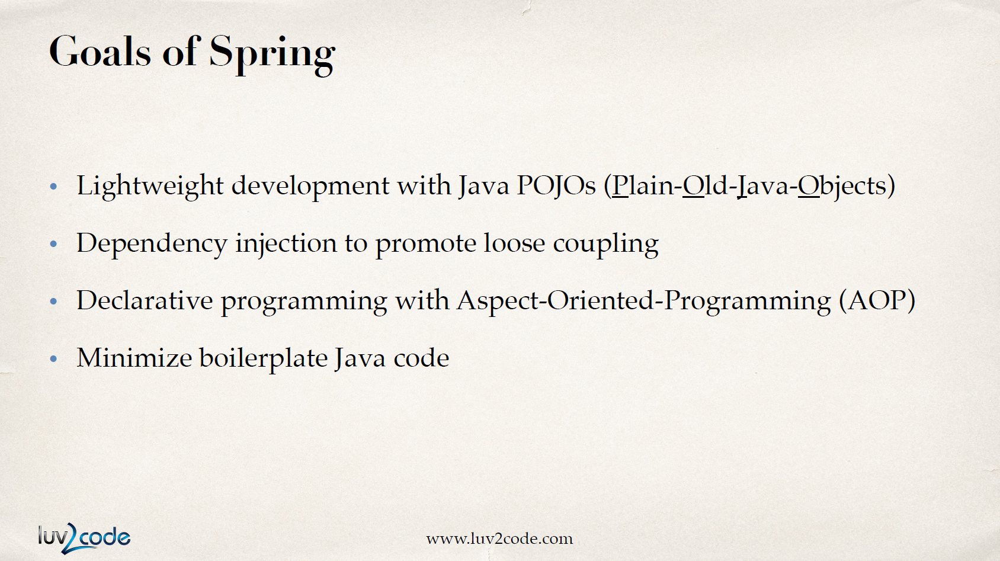
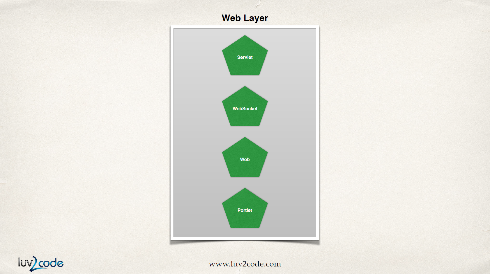

# Spring Overview

## Why Spring?

* 자바 애플리케이션을 만드는 가장 유명한 프레임워크
* 이전에 사용되던 J2EE를 대체할만큼 가볍고 간단함
* helper class가 많아서 만들기 용이함

## What's new in Spring 5

* Java 8 이상 요구
* Servlet API 4.0을 반영하여 Spring MVC 업그레이드
* reactive 프로그래밍 프레임워크인 Spring WebFlux 추가

## Spring Core Framework

### Core Container

Bean을 생성하고 관리하는 부분

* Beans
* Core
* SpEL
* Context

### Infrastructure

AOP 프로그래밍을 지원하는 부분. 즉, 로그, 보안, 트랜잭션 등의 기능을 제공함.

* AOP
* Aspects
* Instrumentation
  * JMX\(Java Management Extension\)를 이용해 원격으로 내 애플리케이션을 모니터링할 수 있다.
* Messaging

### Data Access Layer

데이터 베이스와 통신하는 부분

* JDBC
  * JDBC helper class이며 기존 코드의 50%를 줄여준다.
* ORM
* Transactions
  * transaction을 지원한다.
* OXM
* JMS\(Java MEssage Service\)
  * 비동기적으로 메시지 큐에 메시지를 전달한다.

### Web Layer

Web과 관련된 모든 클래스를 제공한다. Spring MVC framework의 Home이다.

* Servlet
* WebSocket
* Web
* Portlet

### Test Layer

TDD\(Test Driven Development\)를 위해 Mock 객체를 지원한다. container 외부에서도 테스트가 가능하다.

