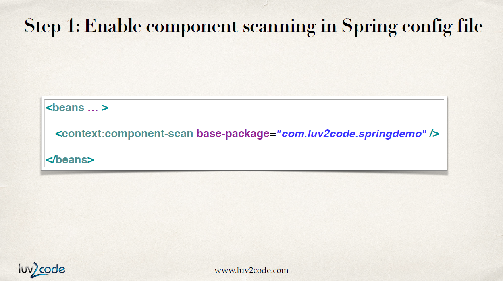
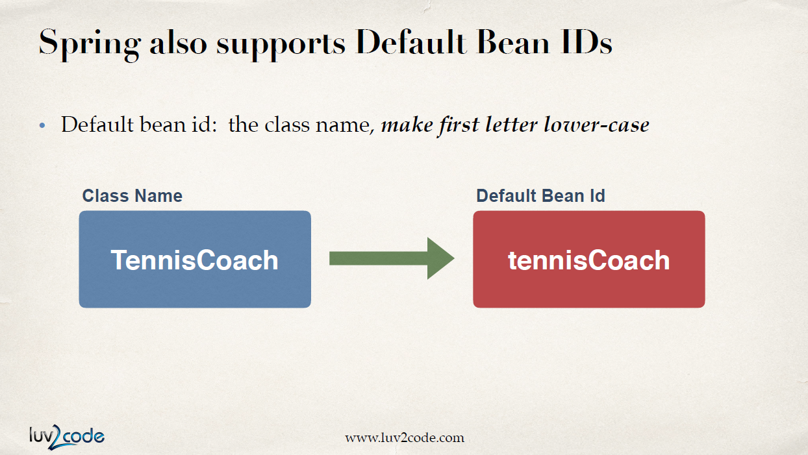
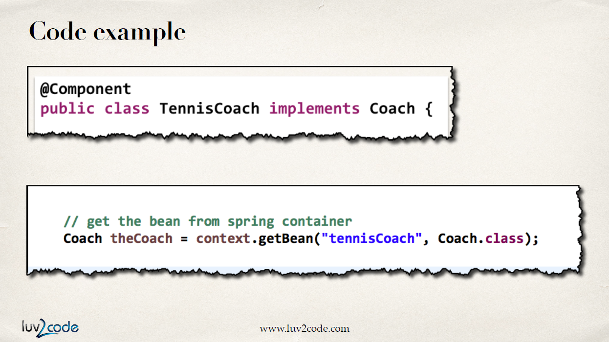

# Spring with Annotations

Java Annotaion은 자바 클래스에 쓰이는 특수한 라벨이다. 클래스에 대한 metadata를 제공하며 compile time이나 runtime 때 수행된다.

```java
public class TrackCoach implements Coach {
    @Override
    public String getDailyWorkout() {
        return "RUN";
    }
}
```

예제에서 `@Override`가 annotation의 예시이다. 컴파일러에게 메소드를 override 할 것이라고 알리는 것이다. 그럼 컴파일 시에 컴파일러가 override를 체크할 것이다.

## Why Spring Configuration with Annotations?

XML 설정은 너무 길다. 만약 빈이 100개라면 그 빈을 하나하나 다 설정해줘야 한다. 애노테이션을 사용하면 코드 길이를 확 줄일 수 있다.

## How this works?



스프링이 scan할 패키지를 적어주기만 하면 component scan이 설정되어 스프링 컨테이너에 자동 등록된다.


빈으로 등록하고 싶은 클래스에 `@Component`를 붙여주고 bean id인 `thatSillyCoach`를 넣으면 이 id를 가지고 빈이 자동으로 등록된다.


`getBean()`에는 변화가 없다. 가져올 bean id만 잘 써주면 된다.

## Default Bean ID



앞서 했던 것처럼 이름을 특정해주지 않아도 기본값으로 설정할 수 있다. class 이름의 맨 앞글자만 소문자로 변경하면 된다.


애노테이션에 bean id를 생략하면 기본값으로 bean id가 만들어진다.



기본값으로 bean을 불러오기만 하면 된다.

