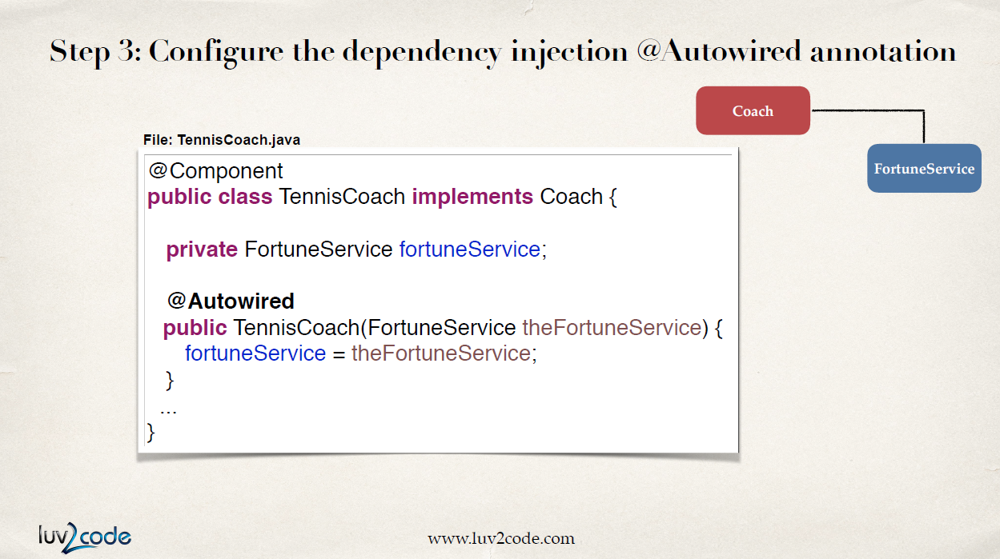
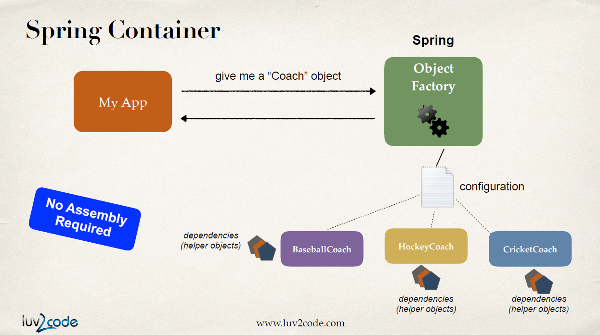

# Constructor Injection

## dependency 인터페이스와 구현하는 클래스 정의

`FortuneService`라는 인터페이스와 이를 구현하는 `HappyFortuneService` 클래스를 만든다. `@Component`를 붙여 스프링이 자동으로 스캔하고 구현체를 찾을 수 있게 한다.

## 주입할 생성자 생성

실제 dependency injection을 활용할 `TennisCoach` 클래스에 생성자를 만들고 `FortuneService`를 받는다.

## @Autowired를 이용한 의존성 주입

`@Autowired`를 추가해 파라미터로 받은 `FortuneService`를 자동으로 주입한다. 스프링은 모든 컴포넌트를 스캔하면서 `FortuneService`를 구현한 `HappyFortuneService` 클래스를 찾아낼 것이다.

애노테이션을 이용해 다양한 dependency들을 주입할 수 있다. 긴 XML 설정없이 이 모든 것이 가능해졌다.

