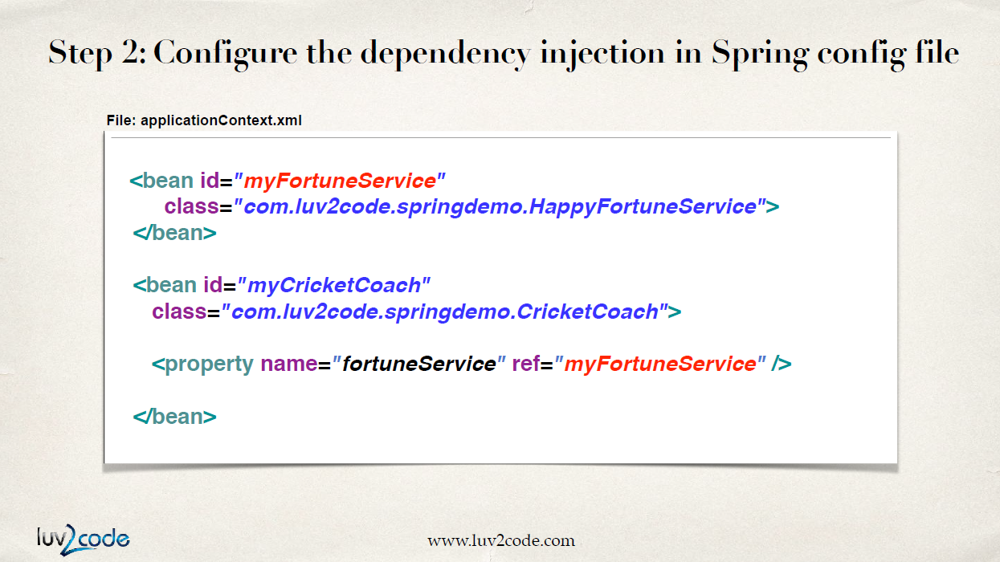
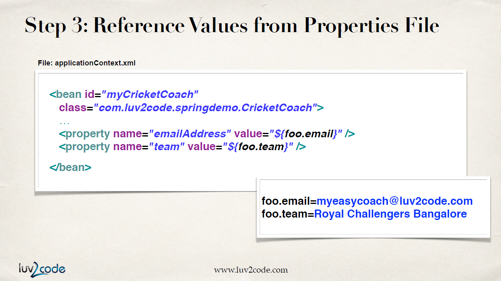

# Setter Injection

`Setter Injection`은 setter\(\) 메소드를 불러와 DI를 하는 것이다.

### setter 메소드 생성

생성자 대신 setter 메소드를 만들어서 `FortuneService`를 가져온다.

### 의존성 주입 설정

사용할 `myFortuneService`를 빈으로 등록해두었다. 이 빈을 직접 사용하는 클래스의 `property`로 등록한다. `name`은 setter 메소드의 이름이 된다. `ref`에 bean id를 써준다.

`property`의 `name` 부분을 자세히 알아보자. 스프링은 `name`에 담긴 이름의 첫 글자를 대문자로 쓰고 그 앞에 set을 붙인 setter 메소드를 불러오게 된다.

정리해보면 `myFortuneService`를 직접 사용하는 `CricketCoach`에서 setter 메소드를 이용해 의존성을 주입하고 있다.

## 리터럴 값 주입

이메일 주소나 team 이름 같이 객체가 아닌 값을 `CricketCoach`에 주입하고 싶다면 어떻게 해야 할까?

### setter 메소드 생성

먼저, 받아오고 싶은 내용을 필드에 선언하고 setter 메소드를 만든다.

### 의존성 주입 설정

해당 리터럴 값을 직접 사용하는 클래스 즉, `CricketCoach`의 빈 설정 부분에 property로 넣는다. 이때도 마찬가지로 `name`에 따라 setter 메소드를 불러온다.

## 파일에서 불러온 값 주입

위의 리터럴 값 예시는 값이 하드 코딩 되어있다. 이 값을 파일 하나로 분리해보자.

### property 파일 생성

`name` = `value` 형태로 `.properties` 파일을 만든다. 여기서의 `name`을 설정 파일에서 참조하게 될 것이다.

### 설정 파일에 property 파일 load

설정 파일에서 해당 파일을 불러온다.

### 파일에 있는 값 참조 설정

`value` 부분에 `${ }` 형식에 맞춰 `.properties` 파일에 명시했던 `name`을 적는다.

