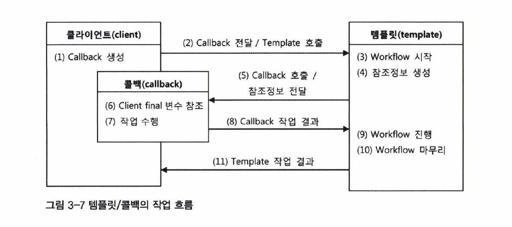
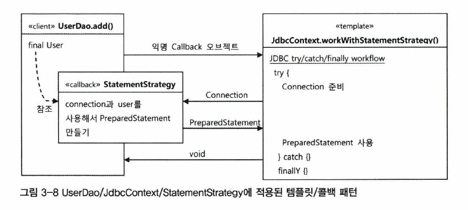
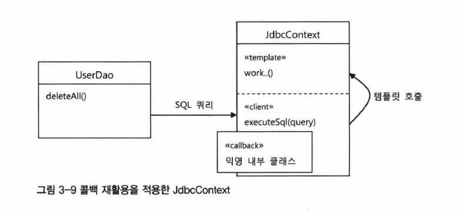

# 템플릿과 콜백

지금까지 만든 코드는 전략 패턴을 기본으로 익명 내부 클래스를 활용했다. 이런 방식을 스프링에서는 `템플릿/콜백` 패턴이라고 한다.

전략 패턴의 컨텍스트를 `템플릿`, 익명 내부 클래스로 만들어지는 오브젝트를 `콜백`이라고 부른다.

### 템플릿

고정된 틀 안에 바꿀 수 있는 부분을 넣어 사용하는 것이다. `JSP` 가 HTML에 EL과 스크립릿을 넣은 일종의 템플릿 파일이다.

템플릿 메소드 패턴은 고정된 로직을 슈퍼클래스에 두고 바뀌는 부분을 서브클래스의 메소드에 두는 구조다.

### 콜백

실행해서 다른 오브젝트의 메소드에 전달되는 오브젝트다. 파라미터로 전달되는데 값을 참조하는 것이 아니라 특정 메소드를 실행하기 위해 사용한다.

자바에서는 메소드 자체를 파라미터로 전달할 수 없기 때문에 오브젝트에 메소드를 담아서 전달한다. 그래서 `Functional Object` 라고도 부른다.

## 템플릿/콜백의 동작 원리

전략 패턴은 인터페이스가 여러 개의 메소드를 가진다. 하지만 템플릿/콜백 패턴은 인터페이스에 메소드가 하나다. 일반적으로 특정한 기능을 위해 한 번 호출되고 말기 때문이다.

메소드가 하나인 인터페이스를 구현한 익명 내부 클래스로 만들어진다고 보면 된다. 한 템플릿에서 여러 전략을 사용해야 한다면 콜백 오브젝트를 여러 개 사용할 수도 있다.

콜백 인터페이스의 메소드는 보통 파라미터가 있는데, 템플릿 작업 중에 만들어진 컨텍스트 정보를 전달할 때 사용된다.

예를 들어 템플릿의 `workWithStatementStrategy()` 메소드에서 `Connection` 오브젝트를 콜백의 `makePreparedStatement()` 메소드의 파라미터로 넘겨준다.

`makePreparedStatement()` 는 `PreparedStatement` 를 만드는 메소드인데 이를 위해서는 JDBC 컨텍스트나 템플릿에서 만들어진 DB 커넥션이 필요하기 때문이다.

## 템플릿/콜백의 작업 흐름



### 1. 클라이언트

* 템플릿에서 실행할 콜백 오브젝트를 만든다.
* 콜백이 참조할 정보를 제공한다.
* 템플릿의 메소드를 호출할 때 콜백을 파라미터로 전달한다.

### 2. 템플릿

* 정해진 작업을 수행하다가 생성한 참조 정보로 콜백 오브젝트의 메소드를 호출한다.

### 3. 콜백

* 클라이언트 메소드에 있는 정보와 템플릿이 제공한 참조 정보를 이용해 작업을 수행한다.
* 결과를 템플릿에 다시 반환한다.

### 4. 템플릿

* 콜백이 돌려준 정보를 사용해 나머지 작업을 수행한다.
* 경우에 따라 결과를 클라이언트에 돌려준다.

## DI와 템플릿/콜백의 공통점

### DI 형태의 오브젝트 전달

템플릿/콜백은 DI 방식으로 전략 패턴 구조를 만들었다고 생각하면 된다. 클라이언트가 템플릿 메소드를 호출하면서 콜백 오브젝트를 전달하는 것이 메소드 레벨의 DI다.

## DI와 템플릿/콜백의 차이점

### 일반적인 DI

#### 수정자 메소드로 전달

템플릿에 인스턴스 변수를 만든다음 사용할 의존 오브젝트를 수정자 메소드로 받아서 사용한다.

### 템플릿/콜백

#### 매번 새롭게 전달

템플릿/콜백은 DI 작업이 클라이언트가 템플릿 기능을 호출하는 것과 동시에 일어난다. 따라서 매번 메소드 단위로 사용할 오브젝트를 새로 전달 받는다.

#### 클라이언트와 콜백의 강한 결합

콜백 오브젝트가 자신을 생성한 클라이언트 메소드의 정보를 직접 참조한다.

## jdbcContext의 템플릿/콜백 적용

저번에 `UserDao`, `JdbcContext`, `StatementStrategy` 에 템플릿/콜백 패턴을 적용했었다.



`JdbcContext` 클래스의 `workWithStatementStrategy()` 템플릿은 리턴값이 없는 `void` 메소드이다. 만약 조회 하는 작업이었다면 템플릿의 작업 결과를 클라이언트에 리턴한다.

템플릿의 작업 흐름이 더 복잡한 경우에는 여러 개의 콜백을 호출하기도 한다.

## 템플릿/콜백의 재활용

아쉬운 점은 DAO 메소드에서 매번 익명 내부 클래스를 사용하기 때문에 코드를 쓰고 읽기가 불편하다는 것이다. 익명 내부 클래스를 최소화 해보자.

분리해서 재사용한 코드가 있는지 찾아낸다면 코드를 간결하게 만들 수 있다.



```java
public class UserDao {
    ...
    public void deleteAll() throws SQLException {
        // CRUD 마다 변하는 SQL 문장만 따로 뽑는다.
        executeSql("delete from users");
    }

    // 바뀌는 SQL 문장만 파라미터로 받아서 사용한다.
    // 이때 final로 선언해야 익명 내부 클래스(콜백) 안에서 직접 사용할 수 있다.
    private void executeSql(final String query) throws SQLException {
        jdbcContextWithStatementStrategy(
            new StatementStrategy() {
                public PreparedStatement makePreparedStatement(Connection c) throws SQLException {
                    return c.preparedStatement(query);    
                }
            }
        );
    }
    ...
}
```



```java
public class UserDao {
    ...

    private void deleteAll() throws SQLException {
        jdbcContextWithStatementStrategy(
            new StatementStrategy() {
                public PreparedStatement makePreparedStatement(Connection c) throws SQLException {
                    return c.preparedStatement("delete form users");    
                }
            }
        );
    }
    ...
}
```



`executeSql()` 메소드는 JDBC를 사용하는 다른 DAO에서도 재활용 가능한 코드다. 그렇다면 템플릿이 담긴 `JdbcContext` 클래스 안으로 옮길 수 있다.



```java
package springbook.user.dao;
...
public class jdbcContext {
    private DataSource dataSource;

    public void setDataSource(DataSource dataSource) {
        this.dataSource = dataSource;
    }

    // UserDao에서 JdbcContext로 이동
    public void executeSql(final String query) throws SQLException {
        jdbcContextWithStatementStrategy(
            new StatementStrategy() {
                public PreparedStatement makePreparedStatement(Connection c) throws SQLException {
                    return c.preparedStatement(query);    
                }
            }
        );
    }

    public void workWithStatementStrategy(StatementStrategy stmt) throws SQLException {
        Connection c = null;
        PreparedStatement ps = null;

        try {
            c = this.dataSource.getConnection();
            ps = stmt.makePreparedStatement(c);
            ps.executeUpdate();
        } catch (SQLException e) {
            throw e;
        } finally {
            if (ps != null) { try { ps.close(); } catch (SQLException e) {} }
            if (c != null) { try {c.close(); } catch (SQLException e) {} }
        }
    }
}
```



```java
package springbook.user.dao;
...
public class jdbcContext {
    private DataSource dataSource;

    public void setDataSource(DataSource dataSource) {
        this.dataSource = dataSource;
    }

    public void workWithStatementStrategy(StatementStrategy stmt) throws SQLException {
        Connection c = null;
        PreparedStatement ps = null;

        try {
            c = this.dataSource.getConnection();
            ps = stmt.makePreparedStatement(c);
            ps.executeUpdate();
        } catch (SQLException e) {
            throw e;
        } finally {
            if (ps != null) { try { ps.close(); } catch (SQLException e) {} }
            if (c != null) { try {c.close(); } catch (SQLException e) {} }
        }
    }
}
```



executeSql\(\)이 이동했으니 이제 그것을 사용하는 UserDao의 메소드에서도 수정해야 한다.



```java
public class UserDao {
    ...
    public void deleteAll() throws SQLException {
        this.jdbcContext.exeexecuteSql("delete from users");
    }

    // executeSql()은 JdbcContext로 옮겨졌다.
    ...
}
```



```java
public class UserDao {
    ...
    public void deleteAll() throws SQLException {
        executeSql("delete from users");
    }

    private void executeSql(final String query) throws SQLException {
        jdbcContextWithStatementStrategy(
            new StatementStrategy() {
                public PreparedStatement makePreparedStatement(Connection c) throws SQLException {
                    return c.preparedStatement(query);    
                }
            }
        );
    }
    ...
}
```



`executeSql()`를 모든 DAO에서 사용할 수 있게 되었으며, 익명 내부 클래스를 사용하던 UserDao가 좀 더 깔끔해졌다.



JdbcContext 안에 클라이언트, 템플릿, 콜백이 함께 공존하면서 동작하게 되었다.

일반적으로는 성격이 다른 코드를 가능한 분리하는 게 낫지만 이 경우는 하나의 목적을 위해 긴밀하게 연관되어 있다. 이렇게 응집력이 강한 코드는 한 군데에 모여 있는 게 유리하다.

구체적인 구현과 내부의 전략 패턴, DI, 익명 내부 클래스는 감춰두고 외부\(UserDao\)에는 꼭 필요한 메소드\(deleteAll\)만 노출하는 것이다.

