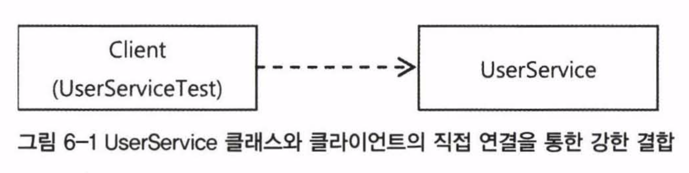
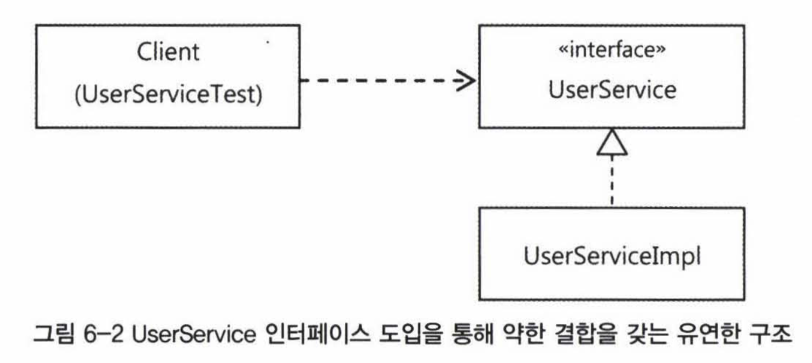
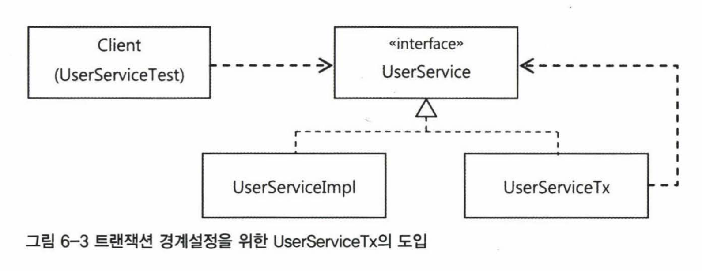
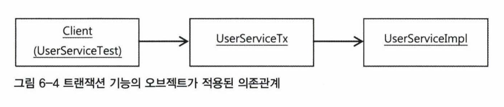

# AOP

AOP는 IoC/DI, 서비스 추상화와 더불어 스프링 3대 기반 기술 중 하나다. AOP를 많이 적용하는 부분은 선언적 트랜잭션 기능이다. 서비스 추상화로 해결했던 트랜잭션 경계설정을 AOP로 더 깔끔하게 만들어보자.

## 트랜잭션 코드의 분리

`UserService`는 깔끔하게 트랜잭션 인터페이스를 썼지만 비즈니스 로직보다 더 길고 무시무시한 트랜잭션 코드를 가지고 있다. 그럼에도 분명 비즈니스 로직 전후에 설정되어야 하므로 트랜잭션 없애기도 어렵다.

```java
public class UserService {
    ...
	public void upgradeLevels() {
        //////// 트랜잭션 경계 설정 ////////
		TransactionStatus status = 
			this.transactionManager.getTransaction(new DefaultTransactionDefinition());
		try {
            //////// 비즈니스 로직 ////////
			List<User> users = userDao.getAll();
			for (User user : users) {
				if (canUpgradeLevel(user)) {
					upgradeLevel(user);
				}
			}
            //////// 트랜잭션 경계 설정 ////////
			this.transactionManager.commit(status);
		} catch (RuntimeException e) {
			this.transactionManager.rollback(status);
			throw e;
		}
	}
}
```

코드를 보면 비즈니스 로직을 사이에 두고 트랜잭션 시작과 종료가 위치한다. 비즈니스 로직과 트랜잭션 사이에 주고 받는 정보도 없다. 그저 트랜잭션 사이에 비즈니스 로직이 실행되기만 하면 된다.



```java
public class UserService {
    ...
	public void upgradeLevels() {
		TransactionStatus status = 
			this.transactionManager.getTransaction(new DefaultTransactionDefinition());
		try {
            // 비즈니스 로직을 메소드로 따로 뺀다.
			upgradeLevelsInternal();
			this.transactionManager.commit(status);
		} catch (RuntimeException e) {
			this.transactionManager.rollback(status);
			throw e;
		}
	}
    
    // 비즈니스 로직을 그대로 옮겨왔다.
    private void upgradeLevelsInternal() {
        List<User> users = userDao.getAll();
        for(User user : users) {
            if(canUpgradeLevel(user)) {
                upgradeLevel(user);
            }
        }
    }
    
	protected void upgradeLevel(User user) {
		user.upgradeLevel();
		userDao.update(user);
		sendUpgradeEMail(user);
	}
}
```



```java
public class UserService {
    ...
	public void upgradeLevels() {
        //////// 트랜잭션 경계 설정 ////////
		TransactionStatus status = 
			this.transactionManager.getTransaction(new DefaultTransactionDefinition());
		try {
            //////// 비즈니스 로직 ////////
			List<User> users = userDao.getAll();
			for (User user : users) {
				if (canUpgradeLevel(user)) {
					upgradeLevel(user);
				}
			}
            //////// 트랜잭션 경계 설정 ////////
			this.transactionManager.commit(status);
		} catch (RuntimeException e) {
			this.transactionManager.rollback(status);
			throw e;
		}
	}

	protected void upgradeLevel(User user) {
		user.upgradeLevel();
		userDao.update(user);
		sendUpgradeEMail(user);
	}
}
```



## DI 적용을 이용한 트랜잭션 분리

하지만 여전히 트랜잭션이 `UserService`에 들어있는 게 마음에 들지 않는다. 클래스 밖으로 뽑아내보자.



현재 `UserService`의 클라이언트는 `UserServiceTest`다. `UserService`가 인터페이스가 아니라 클래스이므로 클라이언트 쪽에서는 직접 참조를 한다.

그런데 만약 트랜잭션을 그냥 빼버리면 트랜잭션 기능이 빠진 `UserService`를 사용하게 된다. 구체적인 구현 클래스를 직접 참조하면 이런 단점이 있다.



따라서 DI로 실제 클래스는 감추고 인터페이스를 통해 간접으로 접근하면 된다. 그러면 구현 클래스는 얼마든지 외부에서 변경할 수 있다.

보통 이런 방법은 구현 클래스를 바꿔가며 사용하기 위해서 적용한다. 테스트 때는 테스트 구현 클래스, 운영 버전에는 운영 전용 클래스를 하나 선택해서 사용하는 것이다.

하지만 꼭 그럴 필요도 없다. 한 번에 두 개의 구현 클래스를 동시에 사용해도 된다. 즉, `UserServiceImpl`과 트랜잭션 코드를 함께 적용할 수 있다.



`UserService` 인터페이스를 구현한 또 다른 구현 클래스를 트랜잭션 용으로 만든다. 그리고 실제 비즈니스 로직은 `UserServiceImpl`에 위임한다.

일단 `UserService` 인터페이스를 만들고 기존의 `UserService`를 `UserServiceImpl`로 바꾼다.

```java
public interface UserService {
    void add(User user);
    void upgradeLevels();
}
```

```java
public class UserServiceImpl implements UserService {
    UserDao userDao;
    MailSender mailSender;
   
    // 비즈니스 로직만 남긴다.
	public void upgradeLevels() {
        List<User> users = userDao.getAll();
        for(User user : users) {
            if(canUpgradeLevel(user)) {
                upgradeLevel(user);
            }
        }
	}
    
	protected void upgradeLevel(User user) {
		user.upgradeLevel();
		userDao.update(user);
		sendUpgradeEMail(user);
	}
}
```

```java
public class UserServiceTx implements UserService {
    // UserService를 구현한 오브젝트 UserServiceImpl을 DI 받는다.
    UserService userService;
    PlatformTransactionManager transactionManager;

    public void setTransactionManager(PlatformTransactionManager transactionManager) {
        this.transactionManager = transactionManager;
    }

    public void setUserService(UserService userService) {
        this.userService = userService;
    }

    // DI 받은 UserServiceImpl에 모든 기능을 위임한다.
    public void add(User user) {
        userService.add(user);
    }

    public void upgradeLevels() {
        userService.upgradeLevels();
    }

    public void upgradeLevels() {
        TransactionStatus status = 
            this.transactionManager.getTransaction(new DefaultTransactionDefinition());
        try {
            // DI 받은 오브젝트에 위임한다.
            userService.upgradeLevels();

            this.transactionManager.commit(status);
        } catch (RuntimeException e) {
            this.transactionManager.rollback(status);
            throw e;
        }
    }
}
```

똑같이 `UserService` 인터페이스를 구현했기 때문에 클라이언트는 `UserService` 타입 하나로 사용할 수 있다.



이제 빈 오브젝트의 의존관계는 위와 같다. 트랜잭션을 담당하는 `transactionManager`는 `userService` 대신 `UserServiceTx` 빈이 의존하고, `userDao`와 `mailSender`는 `UserServiceImpl` 빈이 의존한다.

인터페이스와 클래스로 분리되었으니 테스트 코드도 바뀌어야 한다. 현재 `UserService` 인터페이스를 구현하는 클래스는 두 개다. 만약 이 상황에서 `UserService`를 `@Autowired`로 가져온다면 필드 이름이 같은 것을 찾는다. 일차적으로는 타입으로, 그 다음으론 이름으로!



```java
@RunWith(SpringJUnit4ClassRunner.class)
@ContextConfiguration(locations="/test-applicationContext.xml")
public class UserServiceTest {
    // 빈 아이디가 userService인 빈이 주입된다. 구현 클래스의 구체적인 정보는 모른다.
	@Autowired UserService userService;	
    // 비즈니스 로직이 담긴 구현 클래스에서 MailSender를 가져다 써야 하므로 UserServiceImpl도 주입받는다.
    @Autowired UserServiceImpl userServiceImpl;

	@Autowired UserDao userDao;
	@Autowired MailSender mailSender; 
	@Autowired PlatformTransactionManager transactionManager;
	
	List<User> users;	// test fixture
	
	@Before
	public void setUp() {
        ...
	}

	@Test @DirtiesContext
	public void upgradeLevels() {
		userDao.deleteAll();
		for(User user : users) userDao.add(user);
		
		MockMailSender mockMailSender = new MockMailSender();
        // 구현 클래스에 mailSender의 목 오브젝트를 설정한다.  
		userServiceImpl.setMailSender(mockMailSender);  
		
		userService.upgradeLevels();
		
		checkLevelUpgraded(users.get(0), false);
		checkLevelUpgraded(users.get(1), true);
		checkLevelUpgraded(users.get(2), false);
		checkLevelUpgraded(users.get(3), true);
		checkLevelUpgraded(users.get(4), false);
		
		List<String> request = mockMailSender.getRequests();  
		assertThat(request.size(), is(2));  
		assertThat(request.get(0), is(users.get(1).getEmail()));  
		assertThat(request.get(1), is(users.get(3).getEmail()));  
	}
}
```



```java
@RunWith(SpringJUnit4ClassRunner.class)
@ContextConfiguration(locations="/test-applicationContext.xml")
public class UserServiceTest {
	@Autowired UserService userService;	
	@Autowired UserDao userDao;
	@Autowired MailSender mailSender; 
	@Autowired PlatformTransactionManager transactionManager;
	
	List<User> users;	// test fixture
	
	@Before
	public void setUp() {
        ...
	}

	@Test @DirtiesContext
	public void upgradeLevels() {
		userDao.deleteAll();
		for(User user : users) userDao.add(user);
		
		MockMailSender mockMailSender = new MockMailSender();  
		userService.setMailSender(mockMailSender);  
		
		userService.upgradeLevels();
		
		checkLevelUpgraded(users.get(0), false);
		checkLevelUpgraded(users.get(1), true);
		checkLevelUpgraded(users.get(2), false);
		checkLevelUpgraded(users.get(3), true);
		checkLevelUpgraded(users.get(4), false);
		
		List<String> request = mockMailSender.getRequests();  
		assertThat(request.size(), is(2));  
		assertThat(request.get(0), is(users.get(1).getEmail()));  
		assertThat(request.get(1), is(users.get(3).getEmail()));  
	}
}
```



단순히 `userService` 기능만 테스트 할 때는 구체적인 클래스 정보를 노출하지 않는 게 좋다. 하지만 이렇게 목 오브젝트로 수동 DI를 해야하는 테스트라면 정확히 어떤 오브젝트인지 알 필요가 있다. 그래야 `mockMailSender`를 주입하기 위한 수정자 메소드에 접근할 수 있기 때문이다.

`UserServiceTest`의 `upgradeAllOrNothing()`도 수정이 필요하다. 로직이 아니라 트랜잭션 기술이 잘 적용됐는지 확인하는 일종의 학습 테스트 코드라 바뀐 구조를 반영해야 한다.

이전에는 `TestUserService`를 만들어서 필요한 의존 오브젝트를 넣어 테스트했다. 이젠 트랜잭션 기능이 빠진 `UserServiceImpl`을 상속하도록 해야 한다. 트랜잭션 롤백을 확인하기 위해 강제로 예외를 발생시키는 곳이 `UserServiceImpl`이기 때문이다.



```java
@RunWith(SpringJUnit4ClassRunner.class)
@ContextConfiguration(locations="/test-applicationContext.xml")
public class UserServiceTest {
	@Autowired UserService userService;	
    @Autowired UserServiceImpl userServiceImpl;

	@Autowired UserDao userDao;
	@Autowired MailSender mailSender; 
	@Autowired PlatformTransactionManager transactionManager;
	
	List<User> users;	// test fixture
	
	@Before
	public void setUp() {
        ...
	}

    @Test
	public void upgradeAllOrNothing() {
		UserService testUserService = new TestUserService(users.get(3).getId());  
		testUserService.setUserDao(userDao);
		testUserService.setMailSender(mailSender);

        // 트랜잭션 기능을 분리한 UserServiceTx를 만든다.
        // 이 오브젝트로 예외를 발생시킨다.
        UserServiceTx txUserService = new UserServiceTx();
        txUserService.setTransactionManager(transactionManager);
        txUserService.setUserService(testUserService);
		 
		userDao.deleteAll();			  
		for(User user : users) userDao.add(user);
		
		try {
            // 트랜잭션 기능을 가진 오브젝트로 예외 발생용 TestUserService가 호출되게 한다.
            txUserService.upgradeLevels();
			fail("TestUserServiceException expected"); 
		}
		catch(TestUserServiceException e) { 
		}
		
		checkLevelUpgraded(users.get(1), false);
	}

    // 트랜잭션 테스트용으로 만든 클래스
    // UserService대신 구현 클래슬르 상속하게 바꿔준다.
    static class TestUserService extends UserServiceImpl {
		private String id;
		
		private TestUserService(String id) {  
			this.id = id;
		}

		protected void upgradeLevel(User user) {
			if (user.getId().equals(this.id)) throw new TestUserServiceException();  
			super.upgradeLevel(user);  
		}
	}   
}
```



```java
@RunWith(SpringJUnit4ClassRunner.class)
@ContextConfiguration(locations="/test-applicationContext.xml")
public class UserServiceTest {
	@Autowired UserService userService;	
	@Autowired UserDao userDao;
	@Autowired MailSender mailSender; 
	@Autowired PlatformTransactionManager transactionManager;
	
	List<User> users;	// test fixture
	
	@Before
	public void setUp() {
        ...
	}

    @Test
	public void upgradeAllOrNothing() {
		UserService testUserService = new TestUserService(users.get(3).getId());  
		testUserService.setUserDao(this.userDao);
		testUserService.setTransactionManager(this.transactionManager);
		testUserService.setMailSender(this.mailSender);
		 
		userDao.deleteAll();			  
		for(User user : users) userDao.add(user);
		
		try {
			testUserService.upgradeLevels();   
			fail("TestUserServiceException expected"); 
		}
		catch(TestUserServiceException e) { 
		}
		
		checkLevelUpgraded(users.get(1), false);
	}

    static class TestUserService extends UserService {
        private String id;
        
        private TestUserService(String id) {  
            this.id = id;
        }

        protected void upgradeLevel(User user) {
            if (user.getId().equals(this.id)) throw new TestUserServiceException();  
            super.upgradeLevel(user);  
        }
    }
}
```



이렇게 트랜잭션 경계설정 코드를 분리해서 DI로 연결하는 것은 두 가지 장점이 있다.

- 비즈니스 로직에서 기술적인 내용을 신경쓰지 않아도 됨
- 비즈니스 로직에 대한 테스트를 쉽게 만들 수 있음