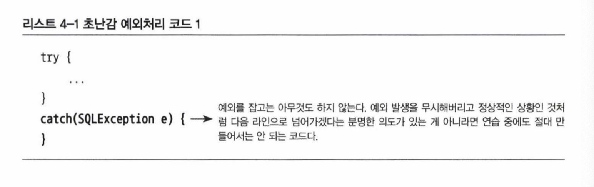
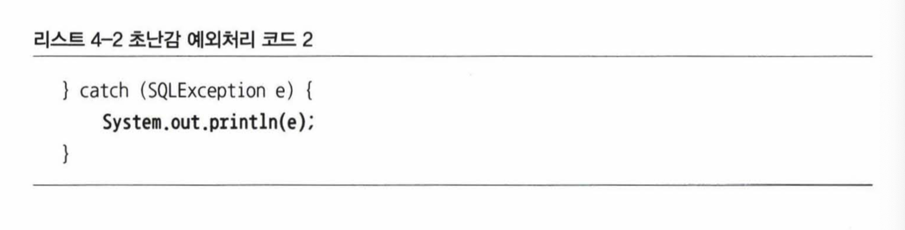
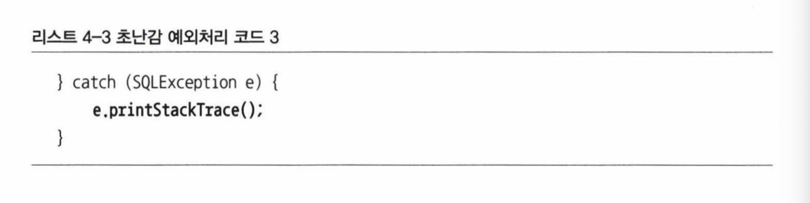
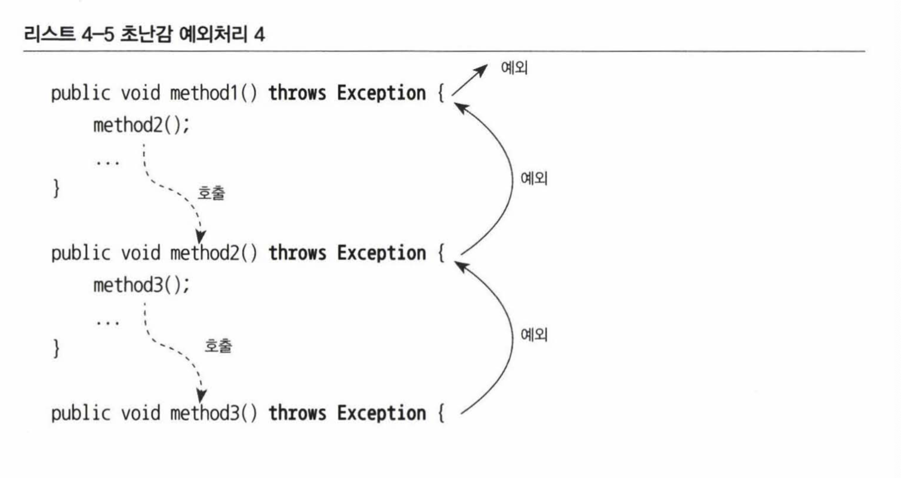
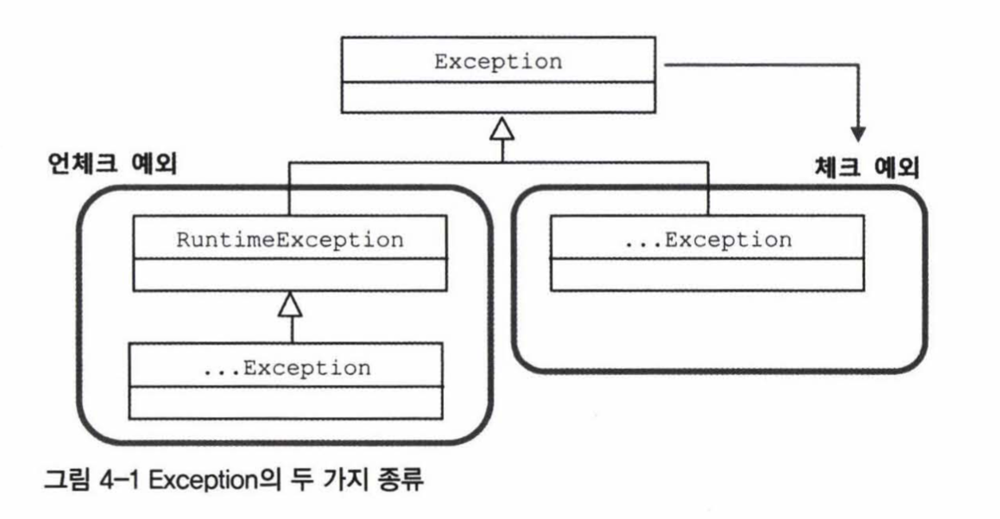
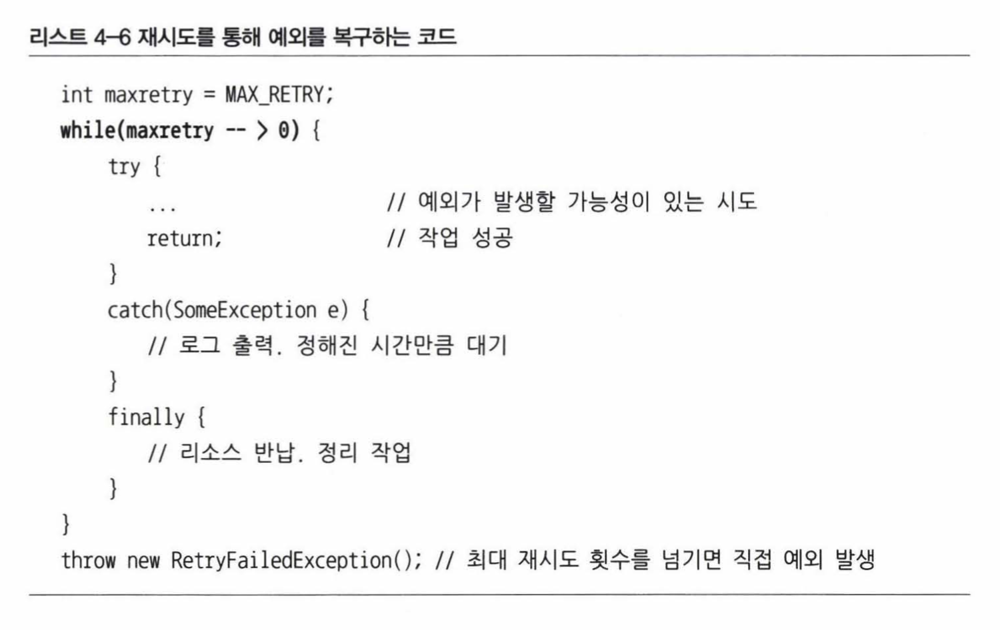
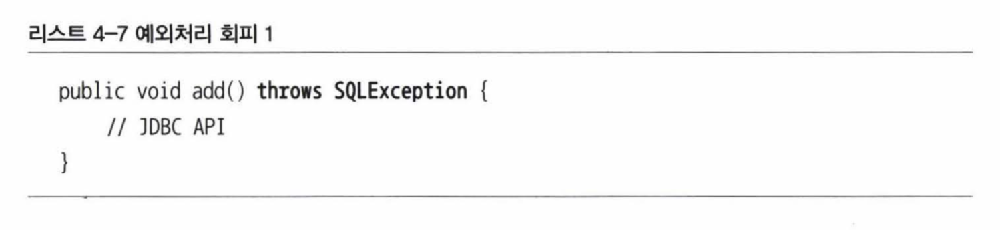
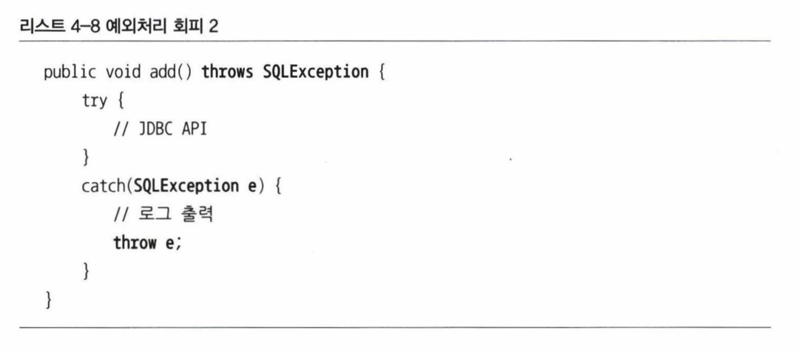
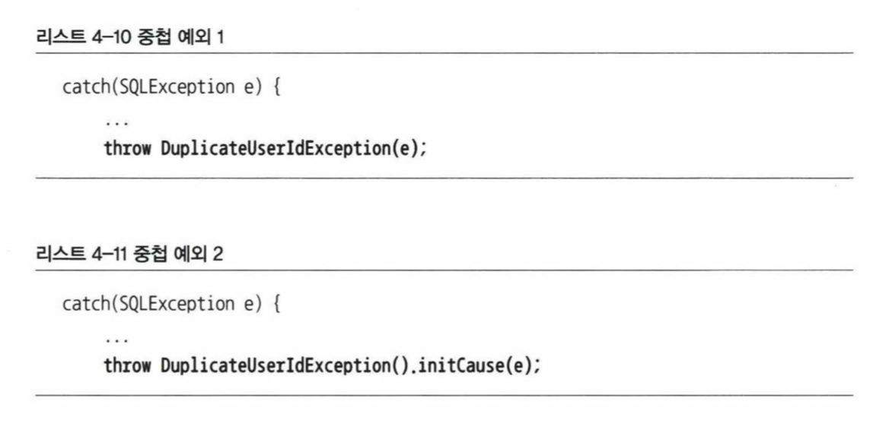
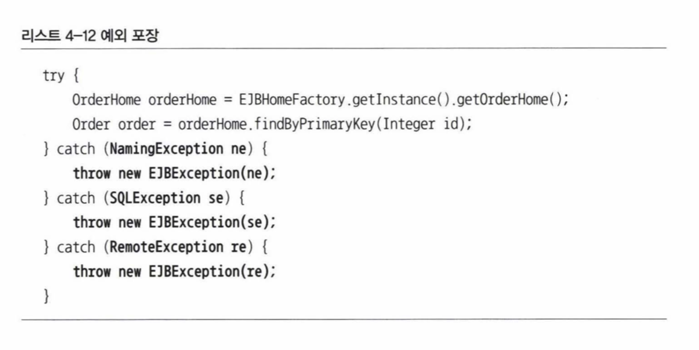

# 예외처리

## 초난감 예외처리

아래는 초보자들이 예외를 처리할 때 가장 많이 하는 실수이다.

예외가 발생하면 catch 블록을 잡는 것까지는 좋은데 아무 처리도 하지 않고 그냥 진행해버린다. 결국에는 해당 오류가 예상치 못한 다른 문제를 일으킬 수 있다.

catch 블록이 귀찮아지면 기계적으로 `throws Exception`을 붙이는 사람도 있다.

이렇게 무책임하게 예외를 처리하면 적절한 처리로 복구될 수 있는 상황도 기회를 놓치게 된다.

## 예외의 종류와 특징
### Error

- `java.lang.Error`의 서브 클래스
- OutOfMemoryError, ThreadDeath

시스템에 비정상적인 상황이 발생한 경우다. 주로 자바 VM에서 발생시키므로 애플리케이션 코드에서는 이런 에러를 신경쓰지 않아도 된다.

### Exception과 체크 예외

- `java.lang.Exception`과 그 서브 클래스

개발자가 만든 애플리케이션 코드의 예외에서 발생한다. `Exception` 클래스는 `언체크 예외`와 `체크 예외`로 다시 구분된다.

`언체크 예외` 는 `RuntimeException` 을 상속한 클래스이며, 나머지 클래스에 속한 것들이 일반적으로 예외라고 불리는 `체크 예외`이다.

`체크 예외`가 발생할 수 있는 메소드는 반드시 `catch`나 `throws`로 처리해줘야 한다. 그렇지 않으면 컴파일 에러가 발생한다. 초창기 자바 언어에서 발생 가능한 에외를 모두 여기에 포함시켰다.

`언체크 예외`는 `런타임 예외`라고도 부르며 프로그램의 오류가 있을 때 발생한다. 미리 조건을 체크해 피할 수 있지만 개발자의 부주의로 발생하는 오륟르이다. 예상치 못한 상황이 아니므로 굳이 `catch`나 `throws`를 쓸 필요는 없다. 

`체크 예외`가 예외처리를 강제하는 것 때문에 무분별하게 `throws` 같은 코드를 남발하게 되자, 최근 자바 스펙의 API는 가능한 `언체크 예외`로 만드는 경향이 있다.

|언체크 예외(런타임 예외)|체크 예외(일반적인 예외)|
|:---:|:---:|
|RuntimeException|그 외의 클래스|
|예외 처리 강제하지 않음|예외 처리 코드 필수|
|시스템 장애나 개발자에 의한 프로그램의 오류|예상치 못하게 발생한 예외|
|NullPointer/IllegalArgumentException|IOException, SQLException|

## 예외처리 방법
### 예외 복구

예외 상황을 파악하고 해결해서 정상으로 되돌리는 것이다. 만약 파일 읽기를 실패했다면 다른 파일을 이용하도록 유도하는 것이다.

단순히 예외 메시지를 던지는 것은 예외 복구라고 할 수 없다. 기능적으로는 예외처럼 보여도 애플리케이션에서는 정상적으로 설계된 흐름을 따라야 한다.

체크 예외는 예외처리 코드를 강제하므로 복구할 가능성이 있는 경우에 사용한다.

만약 DB 서버 접속을 실패해서 `SQLException` 이 일어난다면 대기했다가 재시도를 해볼 수 있다. 물론 정해진 횟수만큼 재시도 하다가 실패하면 예외 복구는 포기한다. 

이렇듯 체크 예외는 어떤 식으로든 복구할 가능성이 있는 경우에 사용한다.

### 예외처리 회피

예외처리를 자기가 담당하지 않고 자신을 호출한 쪽에 던져버리는 것이다. 여기에는 두 가지 방법이 있다.

throws 문으로 선언해 알아서 던져지게 구현한다.

catch 문으로 일단 잡은 후에 로그를 남긴 뒤 다시 rethrow 한다. 빈 블록으로 잡는 게 아니라 반드시 다른 오브젝트나 메소드가 대신 처리할 수 있도록 다른 곳에 던져줘야 한다.

하지만 다른 곳에 회피하는 건 무책임하므로 예외를 복구하는 것만큼이나 의도가 분명해야 한다. 콜백/템플릿처럼 긴밀한 관계의 오브젝트가 대신 처리하거나 자신을 사용하는 쪽에서 다루는게 최선이라는 분명한 확신이 있어야 한다.

### 예외 전환

예외 회피와 비슷하게 복구로 정상 상태를 만들기 힘들어서 메소드 밖으로 던지는 것이다. 하지만 회피와는 다르게 예외를 그대로 넘기는 것이 아니라 적절하게 바꿔 던진다.

#### 메소드 밖으로 던지기

첫번째 방법은 적절한 의미를 부여하기 위해 전환하는 경우다. API의 기술적인 로우 레벨을 상황에 맞는 의미로 변경하는 것이다.

예를 들어 사용자가 중복되어 `SQLException`이 일어난다면, 정확한 예외 원인을 알기 힘드므로 `DuplicateUserIdException`으로 바꿔서 던져준다.

이렇게 의미가 분명한 예외를 던지면 서비스 계층에서는 특정 기술의 정보를 해석하지 않아도 된다. 즉, 기술에 독립적이며 분명한 예외 처리를 할 수 있다.

#### 중첩 예외

중첩 예외는 전환하는 예외에 원래 발생한 예외를 담아서 보내는 것이다. 새로운 예외를 만들면서 생성자나 `initCause()` 메소드로 원래의 원인을 넣어주면 된다.

#### 포장하기

원인을 담아 던지는 방식은 중첩 예외와 같지만, 의미를 명확하게 하려는 것 보다는 체크 예외를 언체크 예외(런타임 예외)로 바꿀 때 사용한다.

